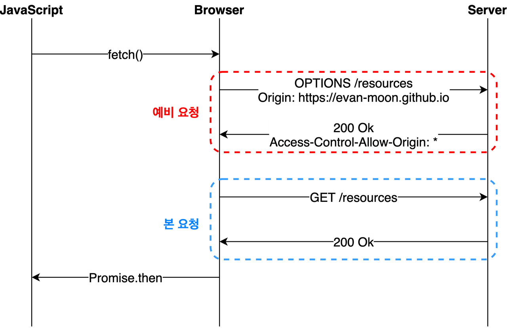
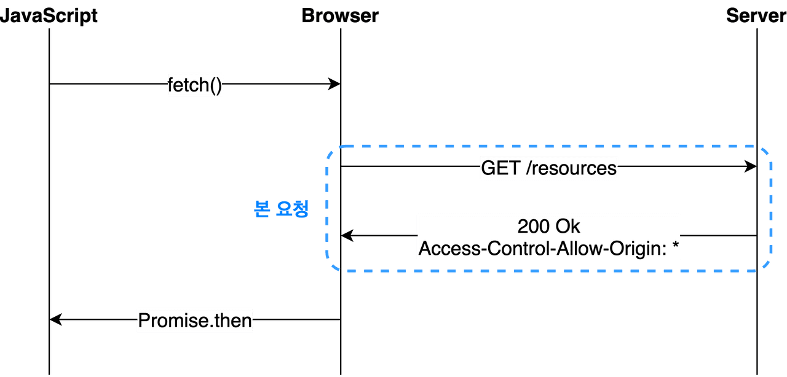

# IP

## 출발지IP 에서 목적지IP로 데이터를 전송하는 방법은?

이는 우체국으로 편지를 보내는 과정과 같다.

즉, 출발지 -> 출발지 동네의 우체국 -> 목적지 동네의 우체국 -> 목적지 와 같은데, 이 때 우체국은 게이트웨이를 뜻한다.

바꿔 말하면 출발지IP -> 출발지 LAN 영역의 게이트웨이 -> 목적지 LAN 영역의 게이트웨이 -> 목적지IP 의 과정과 같다.

예를 들어, 출발지IP 주소를 192.168.0.4 라고 하고, 목적지IP 주소를 10.10.10.10 라고 가정하겠다.

먼저, 두 IP주소의 네트워크ID를 비교한다. 이 때, 서브넷 마스크(IP를 나눈 작은 네트워크 조각)를 활용해서 네트워크ID와 호스트ID를 알아낸다.

여기서 만약 두 IP주소의 네트워크ID가 같으면 스위칭을, 다르면 라우팅을 진행한다.

라우팅은 게이트웨이를 통해 통신(데이터 전송)해야한다.

이 때, 스위칭을 하는 경우에는 호스트ID와 MAC주소를 통해 전달하면 된다.

반면, 라우팅을 해야하는 경우에는 우선 OS에서 목적지IP를 게이트웨이 IP주소로 변경한다. 이 때, 스위칭이 필요하다.

1. 해당 게이트웨이의 MAC주소를 알기 위해 ARP 캐시 테이블로 가서 해당 게이트웨이의 MAC 주소가 등록되어있는지 체크한다.

\*\*\* 예를 들어, 우리 동네의 우체국이 어딘지는 알지만, 다른 동네의 우체국 위치까지는 모른다. 이처럼, 같은 LAN영역 내의 게이트웨이 IP주소는 사전에 알고 있기 때문에 바로 OS에서 목적지IP를 변경할 수 있다.

2. 만약 ARP 캐시 테이블에 게이트웨이의 MAC 주소가 등록되어있지 않으면 브로드캐스트 방식으로 LAN 영역 내의 ARP를 요청한다.

여기서 브로드캐스트 방식이란, 자신과 같은 네트워크ID(LAN 영역 내) 를 사용하는 모든 호스트에게 데이터를 전송하는 방식이다.

3. 이렇게 브로드캐스트로 모두에게 쏘면, 나다 싶은 호스트(게이트웨이) 가 이를 듣고 유니캐스트 방식으로 발신자에게 ARP를 전송한다. 이 때의 ARP는 게이트웨이의 MAC주소이다.

여기서 유니캐스트 방식은 브로드캐스트 방식과 반대로 특정 호스트에게 데이터를 전송하는 방식이다.

4. 이후에는 OS가 전송하고자 하는 데이터를 유니캐스트 방식으로 목적지IP가 포함된 동네(LAN 영역)의 게이트웨이에 전송한다.

5. 목적지 동네의 게이트웨이가 스위칭을 사용하여 목적지IP 주소로 데이터를 전송한다.

\*\*\* ARP 영역 : 2) 의 과정이 진행되는 영역.

이렇듯 IP 주소간에 데이터를 전송하기 위해서는 ARP와 라우팅이 반드시 필요하며, 이 둘을 꼭 사용해야 한다.

## 데이터가 만약 클 경우?

데이터가 클 경우 데이터는 패킷(Packet)이라는 단위로 나눠져서 전달이 되는데 이렇게 패킷단위로 메세지를 전달하는것도 Ip가 하는 일이다. 그 이유는 우리의 데이터 단위가 크다면 각 노드들은 여러 컴퓨터에서온 데이터를 처리하다가 병목현상이 발생할 수 있기 때문에 작은 크기로 나눠서 빠르게 다음 노드로 전달하기 위해서이다

## 이로 미루어본 IP의 역할

1. 출발지 ip주소에서 부터 목적지 ip주소 까지 데이터전달

2. 데이터를 패킷이라는 단위로 나눠서 데이터를 전달

## 용어 정리

ARP 테이블

```
ARP 테이블은 IP와 MAC 주소를 매칭한 테이블 입니다. 보통 ARP 캐시 테이블을 사용하는데, 이는 IP주소와 MAC주소의 대응관계를 저장한 테이블을 뜻합니다. 여기서 IP주소를 가지고 MAC주소를 알 수 있기 때문에 IP주소 간 통신에 활용됩니다.
```

# CORS란?

CORS란 교차 출처 리소스 공유 Cross-Origin Resource Sharing의 줄임이다. 여기서 "교차 출처"라고 하는 것은 "다른 출처"를 의미하는 것이다

## 출처란?

서버의 위치를 의미하는 https://google.com 같은 URL을 의미한다. 이는 여러개의 구성요소로 이루어져 있다.


이때 출처는 Protocol과 Host, 그리고 위 그림에는 나와있지 않지만 :80, :443과 같은 포트 번호까지 모두 합친것을 의미한다. 즉, 서버의 위치를 찾아가기 위해 필요한 가장 기본적인 것들을 합쳐놓은 것이다.

## SOP란?

SOP(Same-Origin Policy)는 지난 2011년 처음 등장한 보안 정책으로 "같은 출처에서만 리소스를 공유할 수 있다."는 규칙을 가진 정책이다.

그러나 웹이라는 오픈스페이스에서 환경에 다른 출처에 있는 리소스를 가져와 사용하는 일은 굉장히 흔한 일이라 무작정 막을 수도 없는 노릇이니 몇 가지 예외 조항을 두고 이 조항에 해당하는 리소스 요청은 출처가 다르더라도 허용하기로 했는데, 그중하나가 "CORS 정책을 지킨 리소스 요청이다."

우리가 다른 출처로 리소스를 요청한다면 SOP 정책을 위반한 것이 되고, 거기에 SOP의 예외조항인 CORS 정책까지 지키지 않는다면 아예 다른 출처의 리소스를 사용할 수 없게 되는것이다.

```
왜 이런 귀찮은 정책이 존재할까?
클라이언트 애플리케이션, 특히나 웹에서 돌아가는 클라이언트 애플리케이션은 사용자의 공격에 너무나도 취약하다. 당장 브라우저의 개발자 도구만 열어도 DOM이 어떻게 작성되어 있는지, 어떤 서버와 통신하는지, 리소스의 출처는 어디인지와 같은 각종 정보들을 아무런 제재 없이 열람할 수 있지 않은가?

최근 JavaScript 소스 코드를 난독화해서 읽기 어렵다고 하지만, 난독화는 그저 읽기 어렵게만 만들어 둔것이지 암호화 된게 아니다. 그리고 아무리 난독화 되었다고 해도 사람이 바로 이해할 수 없는 정도도 아닌데다 소스코드를 직접 볼 수 있다는 것 자체가 보안적으로 상당히 취약한 부분이다. 심지어 아직까지도 소스 코드의 난독화가 안되어 개발자 도구만 열면 <script>태그 안에 날것 그대로의 소스코드가 떡하니 노출되는 사이트도 많다.

이러한 상황속에서 다른 출처의 애플리케이션이 서로 통신하는 것에 대하 아무런 제약도 존재하지 않는다면, 악의를 가진 사용자가 소스코드를 쓱 구경한 후 CSRF나 XSS같은 방법을 사용하여 사용자의 정보를 탈취하기가 너무나도 쉬워진다.
```

## 같은 출처와 다른 출처의 구분

두개의 출처가 서로 같다고 판단하는 로직 자체는 굉장히 간단하다 두 URL의 구성요소중 Scheme(protocol), Host, Port 이 3가지만 동일하면 된다.

https://google.com:433이라는 출처를 예로 들면 https:// 이라는 스킴(프로토콜)에 google.com호스트를 가지고 :433번 포트를 사용하고 있다는 것만 같다면 나머지는 전부 다르더라도 같은 출처로 인정이 된다는 것이다.

## CORS의 동작

총 세가지의 시나리오로 동작한다.

### 1. prefilght Request

프리플라이트(prefilght)방식은 일반적으로 우리가 웹 애플리케이션을 개발할 때 가장 마주치는 시나리오이다. 이 시나리오에 해당 하는 상황일 때 브라우저는 요청을 한번에 보내지 않고 예비 요청과 본 요청으로 나누어서 서버로 전송한다.

이때 브라우저가 본 요청을 보내기 전에 보내는 예비요청을 prefilght라고 하며 이 예비 요청에는 HTTP 메소드중 OPTION메소드가 사용된다. 예 요청의 역할은 본 요청을 보내기 전에 브라우저 스스로 이 요청을 보내는 것이 안전한지 확인하는 것이다.



우리가 자바스크립트의 fetch API를 사용하여 브라우저에게 리소스를 받아오라는 명령을 내리면 브라우저는 서버에게 예비요청을 먼저 보내고 서버는 이 예비요청에 대한 응답으로 현재 자신이 어떤것들을 허용하고 어떤 것들을 금지하고 있는지에 대한 정보를 응답헤더에 담아 브라우저에게 다시 보내주게 된다.

예시

```
const headers = new Headers({
  'Content-Type': 'text/xml',
});
fetch('https://google.com/rss', { headers });
OPTIONS https://google.com/rss

Accept: */*
Accept-Encoding: gzip, deflate, br
Accept-Language: en-US,en;q=0.9,ko;q=0.8,ja;q=0.7,la;q=0.6
Access-Control-Request-Headers: content-type
Access-Control-Request-Method: GET
Connection: keep-alive
Host: google.com
Origin: https://goo-gle.com
Referer: https://goo-gle.com/2020/05/21/about-cors/
Sec-Fetch-Dest: empty
Sec-Fetch-Mode: cors
Sec-Fetch-Site: cross-site
```

실제로 브라우저가 보낸 요청을 보면 단순히 Origin에 대한 정보 뿐만 아니라 자신이 예비 요청 이후에 보낼 본 요청에 대한 다른 정보들도 함께 포함되어 있는 것을 볼 수 있다.

이 예비 요청에서 브라우저는 Access-Control-Request-Headers를 사용하여 자신이 본 요청에서 Content-Type 헤더를 사용할 것을 알려주거나, Access-Control-Request-Method를 사용하여 이후 GET 메소드를 사용할 것을 서버에게 미리 알려주고 있는 것이다.

이렇게 예시 서버에 예비 요청을 보내면 이제 예시 서버가 이 예비 요청에 대한 응답을 보내준다.

```
OPTIONS https://google.com/rss 200 OK

Access-Control-Allow-Origin: https://google.com
Content-Encoding: gzip
Content-Length: 699
Content-Type: text/xml; charset=utf-8
Date: Sun, 24 May 2020 11:52:33 GMT
P3P: CP='ALL DSP COR MON LAW OUR LEG DEL'
Server: Apache
Vary: Accept-Encoding
X-UA-Compatible: IE=Edge
```

우리가 여기서 눈여겨 봐야할 것은 서버가 보내준 응답 헤더에 포함된 Access-Control-Allow-Origin: https://google.com 이라는 값이다.

예시 서버는 이 리소스에 접근이 가능한 출처는 오직 https://google.com 뿐이라고 브라우저에게 이야기해준 것이고 이 요청을 보낸 출처는 https://goo-gle.com 이므로 서버가 허용해준 출저와는 다른 출처이다.

결국 브라우저는 이 요청이 CORS정책을 위반했다고 판단하고 에러를 뱉게 된다.

이때 예비 요청에 대한 응답에서 에러가 발생하지 않고 정상적으로 200번대의 요청이 들어오게 되는데 콘솔창에는 빨갛게 에러표시가 뜨게 된다. CORS 정책 위반으로 인한 에러는 예비 요청의 성공 여부와 별 상관이 없다. 브라우저가 CORS 정책위반 여부를 판단하는 시점은 예비 요청에 대한 응답을 받은 이후이기 때문이다.

물론 예비 요청 자체가 실패해도 똑같이 CORS 정책위반으로 처리될 수도 있지만, 중요한 것은 예비 요청의 성공/실패 여부가 아니라 응답헤더에 유효한 Access-Control-Allow-Origin값이 존재하는가이다. 만약 예비요청이 실패하여 200이 아닌 상태 코드가 내려오더라도 헤더 값이 제대로 들어가 있다면 CORS정책 위반이 아니라는 의미이다.

### 2. Simple Request

단순 요청은 예비 요청을 보내지 않고 바로 서버에게 본 요청부터 보낸 후 서버가 이에 대한 응답의 헤더에 Access-Control-Allow-Origin과 같은 값을 보내주면 그 때 브라우저가 CORS 정책 위반 여부를 검사하는 방식이다. 즉, 프리플라이트와 단순 요청은 전반적인 로직 자체는 같되, 예비 요청의 존재 유무만 다르다.



하지만 아무때나 사용할 수 있는게 아니라 특정 조건을 만족하는 경우에만 요청을 생략할 수 있다. 게다가 이 조건이 조금 까다롭기 때문에 일반적인 방법으로 웹 어플리케이션 아키텍쳐를 설계하게 되면 거의 충족시키기 어려운 조건들이 대부분이다.

```
Simple Request의 조건
1. 요청의 메소드는 get, HEAD, POST중 하나여야 한다.
2. Accept, Accept-Language, Content-Language, Content-Type, DPR, Downlink, Save-Data, Viewport-Width, Width를 제외한 헤더를 사용하면 안된다.
3. 만약 Content-Type를 사용하는 경우에는 application/x-www-form-urlencoded, multipart/form-data, text/plain만 허용된다.
```

### 3. Credentialed Request

인증된 요청을 사용하는 방법이다. 이 시나리오는 CORS의 기본적인 방식이라기 보다는 다른 출처 간 통신에서 좀 더 보안을 강화하고 싶을 때 사용하는 방법이다.

기본적으로 브라우저가 제공하는 비동기 리소스 요청 API인 XMLHttpRequest 객체나 fetch API는 별도의 옵션 없이 브라우저의 쿠키 정보나 인증과 관련된 헤더를 함부로 요청에 담지 않는다. 이때 요청에 인증과 관련된 정보를 담을 수 있게 해주는 옵션이 바로 credentials 옵션이다.

이 옵션에는 총 3가지의 값을 사용할 수 있으며 각 값들이 가지는 의미는 다음과 같다.

| 옵션 값              | 설명                                            |
| -------------------- | ----------------------------------------------- |
| same-origin(기본 값) | 같은 출처 간 요청에만 인증 정보를 담을 수 있다. |
| include              | 모든 요청에 인증 정보를 담을 수 있다.           |
| omit                 | 모든 요청에 인증 정보를 담지 않는다.            |

만약 same-origin이나 include와 같은 옵션을 사용하여 리소스 요청에 인증 정보가 포함된다면, 이제 브라우저는 다른 출처의 리소스를 요청할 때 단순히 Access-Control-Allow-Origin만 확인하는 것이 아니라 좀 더 빡빡한 검사 조건을 추가하게 된다.

브라우저는 인증 모드가 include일 경우, 모든 요청을 허용한다는 의미의 "\*"를 Access-Control-Allow-Origin 헤더에 사용하면 안된다고 이야기하고 있다.

이처럼 요청에 인증 정보가 담겨있는 상태에서 다른 출처의 리소스를 요청하게 되면 브라우저는 CORS 정책 위반 여부를 검사하는 룰에 다음 두 가지를 추가하게 된다.

```
1. Access-Control-Allow-Origin에는 *를 사용할 수 없으며, 명시적인 URL이어야한다.
2. 응답 헤더에는 반드시 Access-Control-Allow-Credentials: true가 존재해야한다.
```

## CORS를 해결할 수 있는 방법

### Access-Control-Allow-Origin 세팅하기

CORS 정책 위반으로 인한 문제를 해결하는 가장 대표적인 방법은, 그냥 정석대로 서버에서 Access-Control-Allow-Origin 헤더에 알맞은 값을 세팅해주는 것이다.

이때 와일드카드인 \*을 사용하여 이 헤더를 세팅하게 되면 모든 출처에서 오는 요청을 받아먹겠다는 의미이므로 당장은 편할 수 있겠지만, 바꿔서 생각하면 정체도 모르는 이상한 출처에서 오는 요청까지 모두 받아먹겠다는 오픈 마인드와 다를 것 없으므로 보안적으로 심각한 이슈가 발생할 수도 있다.

그러니 가급적이면 귀찮더라도 Access-Control-Allow-Origin: https://google.com와 같이 출처를 명시해주도록 하자.

## Webpack Dev Server로 리버스 프록싱하기

사실 CORS를 가장 많이 마주치는 환경은 바로 로컬에서 프론트엔드 어플리케이션을 개발하는 경우라고 해도 과언이 아니다. 백엔드에는 이미 Access-Control-Allow-Origin 헤더가 세팅되어있겠지만, 이 중요한 헤더에다가 http://localhost:3000 같은 범용적인 출처를 넣어주는 경우는 드물기 때문이다.

프론트엔드 개발자는 대부분 웹팩과 webpack-dev-server를 사용하여 자신의 머신에 개발 환경을 구축하게 되는데, 이 라이브러리가 제공하는 프록시 기능을 사용하면 아주 편하게 CORS 정책을 우회할 수 있다.

```
module.exports = {
  devServer: {
    proxy: {
      '/api': {
        target: 'https://api.google.com',
        changeOrigin: true,
        pathRewrite: { '^/api': '' },
      },
    }
  }
}
```

이렇게 설정을 해놓으면 로컬 환경에서 /api로 시작하는 URL로 보내는 요청에 대해 브라우저는 localhost:8000/api로 요청을 보낸 것으로 알고 있지만, 사실 뒤에서 웹팩이 https://api.google.com으로 요청을 프록싱해주기 때문에 마치 CORS 정책을 지킨 것처럼 브라우저를 속이면서도 우리는 원하는 서버와 자유롭게 통신을 할 수 있다. 즉, 프록싱을 통해 CORS 정책을 우회할 수 있는 것이다.
