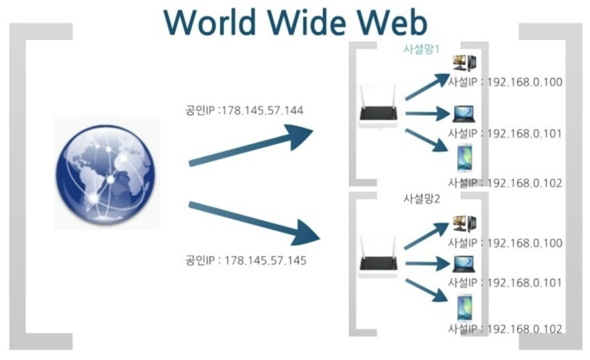

# **공인(public)IP와 사설(private)IP의 차이에 대해 설명하시오**

## **_공인IP_ 란?**

    - 공인IP란 ISP(인터넷 공급자)가 제공하는 IP 주소이며, 외부에 공개되어 있는 IP 주소(공용 IP 주소라고도 불림).
    - 공인IP는 전 세계에서 유일한 IP주소를 가진다.
    - 공인IP 주소가 외부에 공개되어 있기 때문에 인터넷에 연결된 다른 PC로부터의 접근이 가능하다. 따라서 공인 IP 주소를 사용하는 경우에는 방화벽 등의 보안프로그램을 설치할 필요가 있다.

 

## **_사설IP_ 란?**

    사설IP란 일반 가정이나 회사 내 등에 할당된 네트워크 IP 주소이며,
    외부에 공개되어 있는 IPv4의 부족으로 인해 서브넷팅된 IP이기 때문에
    라우터(공유기)에 의해 로컬 네트워크 상의 PC나 장치에 할당된다.

 

### **사설 IP 주소 대역**

    사설 IP 주소는 다음 3가지 주소대역으로 고정된다.
    - Class A: 10.0.0.0 ~ 10.255.255.255
    - Class B: 172.16.0.0 ~ 172.31.255.255
    - Class C: 192.168.0.0 ~ 192.168.255.255

 

## **차이점**

    사설IP 주소만으로는 인터넷에 직접 연결할 수 없다. 라우터를 통해 1개의 공인IP를 할당하고, 라우터에 연결된 개인 PC는 사설 IP는 사설 IP를 각각 할당받아 인터넷에 접속할 수 있다.

 

|           | 공인IP                        | 사설IP                      |
| --------- | ----------------------------- | --------------------------- |
| 할당 주체 | ISP(인터넷 서비스 공급자)     | 라우터(공유기)              |
| 할당 대상 | 개인 또는 회사의 서버(라우터) | 개인 또는 회사의 기기       |
| 고유성    | 인터넷 상에서의 유일한 주소   | 하나의 네트워크 안에서 유일 |
| 공개 여부 | 내/외부 접근 가능             | 외부 접근 불가능            |

 

## **_참고_**

- 💻 ➡️ 🌏 : 사설 IP를 할당받은 스마트폰 혹은 개인 PC가 데이터 패킷을 인터넷으로 전송하면, 라우터(공유기)가 해당 사설 IP를 공인 IP로 바꿔서 전송한다.
- 🌏 ➡️ 💻 : 인터넷에서 오는 데이터 패킷의 목적지도 해당하는 사설 IP로 변경한 후 개인 스마트폰 혹은 PC에 전송한다.

 

# HTTP란 무엇인가?

HTTP는 Hyper Text Transfer Protocol의 두문자어로, 인터넷에서 데이터를 주고받을 수 있는 프로토콜 입니다. 프로토콜은 규칙이라고 생각하면 됩니다. 이렇게 규칙을 정해두었기 때문에, 모든 프로그램이 이 규칙에 맞춰 개발해서 서로 정보를 교환할 수 있게 된 것입니다.

HTTP만 잘 알아도 CORS, CORB와 같은 에러들을 해결할 수 있습니다.

요청 ⇒ 서버에게 어떠한 경로 ex) naver.com 에 대한 정보를 달라고 요청을 보냅니다. 요청을 보낼때는 요청에 대한 정보를 담아 서버로 보냅니다. 식당에서 주문서를 작성하는 것과 같다고 생각하면 편합니다. 서버가 주문서를 받아 클라이언트가 어떤 것을 원하는지 파악할 수 있게 하는 것입니다.

서버도 응답할 때 응답에 대한 정보를 담아 클라이언트로 보냅니다. 이런 저오가 담긴 메시지 들을 HTTP 메시지라고 합니다. HTTP 메시지는 시작줄, 헤더, 본문으로 구성됩니다.

- 시작줄은 메소드 주소 버전으로 구성된 것입니다.
- 헤더는 요청에 대한 정보를 담고있습니다.

응답 ⇒ 요청과 마찬가지로 시작줄, 헤더, 본문으로 구성되어 있습니다.

- 첫줄은 버전 상태코드 상태메시지로 구성되어 있습니다.
- 두번째 줄부터는 헤더입니다. 응답에 대한 정보가 담겨있습니다.
- 본문으로는 요청한 데이터를 받는데 이 응답 메시지에 HTML이 담겨있을 수 있고 이 HTML을 받아 브라우저가 화면에 렌더링을 해줍니다.
