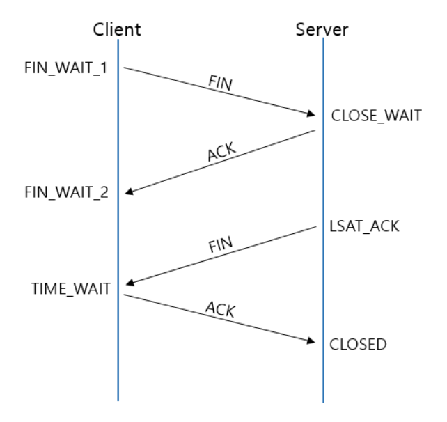
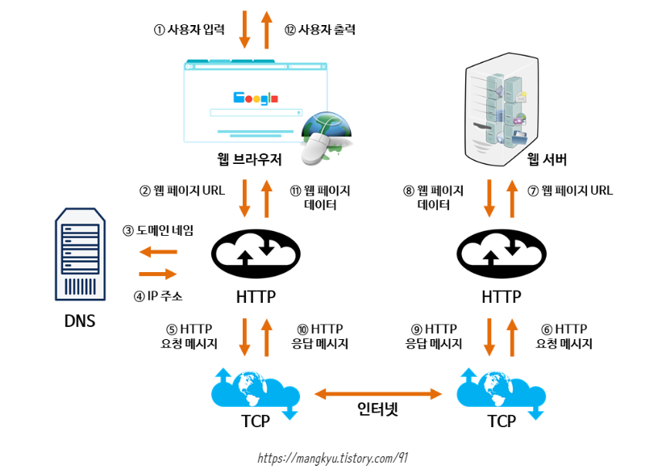

# 3-way handshake와 4-way handshake에 대해 설명해주세요.

✅ **3-way handshake**

- TCP/IP 통신 기법 중 하나로, TCP/IP 프로토콜을 이용하여 통신하기 전에 정확한 전송을 보장하고자 연결이 잘 되어있는지 확인하는 것
- 보통 데이터 송수신 시작 전에 이뤄짐
  
- 순서 :
  ① 먼저, 클라이언트는 서버에게 접속 요청을 위한 SYN 패킷을 보낸다. 클라이언트는 SYN을 보낸 후 SYN/ACK 응답을 기다리는 SYN-SENT 상태가 된다.
  **(CLIENT -> SERVER : 내 말 들리나?)**

  ② 그 다음, 서버가 Listen 상태일 경우에 SYN을 수신받는다. 이후 요청 수락인 ACK와 SYN flag 패킷을 보낸다. 이 때, 서버는 SYN-RECEIVED 상태가 된다.
  **(SERVER -> CLIENT : 어 잘 들린다! 내 말은 들리나?)**

  ③ 마지막으로 클라이언트는 ACK를 서버에게 보내고 이 이후부터는 두 컴퓨터 사이의 연결이 완료되어 데이터를 송수신한다.
  **(CLIENT -> SERVER : 잘 들려!)**

   

- **SYN(SYNchronize sequence numbers)** : 연결 확인을 보내는 무작위의 숫자 값 **(내 말 들려?)**
- **ACK(ACKnowledgements)** : Client 혹은 Server로부터 받은 SYN에 1을 더해 SYN을 잘 받았다는 ACK **(잘 들려!)**

✅ **4-way handshake**

- TCP 3-Way HandShake 와는 반대로 데이터 송수신이 끝나고, 클라이언트와 서버 간 연결을 종료하기 위해 수행하는 것
  
- 순서 :
  ① 먼저, 클라이언트가 서버에게 FIN Flag를 전송한다. 클라이언트가 전송하고나서 FIN-WAIT 상태가 된다.
  **(CLIENT -> SERVER : 나는 다 보냈어! 이제 연결 끊자!)**

  ② 다음으로, 서버가 FIN Flag를 받고, 클라이언트에게 ACK를 보낸다. 이 때, 서버는 CLOSE_WAIT 상태가 된다.
  **(SERVER -> CLIENT : 알겠어. 잠시만)**

  ③ 그럼 클라이언트는 다음 FIN Flag를 받기 전까지 TIME-OUT 상태가 되고, 남은 데이터를 받으며 종료할 준비를 한다.
  ④ 데이터를 모두 보낸 서버는 이제 연결종료의 의미인 FIN Flag를 클라이언트에게 전송한다.
  **(SERVER -> CLIENT : 나도 끊을게!)**

  ⑤ 클라이언트는 이를 받고 ACK 메세지를 서버에 전송한다.
  **(SERVER -> CLIENT : 알겠어!)**

  ⑥ 서버는 이러한 ACK 메세지를 받고 CLOSED (연결 없음)하는 것으로 클라이언트와 서버 간 통신은 마무리된되고 두 컴퓨터 사이의 연결이 종료된다.

 

- **TIME-WAIT** : 먼저 연결을 끊는 쪽에서 생성되는 소켓으로, 혹시 모를 전송 실패에 대비하기 위해 존재하는 소켓이며, TIME-WAIT이 없다면, 패킷의 손실이 발생하거나 통신자 간 연결 해제가 제대로 되지 않을 수 있다.

# "www.cs-study.com" 주소를 친 후, 일어나는 네트워크 동작은?

1. 사용자가 브라우저에 URL(www.cs-study.com)을 입력
2. DNS 서버에 도메인 네임으로 서버의 진짜 주소를 찾음
3. IP 주소로 웹 서버에 TCP 3 handshake로 연결 수립
4. 클라이언트는 웹 서버로 HTTP 요청 메시지를 보냄
5. 웹 서버는 HTTP 응답 메시지를 보냄
6. 도착한 HTTP 응답 메세지는 웹 페이지 데이터로 변환되고, 웹 브라우저에 의해 출력

# 로드 밸런싱의 개념을 설명하고 늘어나는 서버 부하를 처리하기 위한 2가지 방법 (즉, 서버 확장의 두가지 방법)을 설명해주세요.

✅ **로드 밸런싱**

- 로드 밸런서를 클라이언트와 서버 사이에 두고, 부하가 집중되지 않도록 여러 서버에 분산하는 방식
- Scale-out 시에 사용
- Server Load Balancing이라고도 불림

✅ **로드 밸런서**
로드 밸런싱 작업을 담당하는 장비

- 로드 밸런서의 역할 :
  - **NAT(Network Address Translation)** : 사설IP - 공인IP 전환
  - **Tunneling** : 데이터를 캡슐화하여 연결된 노드만 캡슐을 해제할 수 있게 만듦
  - **DSR(동적 소스 라우팅)** : 요청에 대한 응답을 할 때 로드밸런서가 아닌 클라이언트의 IP로 응답

✅ **서버 부하를 처리하기 위한 2가지 방법**
① **Scale-up** : 기존에 갖고 있는 서버 자체의 성능을 업그레이드시키는 것으로, 서버 CPU, RAM 등을 교체하여 서버의 성능을 향상시킴.
② **Scale-out** : 기존 서버와 동일하거나 낮은 서버를 여러 대 증설하여 운영하는 것으로, 주로 많이 사용하는 데 그 이유는 비용적 측면에서 효과적이기 때문.

# L4 로드 밸런싱과 L7 로드 밸런싱에 대해 설명하고, 차이를 말해보세요.

✅ **L4 로드 밸런싱**

- Layer 4(네트워크 계층 또는 트랜스포트(전송) 계층) 의 정보를 바탕으로 트래픽을 분산하는 방식
- TCP/UDP/IP 와 PORT 정보들 기반의 로드 밸런싱
- 보통 L4 스위치 장비로 로드밸런싱하며 L7보다는 저렴함
- 정보가 어떻게 생겼는지 보지 않고 패킷 레벨에서만 트래픽을 분산하기 때문에 속도가 빠르고 효율성이 높음
- VIP 를 통한 로드 밸런싱은 L4 로드밸런싱

✅ **L7 로드 밸런싱**

- Layer 7(애플리케이션(응용) 계층) 의 정보를 바탕으로 요청을 분산
- URI, Payload, HTTP Header, Cookie 등 사용자가 요청한 정보들을 바탕으로 트래픽을 분산
- 섬세한 라우팅이 가능하고 비정상적인 트래픽을 판별할 수 있음
- 보통 L7 스위치 장비로 로드밸런싱하며 가격이 비쌈
- nginx 나 apache 를 통한 로드 밸런싱은 L7 로드밸런싱

# IPv4 와 IPv6 은 무엇이고, 어떤 차이가 있나요?

✅ **먼저.. IP주소란?**

- Internet Protocol의 약자로써 인터넷 영역에서 자기 자신의 PC를 나타내는 고유한 식별자 주소

✅ **IPv4**

- 현재 일반적으로 사용되는 주소 체계
- 32비트를 8비트로 단위로 점을 찍어 표기하는 방식
- 한 자리당 0~255까지 8비트로 표현이 가능
- 123.45.67.88 같은 방식으로 표기됨

✅ **IPv6**

- IPv4 의 주소의 개수가 부족 문제를 해결하기 위해 생긴 주소 체계
- 총 128비트 체계로써, 한 자리당 16비트 씩 8개를 가지고 있음
- 64비트를 16비트 단위로 점을 찍어 표기하는 방식
- IPv6는 IP번호를 나타내는 것 뿐 아니라 QoS 요구 실시간 서비스를 제공하며, 보안 기능이 강화됨
- 2001:db8::ff00:42:8329 같은 방식으로 표기됨

# 로드 밸런싱 알고리즘 중 대표적인 라운드 로빈, 최소 연결 방식 에 대해 설명해보세요.

✅ **라운드 로빈 알고리즘**

- 서버에 들어오는 요청들을 순서대로 돌아가면서 배정하는 알고리즘입니다. 뭐가되었든 하나씩 배정하기 때문에 여러 대의 서버 성능이 비슷하고 세션이 오래 지속되지 않는 경우에 적합

✅ **최소 연결 방식(Least Connection Method)**

- 요청이 서버에 들어왔을 때 가장 연결이 적은 서버에 배정하는 알고리즘입니다. 서버 트래픽이 일정하지 않고 세션이 길어질 때 적합
