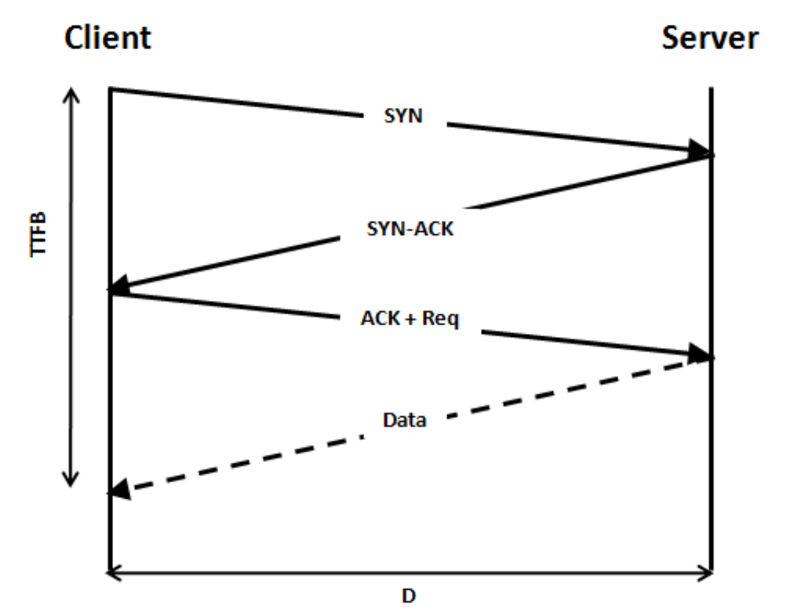

# 3-way handshake와 4-way handshake에 대해 설명해주세요.

✅ **3-way handshake**

- TCP/IP 통신 기법 중 하나로, TCP/IP 프로토콜을 이용하여 통신하기 전에 정확한 전송을 보장하고자 연결이 잘 되어있는지 확인하는 것
- 보통 데이터 송수신 시작 전에 이뤄짐
  
- 순서 :
  ① 먼저, 클라이언트는 서버에게 접속 요청을 위한 SYN 패킷을 보낸다. 클라이언트는 SYN을 보낸 후 SYN/ACK 응답을 기다리는 SYN-SENT 상태가 된다.
  **(CLIENT -> SERVER : 내 말 들리나?)**

      ② 그 다음, 서버가 Listen 상태일 경우에 SYN을 수신받는다. 이후 요청 수락인 ACK와 SYN flag 패킷을 보낸다. 이 때, 서버는 SYN-RECEIVED 상태가 된다.
      **(SERVER -> CLIENT : 어 잘 들린다! 내 말은 들리나?)**

      ③ 마지막으로 클라이언트는 ACK를 서버에게 보내고 이 이후부터는 두 컴퓨터 사이의 연결이 완료되어 데이터를 송수신한다.
      **(CLIENT -> SERVER : 잘 들려!)**

   

- **SYN(SYNchronize sequence numbers)** : 연결 확인을 보내는 무작위의 숫자 값 **(내 말 들려?)**
- **ACK(ACKnowledgements)** : Client 혹은 Server로부터 받은 SYN에 1을 더해 SYN을 잘 받았다는 ACK **(잘 들려!)**

✅ **4-way handshake**

- TCP 3-Way HandShake 와는 반대로 데이터 송수신이 끝나고, 클라이언트와 서버 간 연결을 종료하기 위해 수행하는 것
  
- 순서 :
  ① 먼저, 클라이언트가 서버에게 FIN Flag를 전송한다. 클라이언트가 전송하고나서 FIN-WAIT 상태가 된다.
  **(CLIENT -> SERVER : 나는 다 보냈어! 이제 연결 끊자!)**
  ② 다음으로, 서버가 FIN Flag를 받고, 클라이언트에게 ACK를 보낸다. 이 때, 서버는 CLOSE_WAIT 상태가 된다.
  **(SERVER -> CLIENT : 알겠어. 잠시만)**
  ③ 그럼 클라이언트는 다음 FIN Flag를 받기 전까지 TIME-OUT 상태가 되고, 남은 데이터를 받으며 종료할 준비를 한다.
  ④ 데이터를 모두 보낸 서버는 이제 연결종료의 의미인 FIN Flag를 클라이언트에게 전송한다.
  **(SERVER -> CLIENT : 나도 끊을게!)**
  ⑤ 클라이언트는 이를 받고 ACK 메세지를 서버에 전송한다.
  **(SERVER -> CLIENT : 알겠어!)**
  ⑥ 서버는 이러한 ACK 메세지를 받고 CLOSED (연결 없음)하는 것으로 클라이언트와 서버 간 통신은 마무리된되고 두 컴퓨터 사이의 연결이 종료된다.

 

- **TIME-WAIT** : 먼저 연결을 끊는 쪽에서 생성되는 소켓으로, 혹시 모를 전송 실패에 대비하기 위해 존재하는 소켓이며, TIME-WAIT이 없다면, 패킷의 손실이 발생하거나 통신자 간 연결 해제가 제대로 되지 않을 수 있다.

# "www.cs-study.com" 주소를 친 후, 일어나는 네트워크 동작은?

1. 사용자가 브라우저에 URL(www.cs-study.com)을 입력
2. DNS 서버에 도메인 네임으로 서버의 진짜 주소를 찾음
3. IP 주소로 웹 서버에 TCP 3 handshake로 연결 수립
4. 클라이언트는 웹 서버로 HTTP 요청 메시지를 보냄
5. 웹 서버는 HTTP 응답 메시지를 보냄
6. 도착한 HTTP 응답 메세지는 웹 페이지 데이터로 변환되고, 웹 브라우저에 의해 출력
