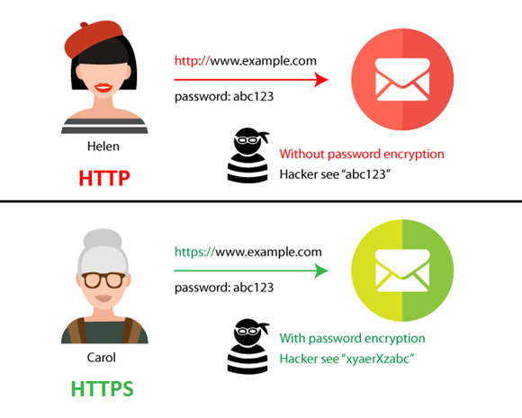

# 3-way handshake와 4-way handshake에 대해 설명해주세요.

✅ **3-way handshake**

- TCP/IP 통신 기법 중 하나로, TCP/IP 프로토콜을 이용하여 통신하기 전에 정확한 전송을 보장하고자 연결이 잘 되어있는지 확인하는 것
- 보통 데이터 송수신 시작 전에 이뤄짐
  
- 순서 :
  ① 먼저, 클라이언트는 서버에게 접속 요청을 위한 SYN 패킷을 보낸다. 클라이언트는 SYN을 보낸 후 SYN/ACK 응답을 기다리는 SYN-SENT 상태가 된다.
  **(CLIENT -> SERVER : 내 말 들리나?)**

  ② 그 다음, 서버가 Listen 상태일 경우에 SYN을 수신받는다. 이후 요청 수락인 ACK와 SYN flag 패킷을 보낸다. 이 때, 서버는 SYN-RECEIVED 상태가 된다.
  **(SERVER -> CLIENT : 어 잘 들린다! 내 말은 들리나?)**

  ③ 마지막으로 클라이언트는 ACK를 서버에게 보내고 이 이후부터는 두 컴퓨터 사이의 연결이 완료되어 데이터를 송수신한다.
  **(CLIENT -> SERVER : 잘 들려!)**

  <br/>

- **SYN(SYNchronize sequence numbers)** : 연결 확인을 보내는 무작위의 숫자 값 **(내 말 들려?)**
- **ACK(ACKnowledgements)** : Client 혹은 Server로부터 받은 SYN에 1을 더해 SYN을 잘 받았다는 ACK **(잘 들려!)**

✅ **4-way handshake**

- TCP 3-Way HandShake 와는 반대로 데이터 송수신이 끝나고, 클라이언트와 서버 간 연결을 종료하기 위해 수행하는 것
  
- 순서 :
  ① 먼저, 클라이언트가 서버에게 FIN Flag를 전송한다. 클라이언트가 전송하고나서 FIN-WAIT 상태가 된다.
  **(CLIENT -> SERVER : 나는 다 보냈어! 이제 연결 끊자!)**

  ② 다음으로, 서버가 FIN Flag를 받고, 클라이언트에게 ACK를 보낸다. 이 때, 서버는 CLOSE_WAIT 상태가 된다.
  **(SERVER -> CLIENT : 알겠어. 잠시만)**

  ③ 그럼 클라이언트는 다음 FIN Flag를 받기 전까지 TIME-OUT 상태가 되고, 남은 데이터를 받으며 종료할 준비를 한다.
  ④ 데이터를 모두 보낸 서버는 이제 연결종료의 의미인 FIN Flag를 클라이언트에게 전송한다.
  **(SERVER -> CLIENT : 나도 끊을게!)**

  ⑤ 클라이언트는 이를 받고 ACK 메세지를 서버에 전송한다.
  **(SERVER -> CLIENT : 알겠어!)**

  ⑥ 서버는 이러한 ACK 메세지를 받고 CLOSED (연결 없음)하는 것으로 클라이언트와 서버 간 통신은 마무리된되고 두 컴퓨터 사이의 연결이 종료된다.

<br/>

- **TIME-WAIT** : 먼저 연결을 끊는 쪽에서 생성되는 소켓으로, 혹시 모를 전송 실패에 대비하기 위해 존재하는 소켓이며, TIME-WAIT이 없다면, 패킷의 손실이 발생하거나 통신자 간 연결 해제가 제대로 되지 않을 수 있다.

<hr/>

# "www.cs-study.com" 주소를 친 후, 일어나는 네트워크 동작은?


1. 사용자가 브라우저에 URL(www.cs-study.com)을 입력
2. DNS 서버에 도메인 네임으로 서버의 진짜 주소를 찾음
3. IP 주소로 웹 서버에 TCP 3 handshake로 연결 수립
4. 클라이언트는 웹 서버로 HTTP 요청 메시지를 보냄
5. 웹 서버는 HTTP 응답 메시지를 보냄
6. 도착한 HTTP 응답 메세지는 웹 페이지 데이터로 변환되고, 웹 브라우저에 의해 출력

<hr/>

# 로드 밸런싱의 개념을 설명하고 늘어나는 서버 부하를 처리하기 위한 2가지 방법 (즉, 서버 확장의 두가지 방법)을 설명해주세요.

✅ **로드 밸런싱**

- 로드 밸런서를 클라이언트와 서버 사이에 두고, 부하가 집중되지 않도록 여러 서버에 분산하는 방식
- Scale-out 시에 사용
- Server Load Balancing이라고도 불림

✅ **로드 밸런서**
로드 밸런싱 작업을 담당하는 장비

- 로드 밸런서의 역할 :
  - **NAT(Network Address Translation)** : 사설IP - 공인IP 전환
  - **Tunneling** : 데이터를 캡슐화하여 연결된 노드만 캡슐을 해제할 수 있게 만듦
  - **DSR(동적 소스 라우팅)** : 요청에 대한 응답을 할 때 로드밸런서가 아닌 클라이언트의 IP로 응답

✅ **서버 부하를 처리하기 위한 2가지 방법**
① **Scale-up** : 기존에 갖고 있는 서버 자체의 성능을 업그레이드시키는 것으로, 서버 CPU, RAM 등을 교체하여 서버의 성능을 향상시킴.
② **Scale-out** : 기존 서버와 동일하거나 낮은 서버를 여러 대 증설하여 운영하는 것으로, 주로 많이 사용하는 데 그 이유는 비용적 측면에서 효과적이기 때문.

<hr/>

# L4 로드 밸런싱과 L7 로드 밸런싱에 대해 설명하고, 차이를 말해보세요.

✅ **L4 로드 밸런싱**

- Layer 4(네트워크 계층 또는 트랜스포트(전송) 계층) 의 정보를 바탕으로 트래픽을 분산하는 방식
- TCP/UDP/IP 와 PORT 정보들 기반의 로드 밸런싱
- 보통 L4 스위치 장비로 로드밸런싱하며 L7보다는 저렴함
- 정보가 어떻게 생겼는지 보지 않고 패킷 레벨에서만 트래픽을 분산하기 때문에 속도가 빠르고 효율성이 높음
- VIP 를 통한 로드 밸런싱은 L4 로드밸런싱

✅ **L7 로드 밸런싱**

- Layer 7(애플리케이션(응용) 계층) 의 정보를 바탕으로 요청을 분산
- URI, Payload, HTTP Header, Cookie 등 사용자가 요청한 정보들을 바탕으로 트래픽을 분산
- 섬세한 라우팅이 가능하고 비정상적인 트래픽을 판별할 수 있음
- 보통 L7 스위치 장비로 로드밸런싱하며 가격이 비쌈
- nginx 나 apache 를 통한 로드 밸런싱은 L7 로드밸런싱

<hr/>

# IPv4 와 IPv6 은 무엇이고, 어떤 차이가 있나요?

✅ **먼저.. IP주소란?**

- Internet Protocol의 약자로써 인터넷 영역에서 자기 자신의 PC를 나타내는 고유한 식별자 주소

✅ **IPv4**

- 현재 일반적으로 사용되는 주소 체계
- 32비트를 8비트로 단위로 점을 찍어 표기하는 방식
- 한 자리당 0~255까지 8비트로 표현이 가능
- 123.45.67.88 같은 방식으로 표기됨

✅ **IPv6**

- IPv4 의 주소의 개수가 부족 문제를 해결하기 위해 생긴 주소 체계
- 총 128비트 체계로써, 한 자리당 16비트 씩 8개를 가지고 있음
- 64비트를 16비트 단위로 점을 찍어 표기하는 방식
- IPv6는 IP번호를 나타내는 것 뿐 아니라 QoS 요구 실시간 서비스를 제공하며, 보안 기능이 강화됨
- 2001:db8::ff00:42:8329 같은 방식으로 표기됨

<hr/>

# 로드 밸런싱 알고리즘 중 대표적인 라운드 로빈, 최소 연결 방식 에 대해 설명해보세요.

✅ **라운드 로빈 알고리즘**

- 서버에 들어오는 요청들을 순서대로 돌아가면서 배정하는 알고리즘입니다. 뭐가되었든 하나씩 배정하기 때문에 여러 대의 서버 성능이 비슷하고 세션이 오래 지속되지 않는 경우에 적합

✅ **최소 연결 방식(Least Connection Method)**

- 요청이 서버에 들어왔을 때 가장 연결이 적은 서버에 배정하는 알고리즘입니다. 서버 트래픽이 일정하지 않고 세션이 길어질 때 적합

<hr/>

# HTTP vs HTTPS

✅ **HTTP (HyperText Transfer Protocol)**

- WWW(World Wide Web) 상에서 정보를 주고받는 프로토콜

- 즉, 서버와 클라이언트(사용자) 간에 html 같은 웹 문서를 통해 정보를 주고받는 통신 규약

- HTML을 사용자가 열어서 이미지를 요청하면 서버에서 이를 받아 HTML에 이미지를 전달해주고, 이를 HTML 웹 페이지를 통해 사용자에게 출력된다.

- 7개의 메소드를 사용하여 정보를 전달한다.

- 80 포트를 사용한다.

- HTTP는 텍스트 교환이다. 그렇기 때문에 보안에 취약하다.

- 가장 큰 문제점은 바로 "보안"

✅ **HTTPS (HyperText Transfer Protocol Secure)**

- 인터넷 상에서 정보를 암호화하는 SSL(Secure Socket Layer) 프로토콜을 이용하여 클라이언트(웹) 와 서버가 데이터를 주고받는 통신 규약

- HTTP + S 로서, HTTP의 문제점인 "보안" 을 해결한 것

```
SSL 프로토콜(또는 인증서) : 사용자가 사이트에 제공하는 정보를 암호화하는 역할. 즉, 데이터를 암호로 바꾼 뒤 전송. 그렇기 때문에 중간에서 누군가 훔쳐 낸다고 하더라도 데이터가 암호화되어있기 때문에 해독 불가능.
```

- 암호화 원리는 공개키 암호화 방식 사용

- SSL 인증서가 필요한 만큼, 인증서를 발급 / 유지 하는데 있어 비용 발생

- SSL 인증서를 활용해서 데이터를 암호화하여 송수신하기 때문에 정보를 중간에 가로채도 복호화를 할 수 없게 되었다.



_즉, 결론을 말하면 HTTP 와 HTTPS 의 차이는 SSL 프로토콜(인증서) 의 차이로 이는 "보안" 의 차이를 의미_

<hr/>

# SSL 인증서 암호화 기법인 대칭키 암호화 기법, 공개키 암호화 기법에 대해 설명해보세요.

간단하게 설명드리면 대칭키 암호화 기법은 데이터 암복호화에 사용하기 위해 동일한 키를 활용하는 기법이고, 공개키 암호화 기법은 비대칭키 암호화 기법이라고도 하는데, 암복호화를 위해 각각 다른 키를 가지고 진행하는 기법입니다.

우선, 대칭키 암호화 기법에 대해 설명드리겠습니다. 대칭키 암호화 기법이란, 위에서 설명했다시피 암복호화한 키를 아는 사람만이 해독할 수 있습니다. 이는 공개키 암호화 기법보다 정보전달이 훨씬 빠르지만, 하나의 해독키를 서로 교환해야하기 때문에 키를 중간에 탈취당할 수 있다는 단점이 있습니다.

반면, 공개키 암호화 기법은 하나의 키를 모든 사람들에게 공개하는 공개키를 가지고 데이터를 암호화한 다음 해당 키 주인에게 전달하는데요. 그럼 키 주인은 자기 자신만 갖고 있는 또 하나의 개인키를 가지고 받은 데이터를 복호화하여 전달받습니다.

순서를 간단히 정리하자면 (A : 클라이언트, B : 서버)

1.  B는 공개키 / 개인키 를 만들고(이 때, 개인키는 공개키에 대응됩니다.), 공개키는 모두에게 공개하며 개인키는 본인만 가지고 있습니다.

2.  A가 B에게 정보를 전달하기 위해 B의 공개키를 가져와 데이터를 암호화합니다.

3.  A가 B에게 암호화된 데이터를 전달합니다.

4.  B는 해당 데이터를 자기 자신이 갖고있던 개인키로 복호화하여 정보를 읽습니다. (공개키에 대응되기 때문에 복호화 가능)

<hr/>

# HTTP 메소드의 종류와 역할에 대해 설명하세요.

HTTP 메소드는 **GET, HEAD, POST, PUT, DELETE, CONNECT, OPTIONS**로 총 7개가 있습니다.

**GET** - 데이터 조회
**POST** - 데이터 생성
**PUT** - 데이터 수정
**DELETE** - 데이터 삭제
**HEAD** - 서버가 정상적으로 작동되고 있는지 확인할 때 사용
**CONNECT** - 프록시 서버를 경유하여 SSL 통신을 할 때 사용
**OPTIONS** - 서버가 지원하는 메서드를 확인할 때 사용

<hr/>

# GET 과 POST 의 차이를 설명하세요.


**GET** 은 데이터를 조회할 때 사용하는 메소드로 데이터를 파라미터를 통해 전송하기 때문에 HTTP 요청 메시지의 BODY 부분이 비어있음.

반면 **POST** 는 데이터를 생성할 때 사용하는 메소드로 데이터 전송 시 HTTP 요청 메시지의 BODY 부분에 데이터를 저장하여 전송함. **POST** 방식으로 요청하게 되면 헤더에 요청 데이터 타입을 명시해야함.

<hr/>

# PUT 과 PATCH 의 차이점과 PATCH 를 사용한 이유는?

**PUT** 과 **PATCH** 둘 다 데이터를 UPDATE하는 HTTP Method 입니다.

하지만, **PUT** 같은 경우에는 모든 데이터(리소스)를 업데이트하고, PATCH는 요청한 데이터(리소스)만 업데이트합니다.

그래서 PUT 요청 시 담지 않은 값은 NULL로 되서 저장하고, **PATCH**는 요청한 값만 데이터를 업데이트합니다.

<hr/>

# HTTP Statue Code(HTTP 상태 코드) 의 종류는 어떻게 되나요? (\*\*\* 에러는 무슨 에러인가요?)

네. HTTP 상태 코드는 API 통신 시 응답받아 확인할 수 있는데요?

보통,,,

**100**번 대(10\*) 오류는 정보를 확인할 때 사용합니다.

**200**번 대(20\*) 오류는 통신이 성공했을 때 응답받는 코드입니다. 보통, 200 응답받으면 API 정상 동작한 경우입니다.

**300**번 대(30\*) 오류는 Redirect 시 응답받는 코드입니다. Request URI의 내용, 위치에 따라 코드가 달라집니다.

**400**번 대(40\*) 오류는 클라이언트에서 발생하는 오류가 많은데요.

대표적으로 **400**은 Bad Request, **403**은 Forbidden으로 권한 밖의 접근 시도한 것입니다. **404**는 URI가 존재하지 않을 때 입니다.

**500**번 대(50\*) 오류는 서버에서 발생하는 오류 종류입니다.

**500**은 서버 내부 오류, **502**는 게이트웨이 오류, **503**은 서비스 이용이 불가한 상태 입니다. (점검이나, 서버가 닫혔거나..?)
