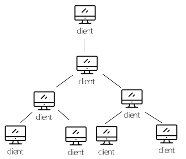

# 네트워크 토폴로지에 대해서 아는 것을 모두 설명해주세요.

## 네트워크 토폴로지란?

    컴퓨터 네트워크의 요소들(링크, 노드 등)을 물리적으로 연결해 놓은것, 또는 그 연결 방식.(통신망의 구조)

    정보 통신망의 구성이라는 것은 데이터 통신을 위해서 각각의 저오 단말장치(컴퓨터)를 어떤 형태로 연결할 것인가에 대한 내용입니다.

## 종류

- 계층형(Tree) 토폴로지

  - 트리 구조 형태로 정보 통신망을 구성하는 것으로 저오 단말 장치를 추가하기 용이한 구성.

    

  - 장점
    - 네트워크 관리가 쉽고 확장이 편리하다.
    - 네트워크의 신뢰도가 높다.
  - 단점
    - 특정 노드에 트래픽이 집중화 되면 네트워크 속도가 떨어진다. -병목 현상이 발생할 수가 있다.

 

- 버스형(Bus) 토폴로지

  - 중앙의 통신 회선 하나에 여러 개의 정보 단말 장치가 연결된 구조로 LAN에서 주로 사용합니다.
  - 터미네이터(Terminator)는 시그널의 반사를 방지하기 위해 사용합니다. 목적지 없는 데이터를 잡는 역할을 합니다.

    

  - 장점
    - 설치비용이 적고 신뢰성이 우수하다.
    - 구조가 간단하다.
    - 버스에 노드 추가가 쉽다.(확장이 쉽다.)
    - 한 클라이언트가 죽어도 망에는 지장이 없습니다.
  - 단점
    - 전송되는 데이터가 많으면 네트워크 병목 현상이 발생합니다.
    - 장애 발생 시에 전체 네트워크에 영향을 받습니다.

 

- 성형(Start) 토폴로지

  - 중앙에 있는 정보 단말 장치에 모두 연결된 구조로 항상 중앙의 정보 단말 장치를 통해서만 연결이 가능한 구조입니다.
  - 성형은 중앙의 정보 단말 장치에 에러가 발생하면 모든 통신이 불가능 합니다.

    

  - 장점
    - 고속의 네트워크에 적합합니다.
    - 노드 추가가 쉽고 에러 탐지가 용이합니다.(관리, 제어가 용이합니다.)
    - 노드에 장애가 발생해도 네트워크는 사용이 가능합니다.
  - 단점
    - 중앙 노드에 장애가 발생하면 전체 네트워크를 사용할 수가 없습니다.
    - 설치 비용이 고가이고 노드가 증가하면 네트워크 복잡도가 올라갑니다.

 

- 링형(Ring) 토폴로지

  - 인접해 있는 정보 단말 장치가 연결된 구조
  - 링형은 토큰링(Token Ring)에서 사용한다.
  - 토큰을 가진 client만 통신이 가능합니다.
  - 토큰은 링을 돌며 통신 권한이 있는 client를 찾습니다.

    

  - 장점

    - 노드의 수가 증가 되어도 데이터 손실이 없다.
    - 충돌이 발생하지 않는다. (토큰을 가지고 통신을 하기 때문에 토큰의 순서가 아닌 client는 통신에 참여하지 않는다.)
    - 경제적인 네트워크 구성이 가능하다.

  - 단점
    - 네트워크 구성의 변경이 어렵다.
    - 회선에 장애 발생 시 전체 네트워크를 사용할 수가 없다.
    - 토큰이 없는 client는 통신을 하지 못한다. - 즉 속도 및 효율성이 떨어진다.

 

- 망형(Mesh) 토폴로지

  - 모든 정보 단말 장치가 통신회선을 통해서 연결된 구조로 한쪽 통신회선에 에러가 발생해도 통신을 수행할 수 있는 구조.
  - 망형은 국방 네트워크처럼 한 네트워크에 장애가 발생해도 네트워크를 계속 사용할 수 있는 안전한 네트워크이다.

  

  - 장점

    - 완벽하게 이중화가 되어 있으므로 장애 발생 시에 다른 경로를 통해서 네트워크를 사용할 수가 있다. (가용성이 좋다.)
    - 많은 양의 데이터를 송수신 할 수가 있다.

  - 단점
    - 네트워크 구축 비용이 고가이다.
    - 운영 비용이 고가이다.

 

# 스위치와 라우터의 차이점에 대해서 설명해주세요.

## 스위치

- 목적지로 출발한 데이터를 중간에 적합한 경로로 스위칭해주는 역할을 하는 것이 스위치이고 스위치는 데이터링크 계층에 속합니다. 스위치는 데이터 링크 계층에 속해 있으므로 MAC주소 기반으로 동작합니다.

## 라우터

- 라우터 또한 목적지로 가는 적합한 경로를 찾아주는 라우팅 기능을 합니다. 라우터는 IP주소를 기반으로 작동하여 네트워크 계층에 속해있습니다.

## 둘의 차이점

- 가장 대표적인 차이점으로는 계층의 차이입니다. 라우터는 네트워크 계층, 스위치는 데이터 링크 계층에서 동작합니다.
- 스위치는 브로드캐스트 도메인을 구분할 수 없는 반면 라우터는 브로드캐스트 도메인을 구분하여 서로 다른 네트워크 대역을 구분합니다.
- 스위치는 불명확한 목적지를 가진 데이터를 처리할 때 모든 포트로 데이터를 퍼뜨리는 브로드캐스트를 하지만 라우터는 해당 데이터를 버립니다.
- 스위치는 관리자의 설정이 필요없지만 라우터는 관리자의 설정으로 라우팅 테이블 생성과 통신을 해야합니다.

 

# 용어 정리

### 병목현상이란?

- 전체 시스템의 성능이나 용량이 하나의 구성 요소로 인해 제한을 받는 현상입니다. 어떤 시스템 내 데이터의 집중적인 사용으로 인해, 전체 시스템에 절대적 영향을 미치는 부분의 사용 빈도가 늘어나 그 부분의 성능이 저하되어 전체 시스템이 마비되는 것으로, 쉽게 말하자면 컴포넌트별로 서로 등급이 안 맞아서 제성능을 못 낸다고 보면 된다.

### LAN이란?

- LAN(Local Area Network)
  - 근거리 영역의 네트워크로 동일한 지역(공장, 사무실) 내의 고속의 전용 회선으로 연결하여 구성하는 통신망 입니다.
  - 단일 기관의 소유의 네트워크로 수 Km 범위 이내 한정된 지역에서 사용합니다.
  - Client / Server 와 Peer-to-Peer 모델.
  - WAN(Wide Area Network)보다 빠른 통신 속도를 지닙니다.

### MAC주소란?

- 네트워크 세그먼트의 데이터 링크 계층에서 통신을 위한 네트워크 인터페이스에 할당된 고유 식별자 입니다.
- 이더넷과 와이파이를 포함한 대부분의 IEEE 802 네트워크 기술에 네트워크 주소로 사용됩니다.

### 브로드캐스트 도메인이란?

- LAN상에서 어떤 단말이 브로드캐스트 패킷을 송출할 때 이 패킷에 대해 네트워크에서 영향을 받는 영역 또는 그 패킷을 수신할 수 있는 단말들의 집합을 이야기합니다.
