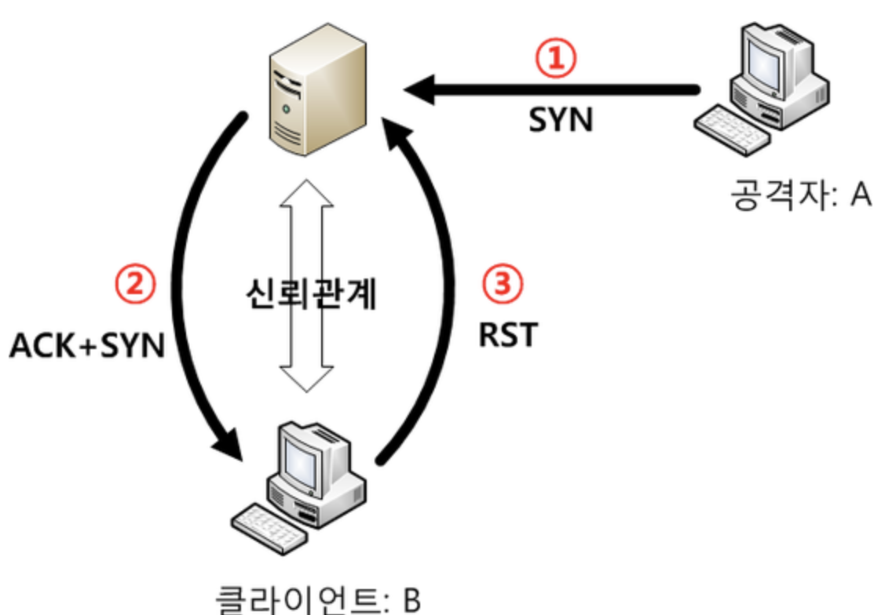
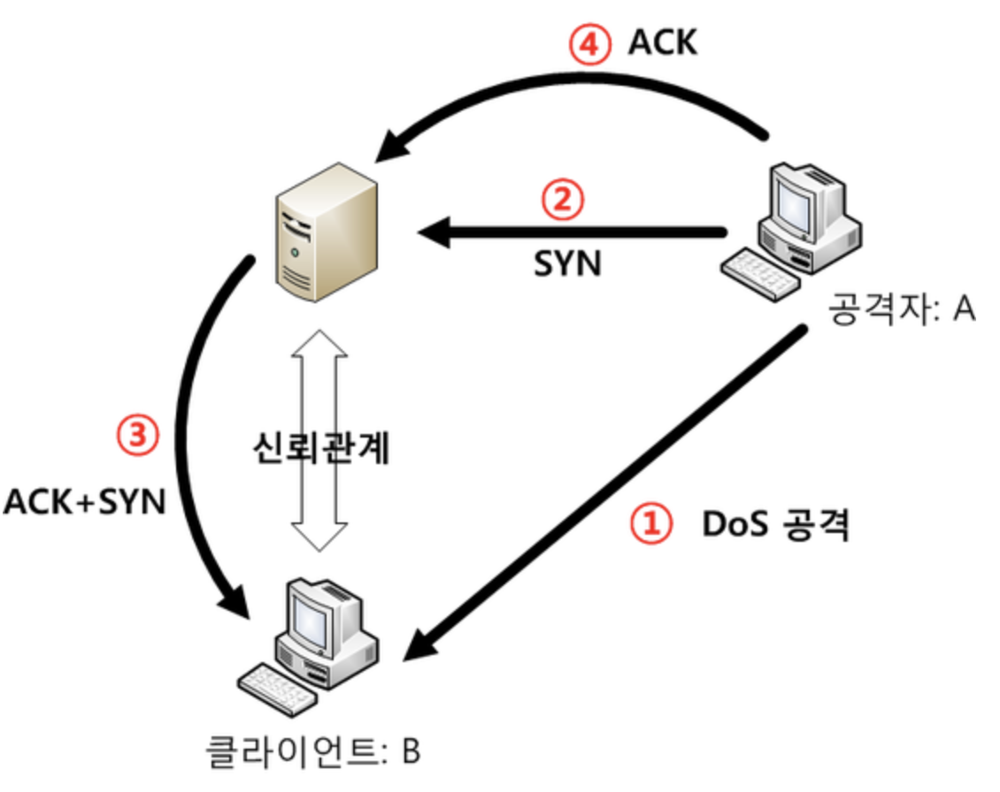
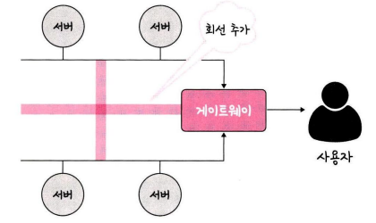

# 네트워크 토폴로지와 병목현상

## 네트워크 토폴로지(네트워크 구조)

- 네트워크 토폴로지는 노드와 링크가 어떻게 배치되어 있는지에 대한 방식이나 연결 형태를 의미
- 종류
  - 트리 토폴로지(계층형 토폴로지)
  - 버스 토폴로지
    - 스푸핑 : LAN상에서 송신부의 패킷을 송신과 관련 없는 다른 호스트에 가지 않도록 하는 스위칭 기능을 마비시키거나 속여서 특정 노드에 해당 패킷이 오도록 처리하는 것
      
      
  - 스타 토폴로지
  - 링형 토폴로지
  - 메시 토폴로지
    <br/><br/>
- 네트워크 토폴로지가 중요한 이유 -> 병목 현상을 찾을 때 중요한 기준

```
병목(Bottle neck) 현상이란 전체 시스템의 성능이나 용량이 하나의 구성 요소로 인해 제한을 받는 현상을 말한다.
병목 현상이 일어났을 경우, 네트워크가 어떤 토폴로지를 갖는지, 또, 어떠한 경로로 이루어져 있는지 안다면, 병목 현상에 좀 더 효율적으로 대처할 수 있다.
```

- <병목 현상이 일어난 네트워크 토폴로지>
  

- 네트워크가 어떤 토폴로지를 갖는지를 안다면 회선을 적절하게 추가시킴으로써 병목 현상을 무난하게 해결할 수 있다.
- <적절한 회선 추가를 통한 병목 현상 해결>
  
