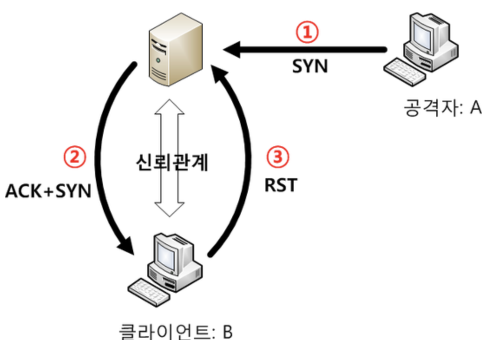
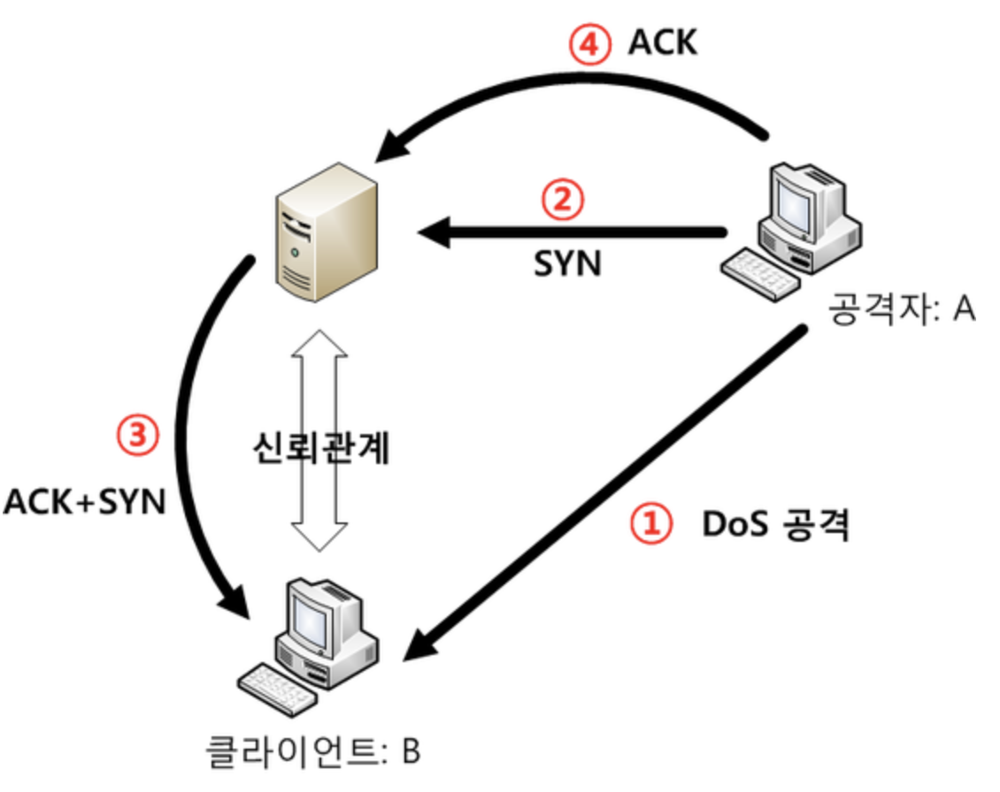
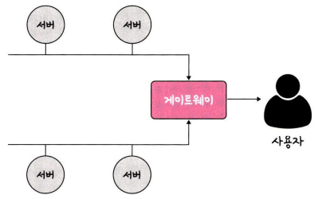
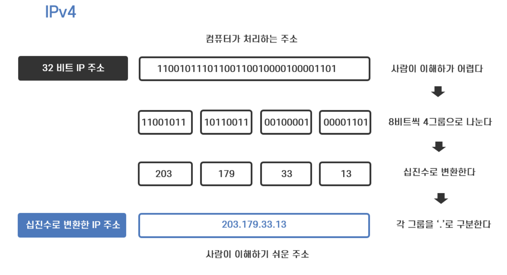
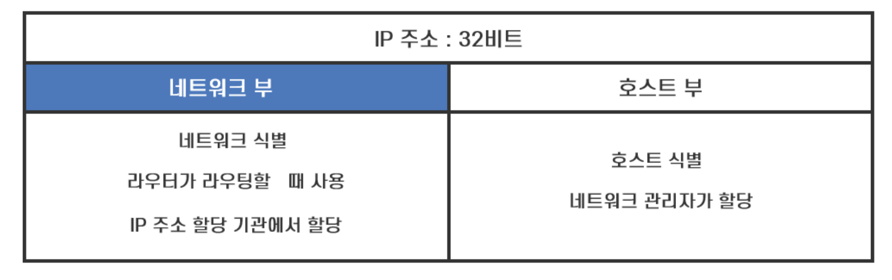

# 네트워크 토폴로지와 병목현상

## 네트워크 토폴로지(네트워크 구조)

- 네트워크 토폴로지는 노드와 링크가 어떻게 배치되어 있는지에 대한 방식이나 연결 형태를 의미
- 종류
  - 트리 토폴로지(계층형 토폴로지)
  - 버스 토폴로지
    - 스푸핑 : LAN상에서 송신부의 패킷을 송신과 관련 없는 다른 호스트에 가지 않도록 하는 스위칭 기능을 마비시키거나 속여서 특정 노드에 해당 패킷이 오도록 처리하는 것
      
      
  - 스타 토폴로지
  - 링형 토폴로지
  - 메시 토폴로지
    <br/><br/>
- 네트워크 토폴로지가 중요한 이유 -> 병목 현상을 찾을 때 중요한 기준

```
병목(Bottle neck) 현상이란 전체 시스템의 성능이나 용량이 하나의 구성 요소로 인해 제한을 받는 현상을 말한다.
병목 현상이 일어났을 경우, 네트워크가 어떤 토폴로지를 갖는지, 또, 어떠한 경로로 이루어져 있는지 안다면, 병목 현상에 좀 더 효율적으로 대처할 수 있다.
```

- <병목 현상이 일어난 네트워크 토폴로지>
  

- 네트워크가 어떤 토폴로지를 갖는지를 안다면 회선을 적절하게 추가시킴으로써 병목 현상을 무난하게 해결할 수 있다.
- <적절한 회선 추가를 통한 병목 현상 해결>
  

---

<br>

## IP 주소 체계

- IP 주소는 전 세계에서 유일하게 할당되어야 한다.
- IPv4 주소 체계와 IPv6 주소 체계로 나누어져 있으며 현재는 IPv4 주소 체계(32bit)를 사용하고 있다.
- 하지만 모든 사물이 인터넷으로 연결되는 사물 인터넷으로 인해 IP주소를 사용하는 기기가 폭발적으로 증가하면서 ,IPv4보다 월등히 많은 수의 IP주소를 할당할 수 있는 IPv6 주소체계로 대체될 것으로 보입니다.



- IPv4로 할당할 수 있는 IP 주소의 개수는 2^32(약 43억개)
- IP 주소의 구성 ( 네트워크 부 , 호스트 부 )
  - 호스트가 속한 네트워크 주소인 네트워크 부
    - 어떤 네트워크 인지를 나타내 다른 네트워크와 구분하는 역할
  - 호스트의 주소인 호스트 부
    - 해당 네트워크의 어느 호스트인지를 나타내 다른 호스트와 구분하는 역할
- cf) 호스트 - 컴퓨터뿐만 아니라 IP 주소가 할당되는 라우터를 포함

- 같은 네트워크 안에 있는 컴퓨터, 즉 라우터 없이도 데이터 전송이 가능한 컴퓨터는 네트워크 부가 동일하고 호스트 부만 다릅니다.
  <br> 달리 말하면 네트워크 부가 다르다는 것은 서로 다른 네트워크라는 의미이고, 라우터를 통하지 않고는 통신이 불가능하다는 뜻입니다. <br>서로 다른 네트워크가 라우터를 통해 통신이 가능한 것은 라우터가 IP 주소의 네트워크 부를 보고 라우팅을 하여 데이터를 전송하기 때문입니다.



- IP주소의 네트워크 주소와 호스트 주소를 구분할 수 있다.(IP주소의 클래스)
- A,B,C,D,E 클래스로 나누어져있다. ( D - 멀티캐스트용, E - 연구용으로 사용합니다. )

[IPv4 주소체계 참고자료](https://better-together.tistory.com/118)

[IP 주소의 클래스](https://limkydev.tistory.com/168)
