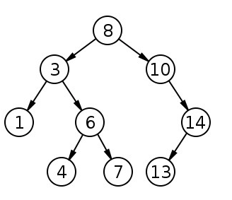

### BST(이진 탐색 트리)에 대해서 설명하세요.

<hr/>



이진탐색트리(Binary Search Tree)는 이진 탐색과 연결 리스트를 결합한 자료구조이다. 이진 탐색의 효율적인 탐색 능력을 유지하면서, 빈번한 자료 입력과 삭제가 가능하다는 장점이 있다. 이진 탐색 트리는 왼쪽 트리의 모든 값이 반드시 부모 노드보다 작아야 하고, 반대로 오른쪽 트리의 모든 값이 부모 노드보다 커야 하는 특징을 가지고 있어야 한다. 이진 탐색 트리의 탐색, 삽입, 삭제의 시간복잡도는 O(h)이다. 트리의 높이에 영향을 받는데, 트리가 균형이 맞지 않으면 워스트 케이스가 나올 수 있다.

모든 부모 노드들의 left child는 부모 노드의 데이터보다 값이 작아야 하고, right child는 부모 노드의 값보다 커야한다. 여기서 중위순회(Inorder Travel)을 적용하면 오름차순 정렬이 된다.

### PriorityQueue의 동작 원리가 어떻게 되나요? (naver 전화면접 기출)

<hr/>

우선순위큐는 가장 우선순위가 높은 데이터를 먼저 꺼내기 위해 고안된 자료구조이다. 우선순위 큐를 구현하기 위해서 일반적으로 힙을 사용한다. 힙은 완전이진트리를 통해서 구현되었기 때문에 우선순위 큐의 시간복잡도는 O(logn)이다.

우선순위 큐는 힙이라는 자료구조를 가지고 구현한다. top이 최대면 최대힙, top이 최소면 최소힙으로 표현한다. 힙으로 구현된 이진 트리는 모든 정점이 자신의 자식 요소보다 우선순위가 높다는 성질을 가지고 있다. 이 성질을 통해 삽입과 삭제 연산을 모두 O(logN)으로 수행할 수 있다.

- Queue 인터페이스를 구현하였다.
- 저장한 순서에 상관없이 우선순위(priority)가 높은 것부터 꺼낸다.
- null을 저장하면 NullPointerException이 발생한다.
- 배열을 사용하며, 각 요소를 힙이라는 자료구조의 형태로 저장한다. ( JVM의 힙과 자료구조의 힙은 다르다!)
- Priority Queue API

```
import java.util.PriorityQueue; //import

//int형 priorityQueue 선언 (우선순위가 낮은 숫자 순)
PriorityQueue<Integer> priorityQueue = new PriorityQueue<>();

//int형 priorityQueue 선언 (우선순위가 높은 숫자 순)
PriorityQueue<Integer> priorityQueue = new PriorityQueue<>(Collections.reverseOrder());

//String형 priorityQueue 선언 (우선순위가 낮은 숫자 순)
PriorityQueue<String> priorityQueue = new PriorityQueue<>();

//String형 priorityQueue 선언 (우선순위가 높은 숫자 순)
PriorityQueue<String> priorityQueue = new PriorityQueue<>(Collections.reverseOrder());
```

```
Queue pq = new PriorityQueue();

pq.offer(9);
pq.offer(3);
pq.offer(5);

답:3,5,9
```

- 위의 pq를 출력하면 3,5,9가 나온다. 저장순서와 출력순서가 다르다. 우선순위는 숫자가 작을수록 높아져서 3이 가장 먼저 출력된다.

### 해시테이블과 해시테이블의 시간복잡도에 대해서 설명하세요.

<hr/>

해시테이블은 효율적인 탐색을 위한 자료구조로 key값을 value에 대응시킨다. 해시테이블을 구현하기 위해서는 연결 리스트와 해쉬 함수가 필요하다. 해싱은 임의의 길이의 값을 해쉬 함수를 통해 고정된 크기의 값으로 변환하는 작업을 말하는데, 키 값을 해시 코드로 변환한 후 해당 해시 코드로 배열의 인덱스를 참조하여 값을 찾는다. 충돌이 발생할 수 있으며, 최악의 경우 O(N), 일반적으로 잘 구현된 경우는 O(1)의 시간 복잡도를 가지게 된다. 충돌은 Chaining, Open addressing 등의 방식으로 해결할 수 있다.
https://ict-nroo.tistory.com/76

해시테이블은 균형 이진 탐색 트리로도 구현할 수 있다. 이 경우는 탐색 시간이 O(logN)이 된다. 이 방법은 크기가 큰 배열을 미리 할당해 놓지 않아도 되기 때문에 잠재적으로 적은 공간을 사용한다는 장점이 있다.

해시 테이블은 고유한 index로 값을 조회하기 때문에 평균적으로 O(1)의 시간복잡도를 갖는다. 하지만 해시의 index값이 충돌이 발생한 경우 충돌된 index값에 대해 연결된 데이터들을 조회하여 원하는 값을 조회하기 때문에 O(N)까지 증가할 수 있다.
