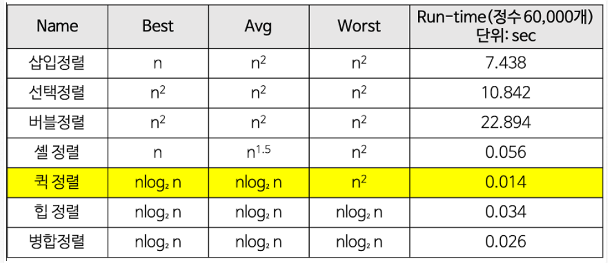

# DFS와 BFS를 비교해 보세요.

✅ **DFS**

- 깊이 우선 탐색

- 루트 노드에서 시작해서 다음 분기로 넘어가기 전에 해당 분기를 완벽하게 탐색한다.

- 넓게 탐색하기 전에 깊게 탐색하는 것이다.

- 예를 들어, 미로를 탐색할 때 한 방향으로 갈 수 있을 때까지 계속 가다가 더 이상 갈 수 없게 되면 다시 가장 가까운 갈림길로 돌아와서 이곳으로부터 다른 방향으로 다시 탐색을 진행하는 방법과 유사하다.

- 스택이나 재귀함수를 통해 구현한다.

- 모든 경로를 방문해야 할 경우 사용에 적합하다.

 

    🔑 메모리도 많이 잡아먹고 헷갈리는 재귀함수 왜 씀?

      - 명령형 프로그래밍이 아니라 선언형 프로그래밍
      - 함수가 호출되면 운영체제가 스택메모리에 원래 함수의 정보를 유지한다는 특징을 활용해서 개발자의 구현 측면에서 편리함을 얻을 수 있게 되는 것
      - 정리하자면, for문으로 DFS와 같은 코드 흐름을 만들기 위해서는 개발자가 stack이라는 자료구조를 만들어서 필요한 정보들을 구조체 형식으로 저장하는 등 복잡한 절차를 거쳐야 하지만, 재귀로 구현하면 이 복잡한 절차를 운영체제가 알아서 해준다는 것이 개발자 입장에서 아주 편리하다고 할 수 있다.

 

✅ **BFS(Breadth-First Search)**

- 너비 우선 탐색

- 루트 노드 혹은 임의의 노드에서 시작해 인접한 노드를 먼저 탐색하는 방법.

- 시작 정점으로부터 가까운 정점을 먼저 방문하고 멀리 떨어져 있는 정점을 나중에 방문하는 순회 방법이다.

- 즉, 깊게 탐색하기 전에 넓게 탐색하는 것이다.

- 큐를 사용한다. (해당 노드의 주변부터 탐색해야 하기 때문이다.)

- 최소 비용(즉, 모든 곳을 탐색하는 것보다 최소 비용이 우선일 때)에 적합하다.

# 정렬 알고리즘의 시간 복잡도 비교

# Array vs LinkedList

**Array**는 인덱스(index)로 해당 원소(element)에 접근할 수 있어 찾고자 하는 원소의 인덱스 값을 알고 있으면 O(1)에 해당 원소로 접근할 수 있습니다. 즉, RandomAccess가 가능해 속도가 빠르다는 **장점**이 있습니다.

하지만 삽입 또는 삭제의 과정에서 각 원소들을 shift 해줘야 하는 비용이 생겨 이 경우 시간 복잡도는 **O(n)** 이 된다는 **단점**이 있습니다.

이 문제점을 해결하기 위한 자료구조가 **LinkedList**입니다. 각각의 원소들은 자기 자신 다음에 어떤 원소인지만을 기억하고 있기 때문에 이 부분만 다른 값으로 바꿔주면 삽입과 삭제를 O(1)로 해결할 수 있습니다.

하지만 **LinkedList**는 원하는 위치에 한 번에 접근할 수 없다는 **단점**이 있습니다. 원하는 위치에 삽입을 하고자 하면 원하는 위치를 Search 과정에 있어서 첫번째 원소부터 다 확인해봐야 합니다.

🔑 간단히 정리하면,
**Array**는 검색이 빠르지만, 삽입, 삭제가 느리다.
**LinkedList**는 삽입, 삭제가 빠르지만, 검색이 느리다.
