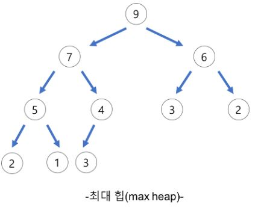
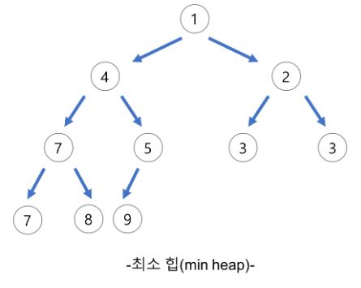
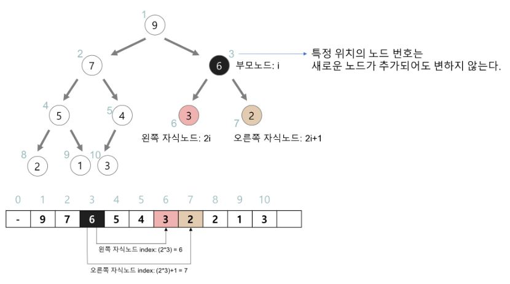

# 배열과 연결리스트이 장단점에 대해서 설명해주세요.

## 배열

    - 장점 : 메모리에 연속된 공간으로 저장된다 그렇기 때문에 빠른 순회가 가능하다. RandomAccess가 가능하다.
    - 단점 : 중간에 데이터를 삽입하거나, 배열의 데이터가 다 찬 상태에서 삽입이 이루어질 때 복사 비용이 들게 된다.

## 연결 리스트(Linked List)

    - 장점 : 삽입과 삭제 모두 O(1)시간에 가능하다.
    - 단점 : 임의의 위치에 한번에 접근할 수 없다.

### 배열과 연결리스트의 삽입 삭제 시간 복잡도 설명

배열에서의 삽입 삭제는 O(N) 타임이 소요됩니다. 왜냐하면 삽입이나 이후 요소들을 밀고 당기는 과정이 포함되기 때문입니다.
하지만 연결리스트의 삽입 삭제는 O(1) 이 소요됩니다. 삽입위치의 전후 포인터만 조정해주면 되기 때문입니다.

# 자료구조 힙(Heap)에 대해서 설명해주세요.

.JPG>)

- 완전 이진 트리의 일종으로 우선순위 큐를 위하여 만들어진 자료구조 입니다.
- 여러개의 값들 중에서 최댓값이나 최솟값을 빠르게 찾아내도록 만들어진 자료구조 입니다.
- 일종의 반정렬 상태(느슨한 정렬 상태)를 유지합니다
  - 큰 값이 상위레벨에 있고 작은 값이 하위 레벨에 있다는 정도
  - 간단히 말하면 부모노드의 키 값이 자식 노드의 키 값보다 항상 큰(작은) 이진트리를 말한다.
- 힙트리에서는 중복된 값을 허용합니다. (이진 탐색 트리에서는 중복된 값을 허용하지 않습니다.)

## 힙의 종류

### 최대 힙(max heap)

    - 부모 노드의 키 값이 자식 노드의 키 값보다 크거나 같은 완전 이진 트리
    key(부모 노드) >= key(자식 노드)

### 최소 힙(min heap)

    - 부모 노드의 키 값이 자식 노드의 키 값보다 작거나 같은 완전 이진 트리
    key(부모 노드) <= key(자식 노드)

## 힙(heap)의 구현

- 힙을 저장하는 표준적인 자료구조는 배열 이다.
- 구현을 쉽게 하기 위하여 배열의 첫 번째 인덱스인 0은 사용되지 않는다.
- 특정 위치의 노드 번호는 새로운 노드가 추가되어도 변하지 않는다.
  - 예를 들어 루트 노드의 오른쪽 노드의 번호는 항상 3이다

### 힙에서의 부모 노드와 자식 노드의 관계

- 왼쪽 자식의 인덱스 = (부모의 인덱스) \* 2
- 오른쪽 자식의 인덱스 = (부모의 인덱스) \* 2 + 1
- 부모의 인덱스 = (자식의 인덱스) / 2

