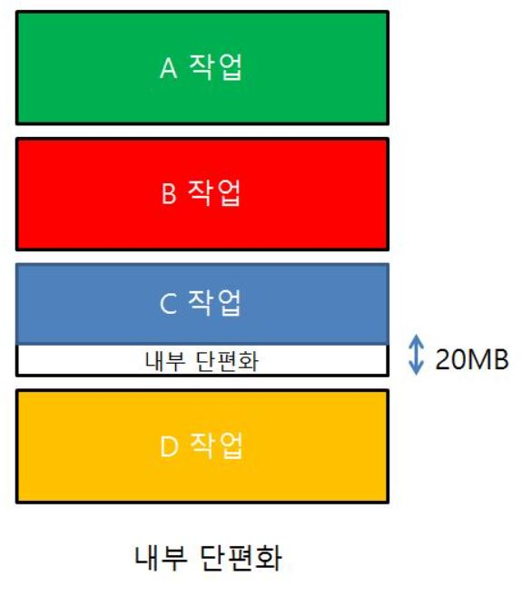
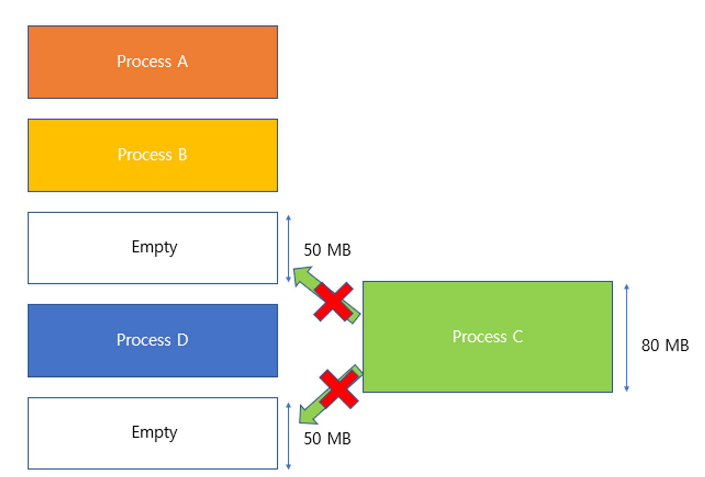
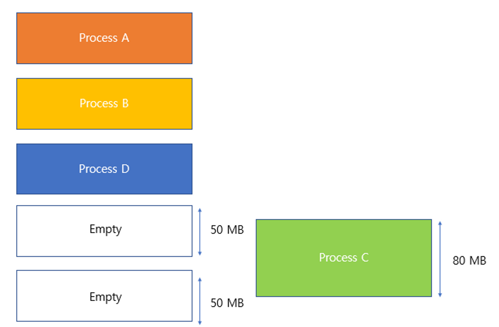
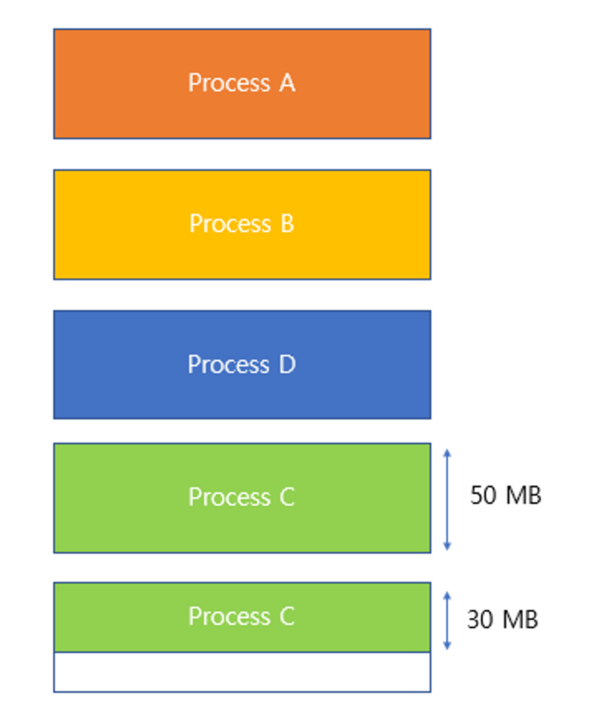

# 세그멘테이션에 대해서 설명하세요.

**“프로세스를 논리적 내용을 기반으로 잘라서 메모리에 배치하는 것”**

    메모리를 서로 크기가 다른 논리적인 블록 단위인 세그먼트(segment)로 분할하고 메모리를 할당하여 물리 주소를 논리 주소로 변환하는 것을 말한다. 미리 분할하는 것이 아니라 메모리를 사용할 시점에 할당된다. 내부단편화는 없지만 외부단편화가 발생할 수 있다.

    - Segmentation : 삼겹살(세그먼트1), 목살(세그먼트2), 갈비(세그먼트3), 껍데기(세그먼트4), 항정살(세그먼트5)
    - 물리 주소 : 메모리는 ‘데이터를 저장하는 컨테이너’ 그 이상도 이하도 아니기에 굉장히 큰 배열이라고 생각해도 무방. 따라서 물리주소란 **메모리 자체의 인덱스**를 뜻한다.
    - 논리 주소 : =가상 주소이다. **CPU입장에서의 메모리 주소** 혹은 **프로그램 실행중에  CPU가 생성하는 주소**이다. 논리 주소를 사용하는 이유는 프로세스가 물리적 주소에 직접 접근하게 되면 아무런 안전장치가 없기 때문에 프로세스끼리 주소 공간을 침범할수 있는 문제가 발생하므로 이를 대비하기 위함(멀티 프로세싱) 이다. 즉 **“여기가 나의 공간이야”** 라는 표시가 바로 논리주소이다. **‘시작 주소 +크기 = 끝 주소’** 이므로 이 사이를 침범하는 상황이 발생하면 에러를 발생시키면 되기 때문이다. 이렇듯 모든 프로세스는 ‘시작 주소’와 ‘크기’를 나타내는 레지스터가 정의되어 있는데, 각각 ‘Base Register’와 ‘Limit Register’라고 부른다.

- 내부단편화 & 외부단편화
  하위 그림과 같이 빈 공간이 50MB 인데 안에 들어간 프로세스가 30MB일 경우 20MB라는 공간이 남게 된다.  
   저 공간은 너무 작아 다른 작업들이 사용하지 못하게 되는데 이러한 작은 빈공간(낭비)들을  **내부단편화** 라고 한다.

    외부단편화는 메모리에 남아 있는 공간은 100MB(50MB+50MB)인데 C라는 작업이 70MB일때 일어나는 경우입니다.
    메모리에는 100MB라는 용량이 남아 있지만 C작업은 메모리에 들어가지 못하게 된다.
    즉 작업보다 많은 공간이 남아 있더라도 실제로 그 작업을 받아 들이지 못하는 경우를 외부단편화라고 하는 것이다.

    ⇒ 외부단편화 해결방법으로는 압축방법이 있습니다.

    외부 단편화 문제를 해결하기 위해서 압축 기법을 사용할 수 있다. 압축 기법은 주기억장치 내 분산되어 있는 단편화된 공간들을 통합하여 하나의 커다란 빈 공간을 만드는 작업을 의미한다.

예를 들어 아래와 같이 외부단편화가 발생한 상황을 살펴보자.

## 외부단편화

    이때 빈 공간을 하나의 연속된 공간으로 만들면(압축) 아래와 같이 된다.

## 압축

    위와 같이 흩어져 있던 공간을 연속된 공간, 즉 하나의 공간으로 만들면 기존에 할당 할 수 없던 프로세스를 할당할 수 있게 된다.

압축 결과

    따라서 위와 같이 할당 할 수 있다.

⇒ 단편화 해결 방법

- 방법
  - **통합 기법**
    - 하나의 작업 완료 후 그 사용 영역이 다른 비어있는 분할 공간과 인접해 있는지 점검하여 만약 **인접해 있다면 두 개의 빈 분할 공간을 하나로 통합하여 효율성을 높이는 작업**
  - **압축 기법**
    - 주기억장치 내 분산되어 있는 단편화된 비어있는 공간들을 통합하여 **하나의 커다란 빈 공간을 만드는 작업**.
      - 가비지 컬렉션(**Garbage Collection**) 작업 이라고도 함.
  - **재배치 기법**(Relocation)
    - 기억장치 관리에서 Fragmentation을 해결하기 위해 압축을 실행하여 이 과정에서 **프로그램의 주소를 새롭게 지정**해주는 기법

  

# 페이징의 장점과 단점에 대해서 설명하세요.

- 장점:
  - 메모리를 페이지단위로 가져와서, 프로세스의 효율적인 운영이 가능하다.
- 단점:
  - 페이지 크기별, 단위별로 페이지 폴트 현상이 발생할 수 있다.
  페이지 폴트란?
  - 프로그램이 자신의 주소 공간에는 존재하지만 시스템의 RAM에는 현재 없는 데이터나 코드에 접근 시도하였을 경우 발생하는 현상

  

- 세그멘테이션과 페이징 정리

  - 정리

    1. 세그멘테이션은 보호, 공유에 매우 좋습니다.
    2. 세그먼트로 짜르면 코드 데이터 스택 등 크기가 각각 달라집니다. ⇒ 이때 2개의 조각난 메모리 공간을 합해야 메모리에 올릴 수 있는 상황이 발생할 수 있습니다.(외부단편화 문제)
       ⇒ 이걸 해결하기 위해 세그멘테이션 + 페이징을 합쳐서 사용
       = 1) 세그멘트를 페이징 함.
    3. 프로세스를 자를 때 처음에는 의미있는 세그멘트로 자름.(코드, 데이터, 스택)

    4. 그 다음 코드 데이터 스택을 일정한 간격(page)로 잘라줍니다.
