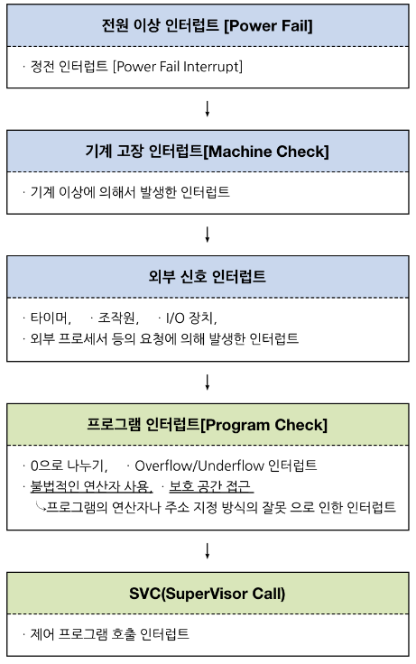
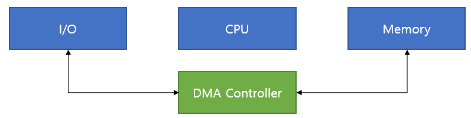

# 인터럽트에 대해서 설명하세요.

    CPU가 프로그램을 실행하고 있을 때, 입출력 하드웨어 등의 장치나 예외상황이 발생하여 처리가 필요할 경우 현재 실행중인 작업을 중단하고 발생한 상황을 처리한 후 다시 실행중인 작업으로 복귀하는 작업

    지금 수행 중인 일보다 `더 중요한일`(Ex. 입출력, 우선 순위 연산 등)이 발생하면 `그 일을 먼저 처리`하고 나서 하던 일을 계속해야함

    참고자료 : [IT위키](https://itwiki.kr/w/인터럽트)
    [[OS기초] 인터럽트 제대로 이해하기](https://velog.io/@adam2/인터럽트)
    [https://github.com/JulSaMo/CS-start/blob/main/Computer Science/Operating System/인터럽트.md](https://github.com/JulSaMo/CS-start/blob/main/Computer%20Science/Operating%20System/%EC%9D%B8%ED%84%B0%EB%9F%BD%ED%8A%B8.md)

## **인터럽트 정리**

    인터럽트는 크게 2종류 하드웨어 인터럽트와 소프트웨어 인터럽트로 나눕니다.

- 하드웨어 인터럽트 종류
  - 입출력 인터럽트 (I/O interrupt) - 입출력 작업의 종료나 입출력 오류에 의해 CPU의 기능이 요청됨 - 정전,전원 이상 인터럽트(Power fail interrupt) - 전원 공급의 이상 - 기계 착오 인터럽트(Machine check interrupt) - CPU의 기능적인 오류 - 외부 신호 인터럽트(External interrupt) - I/O 장치가 아닌 오퍼레이터나 타이머에 의해 의도적으로 프로그램이 중단된 경우
      
- 소프트웨어 인터럽트
  - CPU내부에서 자신이 실행한 명령이나 CPU의 명령 실행에 관련된 모듈이 변화하는 경우 발생 - trap 또는 exception 이라고도 함 - 프로그램의 오류에 의해 생기는 인터럽트
      
- 소프트웨어 인터럽트 종류
  - 0으로 나누는 경우OverFlow/UnderFlow페이지 부재부당한 기억장소의 참조등등...
  - SVC(Supervisor Call: 감시프로그램 호출)인터럽트
    - 사용자가 프로그램을 실행시키거나 supervisior을 호출하는 동작을 수행하는 경우
    - 프로그래머에 의해 코드로 짜인 감시 프로그램을 호출하는 방식

**인터럽트 우선순위**

  

# DMA 의 존재 이유에 대해서 설명하세요.

    인터럽트 처리도 일종의 오버헤드(어떤 처리를 하기 위해 들어가는 간접적인 처리 시간 · 메모리). 인터럽트가 CPU 입장에서는 자주 발생하는 일은 아니지만, 너무 많은 인터럽트가 발생되면 CPU에도 비효율이 발생한다. 너무 잦은 인터럽트를 방지하기 위해 DMA를 사용한다.

## `DMA(Direct Memory Access)`

    입출력장치와 메모리 사이 데이터 흐름에서 CPU를 배제하기 위해 사용하는 입출력 제어 방식

`**기본적인 입출력 제어 방식**`

    예를 들어 하드디스크에서 메모리로 데이터를 이동시킨다. 이때 가장 기본적인 방식인 Programmed I/O(Polling) 방식으로 구현하면 하드디스크에서 데이터를 꺼낸 후 시스템 버스를 통해 CPU 레지스터에 옮겨지고 다시 시스템 버스를 통해 CPU 레지스터에서 메모리로 이동한다.

    위와 같은 방식은 CPU를 거쳐가기 때문에 한곳을 더 거쳐가는 지연시간도 있겠지만 가장 큰 문제는 입출력 시간 동안 CPU가 idle 상태로 대기하는 것이다. I/O 디바이스에 비해 CPU는 비교할 수 없을 정도로 고속이기 때문에 그 시간을 낭비한다는 것은 상당히 비효율적이다.

## **`DMA : Direct Memory Access`**

    위 Programmed I/O 방식의 단점을 제거한것이 DMA 방식이다. DMA는 Direct Memory Access인데, 이름 그대로 입출력장치가 메모리에 직접 접근한다는 뜻이다.

    위 예에서 DMA Controller를 이용하면 하드디스크와 메모리를 직접 연결하여 CPU는 제어신호만 주고받을 뿐 데이터 전송에서 제외시킬 수 있다. 따라서 입출력 시 CPU는 제어를 위해 데이터 전송 시작과 완료에만 할당되어 CPU 자원의 낭비가 제거된다.

cf) 메모리는 CPU의 작업공간이기 때문에 I/O 장치들은 메모리에 직접 접근하지 못하고, CPU만 접근할 수 있다. 따라서 메모리에 저장할 수 있는 장치를 하나 더 만든 것이 DMA Controller

## `DMA 동작 순서`

    1. 입출력장치가 CPU에게 입출력 요청
    2. CPU가 DMA 컨트롤러에 명령 송신
    3. DMA가 CPU에게 시스템 버스 사용 요청
    4. CPU가 버스 사용 허가(CPU가 버스 사용 포기)
    5. DMA 컨트롤러가 입출력장치에서 데이터 읽은 후 메모리로 전송
    6. 전송 완료 후 CPU에게 완료 신호 송신

    참고자료 : [운영체제 - DMA 사용이유(DMA와 CPU, 메모리의 관계), 저장장치 계층구조별 특징과 캐싱](https://structuring.tistory.com/119)
