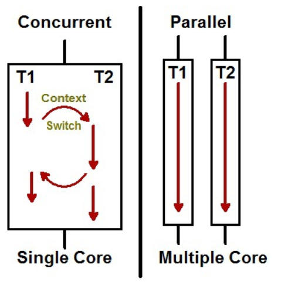

# 인터럽트에 대해서 설명하세요.

    CPU가 프로그램을 실행하고 있을 때, 입출력 하드웨어 등의 장치나 예외상황이 발생하여 처리가 필요할 경우 현재 실행중인 작업을 중단하고 발생한 상황을 처리한 후 다시 실행중인 작업으로 복귀하는 작업

    지금 수행 중인 일보다 `더 중요한일`(Ex. 입출력, 우선 순위 연산 등)이 발생하면 `그 일을 먼저 처리`하고 나서 하던 일을 계속해야함

    참고자료 : [IT위키](https://itwiki.kr/w/인터럽트)
    [[OS기초] 인터럽트 제대로 이해하기](https://velog.io/@adam2/인터럽트)
    [https://github.com/JulSaMo/CS-start/blob/main/Computer Science/Operating System/인터럽트.md](https://github.com/JulSaMo/CS-start/blob/main/Computer%20Science/Operating%20System/%EC%9D%B8%ED%84%B0%EB%9F%BD%ED%8A%B8.md)

## **인터럽트 정리**

    인터럽트는 크게 2종류 하드웨어 인터럽트와 소프트웨어 인터럽트로 나눕니다.

- 하드웨어 인터럽트 종류
  - 입출력 인터럽트 (I/O interrupt) - 입출력 작업의 종료나 입출력 오류에 의해 CPU의 기능이 요청됨 - 정전,전원 이상 인터럽트(Power fail interrupt) - 전원 공급의 이상 - 기계 착오 인터럽트(Machine check interrupt) - CPU의 기능적인 오류 - 외부 신호 인터럽트(External interrupt) - I/O 장치가 아닌 오퍼레이터나 타이머에 의해 의도적으로 프로그램이 중단된 경우
      
- 소프트웨어 인터럽트
  - CPU내부에서 자신이 실행한 명령이나 CPU의 명령 실행에 관련된 모듈이 변화하는 경우 발생 - trap 또는 exception 이라고도 함 - 프로그램의 오류에 의해 생기는 인터럽트
      
- 소프트웨어 인터럽트 종류
  - 0으로 나누는 경우OverFlow/UnderFlow페이지 부재부당한 기억장소의 참조등등...
  - SVC(Supervisor Call: 감시프로그램 호출)인터럽트
    - 사용자가 프로그램을 실행시키거나 supervisior을 호출하는 동작을 수행하는 경우
    - 프로그래머에 의해 코드로 짜인 감시 프로그램을 호출하는 방식

**인터럽트 우선순위**

  

# DMA 의 존재 이유에 대해서 설명하세요.

    인터럽트 처리도 일종의 오버헤드(어떤 처리를 하기 위해 들어가는 간접적인 처리 시간 · 메모리). 인터럽트가 CPU 입장에서는 자주 발생하는 일은 아니지만, 너무 많은 인터럽트가 발생되면 CPU에도 비효율이 발생한다. 너무 잦은 인터럽트를 방지하기 위해 DMA를 사용한다.

## `DMA(Direct Memory Access)`

    입출력장치와 메모리 사이 데이터 흐름에서 CPU를 배제하기 위해 사용하는 입출력 제어 방식

`**기본적인 입출력 제어 방식**`

    예를 들어 하드디스크에서 메모리로 데이터를 이동시킨다. 이때 가장 기본적인 방식인 Programmed I/O(Polling) 방식으로 구현하면 하드디스크에서 데이터를 꺼낸 후 시스템 버스를 통해 CPU 레지스터에 옮겨지고 다시 시스템 버스를 통해 CPU 레지스터에서 메모리로 이동한다.

    위와 같은 방식은 CPU를 거쳐가기 때문에 한곳을 더 거쳐가는 지연시간도 있겠지만 가장 큰 문제는 입출력 시간 동안 CPU가 idle 상태로 대기하는 것이다. I/O 디바이스에 비해 CPU는 비교할 수 없을 정도로 고속이기 때문에 그 시간을 낭비한다는 것은 상당히 비효율적이다.

## **`DMA : Direct Memory Access`**

    위 Programmed I/O 방식의 단점을 제거한것이 DMA 방식이다. DMA는 Direct Memory Access인데, 이름 그대로 입출력장치가 메모리에 직접 접근한다는 뜻이다.

    위 예에서 DMA Controller를 이용하면 하드디스크와 메모리를 직접 연결하여 CPU는 제어신호만 주고받을 뿐 데이터 전송에서 제외시킬 수 있다. 따라서 입출력 시 CPU는 제어를 위해 데이터 전송 시작과 완료에만 할당되어 CPU 자원의 낭비가 제거된다.

cf) 메모리는 CPU의 작업공간이기 때문에 I/O 장치들은 메모리에 직접 접근하지 못하고, CPU만 접근할 수 있다. 따라서 메모리에 저장할 수 있는 장치를 하나 더 만든 것이 DMA Controller

## `DMA 동작 순서`

    1. 입출력장치가 CPU에게 입출력 요청
    2. CPU가 DMA 컨트롤러에 명령 송신
    3. DMA가 CPU에게 시스템 버스 사용 요청
    4. CPU가 버스 사용 허가(CPU가 버스 사용 포기)
    5. DMA 컨트롤러가 입출력장치에서 데이터 읽은 후 메모리로 전송
    6. 전송 완료 후 CPU에게 완료 신호 송신

    참고자료 : [운영체제 - DMA 사용이유(DMA와 CPU, 메모리의 관계), 저장장치 계층구조별 특징과 캐싱](https://structuring.tistory.com/119)

# **`프로세스와 스레드의 차이`**

## 프로그램(Program): 어떤 작업을 위해 실행할 수 있는 파일

## 프로세스(Process)

1. 컴퓨터에서 연속적으로 실행되고 있는 컴퓨터 프로그램, 종종 스케줄링의 대상이 되는 작업(task)이라는 용어와 거의 같은 의미로 쓰인다.
2. 메모리에 올라와 실행되고 있는 프로그램의 인스턴스(독립적인 개체)
3. 운영체제로부터 시스템 자원을 할당받는 작업의 단위
4. 즉, 동적인 개념으로는 실행된 프로그램

cf) 할당받는 시스템 자원의 예:
CPU시간, 운영되기 위해 필요한 주소 공간, Code Data Stack Heap 구조로 되어 있는 독립된 메모리 영역

## 프로세스의 특징

- 프로세스는 각각 독립된 메모리 영역(Code, Data, Stack, Heap)을 할당받는다.
- 기본적으로 프로세스당 최소 1개의 스레드(메인 스레드)를 가지고 있다.
- 각 프로세스는 별도의 주소 공간에서 실행되며, 한 프로세스는 다른 프로세스의 변수나 자료구조에 접근할 수 없다.
- 한 프로세스가 다른 프로세스의 자원에 접근하려면 프로세스간의 통신(IPC, inter-process-communication)에 접근해야한다.
  ex) 파이프, 파일 소켓 등을 이용한 통신 방법 이용

## 스레드(Thread)

1. 프로세스 내에서 실행되는 여러 흐름의 단위
2. 프로세스의 특정한 수행 경로
3. 프로세스가 할당받은 자원을 이용하는 실행의 단위

## 스레드의 특징

- 스레드는 프로세스 내에서 각각 Stack만 할당받고 Code, Data, Heap 영역은 공유한다.
- 스레드는 한 프로세스 내에서 동작되는 여러 실행의 흐름으로, 프로세스 내의 주소공간이나 자원들(힙 공간 등)을 같은 프로세스 내의 스레드끼리 공유하면서 실행된다.
- 같은 프로세스 안에 있는 여러 스레드들은 같은 힙 공간을 공유한다. 반면에 프로세스는 다른 프로세스의 메모리에 직접 접근할 수 없다.
- 각각의 스레드는 별도의 레지스터와 스택을 갖고 있지만, 힙 메모리는 서로 읽고 쓸 수 있다.
- 한 스레드가 프로세스 자원을 변경하면, 다른 이웃 스레드(sibling thread)도 그 변경 결과를 즉시 볼 수 있다.

**프로세스는 자신만의 고유한 공간을 할당받아 사용하고,
스레드는 다른 스레드와 공간과 자원을 공유하면서 사용한다.**

# **`스레드의 출현 목적은?`**

    1. 프로세스의 크기가 작은 실행 단위 필요
    2. 프로세스의 생성 및 소멸에 따른 오버헤드 감소
    3. 빠른 컨텍스트 스위칭
    4. 프로세스들의 통신 시간, 방법 어려움 해소

    컨텍스트 스위칭: 여러개의 프로세스가 실행되고 있을 때, 기존에 실행되던 프로세스를 중단하고 다른 프로세스를 실행하는 것. 즉, CPU에 실행할 프로세스를 교체하는 기술

# **`멀티 스레드의 동시성과 병렬성을 설명해주세요`**

- 동시성: 멀티 작업을 위해 싱글 코어에서 여러 개의 스레드가 번갈아 실행하는 것.(동시에 실행하는 것처럼 보이지만 사실은 번갈아가면서 실행하고 있는 것임)
  이 떄, 다른 작업으로 바꿔서 실행할 때 내부적으로 컨텍스트 스위칭이 일어난다.
- 병렬성: 멀티 작업을 위해 멀티 코어에서 한 개 이상의 스레드를 포함하는 각 코어들을 동시에 실행하는 것

  
