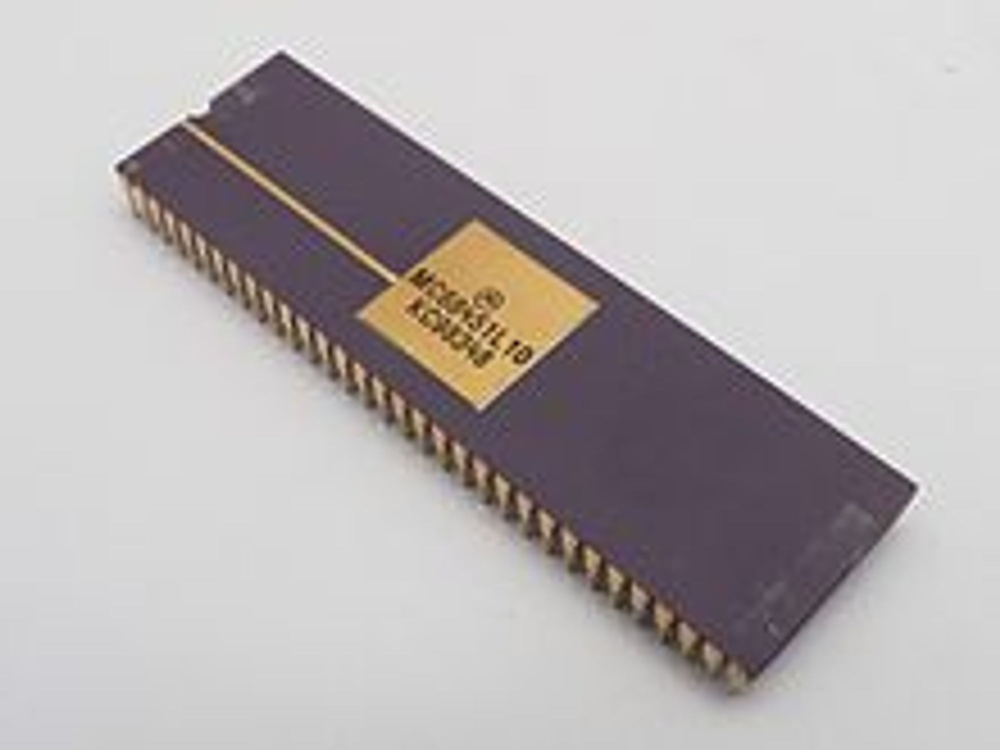

# Page Fault 를 줄이는 방법에 대해서 설명하세요.

✅ **Page Fault(페이지 부재라고도 함)란?**

    - 필요로 하는 페이지, 또는 요청한 주소가 메모리에 적재되어 있지 않은 경우

✅ **Page Replacement(페이지 교체)**

    - 비어있는 Frame 이 없는 경우 수행됨
    - 어떤 Frame 을 빼앗아올지 결정해야함
    - 동일한 페이지가 여러 번 메모리에서 쫓겨났다가 다시 들어올 수 있음

✅ **Page Replacement Algorithm 의 종류**

    ① Optimal Algorithm (=Min Algorithm)

    - 앞으로 가장 오랫동안 사용하지 않을 페이지를 교체
    - 이론적으로 가장 최적의 알고리즘
    - 다른 알고리즘의 성능을 측정하는 기준점이 됨
    - 각 페이지의 호출 순서와 참조 상황을 미리 예측해야하므로 실현 가능성이 희박

    ② FIFO Algorithm

    - 각 페이지가 주기억장치에 적재될 때마다 시간을 기억시켜 그 시간을 기준으로 가장 먼저 들어와서 가장 오래 있었던 페이지를 교체
    - Belady's Anomaly(벨레이디의 모순현상) : FIFO 알고리즘에서 기존 페이지 프레임의 개수를 늘리면 Page Fault 발생이 감소해야하나, 오히려 늘어나는 현상

    ③ LRU(Least Recently Used) Algorithm

    - 최근에 가장 오랫동안 사용하지 않은 페이지를 교체

    ④ LFU(Least Frequently Used) Algorithm

    - 사용빈도가 가장 적은 페이지를 교체
    - 프로그램 실행 초기에 많이 사용된 페이지가 그 후로 사용되지 않을 경우에도 프레임을 계속 차지하는 단점이 존재

  

# 시스템 콜과 함수 호출의 차이에 대해서 설명하세요.

|                  | 시스템 콜                               | 함수 호출                                                        |
| ---------------- | --------------------------------------- | ---------------------------------------------------------------- |
| 정의             | 운영체제에 정의된 함수를 호출하는 것    | 자신이 작성한 함수 혹은 라이브러리에 저장된 함수를 호출하는 것   |
| 수행 공간        | 커널 주소 공간(커널 모드)               | 사용자 주소 공간(사용자 모드)                                    |
| 메모리 할당 여부 | 별도로 사용자 모드에서 메모리 할당 필요 | 특별한 할당이 없이도 라이브러리 함수에서 할당된 메모리 이용 가능 |

  

# 인터럽트와 시스템 콜의 차이에 대해서 설명하세요.

    시스템 호출은 시스템에 내장 된 서브 루틴에 대한 호출이고 인터럽트는 이벤트로 프로세서가 현재 실행을 일시적으로 유지하게합니다. 그러나 한 가지 주요 차이점은 시스템 호출은 동기식이지만 인터럽트는 그렇지 않다는 것입니다. 즉, 시스템 호출은 고정 된 시간 (일반적으로 프로그래머가 결정)에 발생하지만 사용자가 키보드를 누르는 것과 같은 예기치 않은 이벤트로 인해 언제든지 인터럽트가 발생할 수 있습니다. 따라서 시스템 호출이 발생할 때마다 프로세서는 복귀 할 위치 만 기억하면되지만 인터럽트 발생시 프로세서는 복귀 할 위치와 시스템 상태를 모두 기억해야합니다. 시스템 호출과 달리 인터럽트는 일반적으로 현재 프로그램과 관련이 없습니다.

  

# 가상 메모리란? 가상 메모리는 구체적으로 어떻게 구현되는 지 알고 있나요?

    메모리가 실제 메모리보다 많아 보이게 하는 기술로, 어떤 프로세스가 실행될 때 메모리에 해당 프로세스 전체가 올라가지 않더라도 실행이 가능하다는 점에 착안하여 고안되었다.

    - 애플리케이션이 실행될 때, 실행에 필요한 일부분만 메모리에 올라가며 애플리케이션의 나머지는 디스크에 남게 됨. 즉, 디스크가 RAM의 보조 기억장치(backing store)처럼 작동하는 것임.

    ⇒ 결국 빠르고 작은 기억장치(RAM)을 크고 느린 기억장치(디스크)와 병합하여, 하나의 크고 빠른 기억장치(가상 메모리)처럼 동작하게 하는 것임.

    - 가상 메모리를 구현하기 위해서는 컴퓨터가 특수 메모리 관리 하드웨어를 갖추고 있어야만 함. ⇒ 바로 MMU(Memory Management Unit)

    예전에는 MMU가 이와 같이 따로 분리된 하드웨어였지만 최근의 아키텍처에서는 프로세서와 같은 칩에 회로로 삽입된다.

    - MMU는 하고, 하는 기능을 수행함.
        1. 가상주소를 물리주소로 변환
        2. 메모리를 보호
    - MMU를 사용하게 되면, CPU가 각 메모리에 접근하기 이전에 메모리 주소 번역 작업이 수행됨.
    - 그러나 메모리를 일일이 가상 주소에서 물리적 주소로 번역하게 되면 작업 부하가 너무 높아지므로, MMU는 RAM을 여러 부분(페이지, pages)로 나누어 각 페이지를 하나의 독립된 항목으로 처리함.
    - 페이지 및 주소 번역 정보를 기억하는 작업이 가상 메모리를 구현하는 데 있어 결정적인 절차임.

  

# 프로세스와 프로그램의 차이에 대해 설명해주세요.

    - 프로세스 : 실행 중인 프로그램
    - 프로그램 : 명령어들의 모음을 포함한 디스크에 저장된 파일

  

# 프로세스와 스레드의 차이에 대해 설명해주세요.

✅ **Process 란?**

    프로세스는 실행 중인 프로그램으로 디스크로부터 메모리에 적재되어 CPU 의 할당을 받을 수 있는 것을 말한다. 운영체제로부터 주소 공간, 파일, 메모리 등을 할당받으며 이것들을 총칭하여 프로세스라고 한다. 구체적으로 살펴보면 프로세스는 함수의 매개변수, 복귀 주소와 로컬 변수와 같은 임시 자료를 갖는 프로세스 스택과 전역 변수들을 수록하는 데이터 섹션을 포함한다. 또한 프로세스는 프로세스 실행 중에 동적으로 할당되는 메모리인 힙을 포함한다.

✅ **Thread 란?**

    스레드는 프로세스의 실행 단위라고 할 수 있다. 한 프로세스 내에서 동작되는 여러 실행 흐름으로 프로세스 내의 주소 공간이나 자원을 공유할 수 있다. 스레드는 스레드 ID, 프로그램 카운터, 레지스터 집합, 그리고 스택으로 구성된다. 같은 프로세스에 속한 다른 스레드와 코드, 데이터 섹션, 그리고 열린 파일이나 신호와 같은 운영체제 자원들을 공유한다. 하나의 프로세스를 다수의 실행 단위로 구분하여 자원을 공유하고 자원의 생성과 관리의 중복성을 최소화하여 수행 능력을 향상시키는 것을 멀티스레딩이라고 한다. 이 경우 각각의 스레드는 독립적인 작업을 수행해야 하기 때문에 각자의 스택과 PC 레지스터 값을 갖고 있다.

  

# 프로세스 메모리 구조에 대해 설명해주세요.

    - Code 영역 : 프로그램을 실행시키는 실행 파일 내의 명령어들이 위치하는 공간
        ▶ 작성된 코드가 들어있는 부분
        ▶ 읽기만 가능
        ▶ 크롬을 여러 탭 띄우고 있는 것처럼 같은 프로그램을 실행하는 프로세스끼ㅣㄹ 공유해 메모리 사용량을 줄인다.

    - Data 영역 : 전역변수, static 변수들이 위치하는 공간
        ▶ 프로그램 시작과 동시에 할당되고 프로그램이 종료되어야 메모리가 소멸됨
        ▶ 읽고 쓰기가 가능

    - Heap 영역 : 동적으로 메모리를 할당 / 해제하는 메모리 영역( malloc(), new 등)
        ▶ 메모리의 낮은 주소에서 높은 주소의 방향으로 할당됨
        ▶ 읽고 쓰기가 가능
        ▶ 런타임에 크기가 결정됨
        ▶ 스택과 힙은 같은 공간을 공유하지만, 할당되는 시작 위치가 다르다. 그래서 힙이 스택을, 스택이 힙을 침범할 수 있는데 이를 overflow라 한다.

    - Stack 영역 : 지역 변수, 파라미터(함수에 전달되는 인자 or 매개변수)가 위치하는 공간, 임시 데이터
        ▶ 프로그램이 자동으로 사용하는 임시 메모리 영역
        ▶ 함수 호출 시 지역 변수와 매개 변수가 저장되는 영역
        ▶ 메모리의 높은 주소에서 낮은 주소의 방향으로 할당됨
        ▶ 읽고 쓰기가 가능
        ▶ 컴파일 타임에 크기가 결정됨

  

# 멀티 프로세스, 멀티 쓰레드는 각각 언제 사용하나요?

    멀티 스레드는 멀티 프로세스보다 적은 메모리 공간을 차지하고 문맥 전환이 빠르다는 장점이 있지만, 오류로 인해 하나의 스레드가 종료되면 전체 스레드가 종료될 수 있다는 점과 동기화 문제를 안고 있다.

    반면 멀티 프로세스 방식은 하나의 프로세스가 죽더라도 다른 프로세스에는 영향을 끼치지 않고 정상적으로 수행된다는 장점이 있지만, 멀티 스레드보다 많은 메모리 공간과 CPU 시간을 차지한다는 단점이 존재한다.

    이 두 가지는 동시에 여러 작업을 수행한다는 점에서 같지만 적용해야 하는 시스템에 따라 적합/부적합이 구분된다. 따라서 대상 시스템의 특징에 따라 적합한 동작 방식을 선택하고 적용해야 한다.

  

# 컨텍스트 스위칭에 대해 설명해주세요.

✅ **Context Switching 이란?**

    스케줄러가 기존 실행 프로세스를 우선순위 때문에 미루고 새 프로세스로 교체해야할 때, 상태 값을 교체하는 작업

✅ **언제 발생하는가?**

    - 주어진 time slice를 다 사용한 경우
    - IO 작업을 해야하는 경우
    - 다른 리소스를 기다려야 하는 경우

✅ **누구에 의해 진행되는가?**

    - OS Kernel에 의해 진행됨
    - OS Kernel 이란? 컴퓨터에 존재하는 여러 리소스 (cpu, 메모리 등)들을 관리 감독

  

# 동기식, 비동기식에 대해 설명해주세요.

    해야할 일(task)이 빨래, 설거지, 청소 세 가지가 있다고 가정한다. 이 일들을 동기적으로 처리한다면 빨래를 하고 설거지를 하고 청소를 한다. 비동기적으로 일을 처리한다면 빨래하는 업체에게 빨래를 시킨다. 설거지 대행 업체에 설거지를 시킨다. 청소 대행 업체에 청소를 시킨다. 셋 중 어떤 것이 먼저 완료될지는 알 수 없다. 일을 모두 마친 업체는 나에게 알려주기로 했으니 나는 다른 작업을 할 수 있다. 이 때는 백그라운드 스레드에서 해당 작업을 처리하는 경우의 비동기를 의미한다.

✅ **Sync vs Async**

    일반적으로 동기와 비동기의 차이는 메소드를 실행시킴과 동시에 반환 값이 기대되는 경우를 동기 라고 표현하고 그렇지 않은 경우에 대해서 비동기 라고 표현한다. 동시에라는 말은 실행되었을 때 값이 반환되기 전까지는 blocking 되어 있다는 것을 의미한다. 비동기의 경우, blocking 되지 않고 이벤트 큐에 넣거나 백그라운드 스레드에게 해당 task 를 위임하고 바로 다음 코드를 실행하기 때문에 기대되는 값이 바로 반환되지 않는다.
