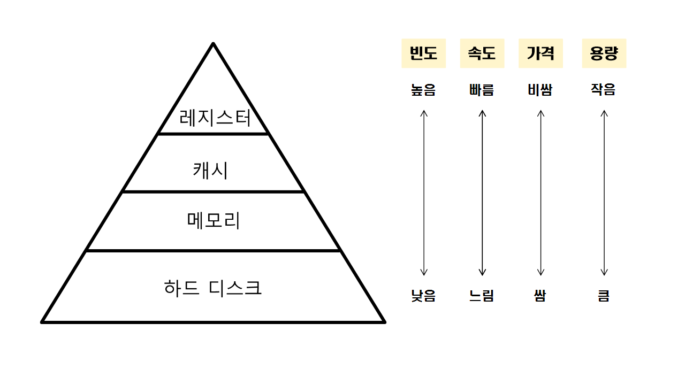

# 메모리에 대해서 설명해주세요.

## 메모리

    - 데이터를 기록하거나 읽기 위한 저장공간
    - 휘발성과 비휘발성으로 RAM(휘발성)과 ROM(비휘발성) ,플래시 메모리로 분류
        - 램(RAM , Random Access Memory )
            - 읽기 쓰기가 가능한 주 기억장치
            - 전원이 끊어지면 소멸 / 휘발성 메모리
            - 데이터 읽는 속도와 기록하는 속도가 같음
            - 주기억장치 ,프로그램 로딩 , 데이터 임시저장 등과 같은 곳에서 사용
        - 롬(ROM , Read Only Memory )
            - 전원이 끊어져도 기록된 데이터 소멸 X
            - 데이터 저장시 반영구적 사용 가능
            - 보통 ROM은 수정 불가 (읽기만 가능하나 , 경우에 따라 쓰기도 가능)
                - PROM(1번 다시쓰기 가능) , EPROM(무한), EEPROM(무한)
                - 특수한 방법을 통해 데이터 삭제 후 다시 기록가능
        - 플래시(Flash) 메모리
            - 데이터를 지우고 다시 기록할 수 있는 비휘발성 컴퓨터 기억 장치
            - EEPROM과 다르게 여러 구역에서 구성된 블록안에서 지우고 쓸 수 있음
            - EEPROM 보다 훨씬 저렴 , 비휘발성 고체 상태 저장 매체가 많이 필요하는 곳에서 주로 사용
            - 예시 ) MP3, 디지털 카메라 , 휴대폰 ,USB 등등

  

# 메모리 계층과 계층별 특징에 대해 설명하세요.

| 명칭       | 위치               | 접근 속도                            |
| ---------- | ------------------ | ------------------------------------ |
| 레지스터   | CPU 내부           | 빠름                                 |
| 캐시       | CPU 내부           | 빠름                                 |
| 메모리     | CPU 외부           | 레지스터와 캐시보다 느림             |
| 하드디스크 | CPU 직접 접근 불가 | 데이터를 메모리로 이동시켜 접근 가능 |

## 용어 간단 정리

    - 레지스터
        - CPU가 요청을 처리하는 데 필요한 데이터를 일시적으로 저장하는 기억장치
            - 컴퓨터에서 4대 주요 기능(기억,해석,연산,제어) 관할
            - 연산을 위해서는 반드시 레지스터를 거쳐야 한다.
    - 캐시
        - 데이터나 값을 미리 복사해 놓는 임시 장소
            - 시스템의 효율성을 위해 사용
            - 속도가 빠른 장치와 느린 장치 사이에서 속도차에 따른 병목 현상을 완화 하기 위한 범용 메모리
    - 메모리
            - 주기억 장치
            - 컴퓨터에서 수치,명령,자료 등을 기억하는 컴퓨터 하드웨어 장치
            - RAM과 ROM 으로 구성
                - RAM : 휘발성 기억 장치 / 단기간 저장
                - ROM : 고정 기억 장치  / 영구 저장
            - 하드 디스크 드라이브 ( HDD )
                - 하드 디스크 ,하드 드라이브, 고정 디스크
                - 비휘발성, 순차접근이 가능한 컴퓨터의 보조 기억 장치

  

# 쿠키 , 로컬 스토리지 , 세션 스토리지의 특징에 대해 설명하세요

    - 쿠키와 웹스토리지가 생성된 배경
        - HTTP는 요청과 응답으로 이뤄지는 하나의 사이클이 끝나면 , stateless 한 상태를 가져 클라이언트의 상태를 보존하지 않는다. 이러한 단점을 보완하기 위해 사용된다.

## 쿠키

    - 만료 기간이 있는 클라이언트 단에 저장하는 작은 텍스트 파일

- 장점
  - 데이터 유효기간 지정 가능
  - XSS로부터 안전 (XSS , 악성 js 코드 심는 행위)
  - 서버에서 쿠키의 httpOnly옵션을 설정하면 js에서 쿠키에 접근 자체 불가
- 단점 - 매우 작은 데이터 저장 용량 (4KB) - 매번 서버에 HTTP 요청시 같이 전달되어 서버에 부담 - 암호화가 안되어 있어 정보 도난 위험 - CSRF 위협 (사용자의 요청을 가로채 사용자의 의지와는 상관없이 보안적으로 위험한 행동을 하게끔 변조하여 부당 이익을 얻는 행위) - 문자열만 저장 가능
    

## 웹 스토리지 (로컬 스토리지, 세션 스토리지)

    - key,value 쌍의 형태로 데이터 저장
    - window 객체의 프로퍼티로 존재

- 장점
  - 서버에 불필요하게 데이터 저장 X
  - 넉넉한 데이터 저장 용량 ( 모바일 2.5MB , 데스크탑 5~10MB)
  - 문자열 , JS의 모든 원시형 데이터 , 객체 저장 가능
  - 도메인 단위로 접근이 제한되는 CORS 특성 덕분에 CSRF로부터 안전
- 단점
  - HTML5를 지원하는 브라우저만 사용 가능
  - XSS로부터 위험 - localStorage에 접근하는 JS 코드로 쉽게 접근 가능

## 로컬 스토리지 vs 세션 스토리지

    - 로컬스토리지 - 데이터 영구 저장 가능 / window.localStorage 객체
    - 세션스토리지 - 브라우저 탭/윈도우가 닫히면 스토리지가 초기화 / window.sessionStorage 객체 사용

---

## 요약

    - 쿠키 : 일시적으로 가벼운 데이터 저장시 (ex, 다시 보지 않음 쿠키 팝업창)
    - 로컬 스토리지 : 지속적으로 데이터 저장이 필요할 때 (ex, 자동로그인)
    - 세션 스토리지 : 일시적으로 데이터 저장이 필요할 때 (ex, 비로그인 장바구니)
    - 참고 : [쿠키, 로컬 스토리지, 세션 스토리지](https://velog.io/@hs0217/쿠키-로컬-스토리지-세션-스토리지)

---

  

## 로그인 시 유용한 저장 공간에 대해서 설명

### **토큰 탈취와 공격 방법**

    - 인증/인가에 활용되는 JWT가 탈취된다면, 탈취된 사용자의 개인정보를 조회하거나, 인가되지 않은 범위의 접근 등에 악용될 수 있어 보안에 중대한 위험을 끼치게 됩니다. 주요 탈취 경로로는 대표적으로 XSS공격, CSRF 공격등이 있습니다.
        - XSS공격
            - 공격자가 상대방의 브라우저에 스크립트가 실행되도록 하여 사용자의 세션 혹은 웹사이트를 변조하여 악의적인 콘텐츠/피싱 공격을 말합니다.
            - Cross Site Scripting의 약자.
            - 게시판이나 웹 메일 등 자바 스크립트와 같은 스크립트 코드를 삽입 해 개발자가 고려하지 않은 기능이 작동하게 하는 치명적인 공격
            - 크게 Reflected XSS와 Stored XSS 그리고 DOM Based XSS 3가지로 분류가 됩니다.
        - CSRF공격 : 사용자가 자신의 의지와는 무관하게 공격자가 의도한 행위를 특정 웹사이트에 요청하게 하는 행위입니다.

### **안전한 저장 위치는 어디인가?**

    1. 비공개 변수
    - 다른 방식에 비해 보안에서 가장 안전하지만 페이지 이동, 새로고침시에 토큰 정보가 휘발되어서 사실상 단독적으로 사용이 불가능 합니다.

    2. 세션스토리지
    - 페이지를 새로고침하거나, 이동하여도 유지가 되지만, 새로운 탭에서 접속 시 세션이 나뉘어지고, 브라우저가 종료되는 순간 휘발되어 세션스토리지도 좋지않다.
    - 세션스토리지는 모든 자바스크립트 코드를 통해 액세스 할 수 있어서 XSS 공격에 취약하나 자바스크립트 코드로 제어가 필요하기 때문에 CSRF 공격에서는 안전합니다.

    3. 로컬 스토리지
    - 로컬 스토리지는 페이지를 이동하거나, 브라우저를 다시 시작해도 만료없이 유지가 됩니다. 하지만 세션 스토리지와 동일하게 모든 자바스크립트 코드를 통해 액세스 할 수 있음으로 XSS공격에 취약하고 CSRF 공격에는 안전합니다.

    4. 쿠키
    - 옵션 없이 기본적으로 작동이 된다면 XSS, CSRF 공격에 모두 취약합니다.
    - 하지만 백엔드와 협업을 해 쿠키에 httpOnly / secure / SameSite 옵션을 사용한다면 쿠키는 자바스크립트 코드 상에서 접근이 불가능해지고, HTTP 요청에만 포함되어 보내집니다.
    - 쿠키 옵션 :`httpOnly` → 스크립트 상에서 접근이 불가능하도록 한다.`secure` → 패킷 감청을 막기 위해 https 통신 시에만 해당 쿠키를 사용하도록 한다.`SameSite` → `Strict`, `Lax` 모드가 있으며 `Strict` 모드에서는 같은 도메인 범위에서만 해당 쿠키를 사용하게 하며, `Lax`는 사용자가 페이지 이동 시 혹은 Form을 통한 Get 요청 시에만 허용된다.

### **JWT를 더 안전하게 저장하기**

    1. 백엔드 → 로그인 시 인증 서버로부터 `access token`, `refresh token`을 받아온다.
    2. 프론트엔드 → `access token`은 메모리(변수)에 저장한다.
    3. 백엔드 → `refresh token`은 쿠키에 저장하여 `httpOnly` / `secure` / `SameSite`(Strict or Lax 모드) 옵션을 지정한다. (백엔드)
    4. 프론트엔드 → 권한이 필요한 요청 시 `Authorization` 헤더에 `access token`을 보내준다.
    5. 백엔드 & 프론트엔드 → `access token`이 만료되었거나, 페이지 이동으로 사라졌을 시, 서버 렌더링 과정 혹은 API 통신을 통해 재발급을 요청한다.→ 이때, 요청 시 쿠키에는 자바스크립트에서 접근이 불가능한(`httpOnly` 옵션) `refresh token`이 이미 담겨진 상태로 서버와 통신하게 된다.
    6. 백엔드 → `refresh token`이 만료되었을 때 DB와 다시 한번 통신하여 갱신 혹은 로그아웃 상태로 렌더링을 하여준다.

### **위와 같이 진행하게 된다면?**

    - `refresh token`이 저장된 쿠키는 외부 경로와 자바스크립트 상에서의 접근이 불가능하여 CSRF, XSS 공격에서 모두 안전성이 확보된다.
    - `access token`이 저장된 비공개 변수는 `XSS`, `CSRF` 공격을 시도할 방법이 사라지며, 토큰이 휘발되어 사라졌던 UX 문제도 해결된다.

    참고자료 : [Access Token과 Refresh Token을 어디에 저장해야 할까?](https://velog.io/@ohzzi/Access-Token%EA%B3%BC-Refresh-Token%EC%9D%84-%EC%96%B4%EB%94%94%EC%97%90-%EC%A0%80%EC%9E%A5%ED%95%B4%EC%95%BC-%ED%95%A0%EA%B9%8C)
    [JWT는 어디에 저장해야할까? - localStorage vs cookie](https://velog.io/@0307kwon/JWT%EB%8A%94-%EC%96%B4%EB%94%94%EC%97%90-%EC%A0%80%EC%9E%A5%ED%95%B4%EC%95%BC%ED%95%A0%EA%B9%8C-localStorage-vs-cookie)
    [우아한테크코스 학습로그 저장소](https://prolog.techcourse.co.kr/studylogs/2272)
