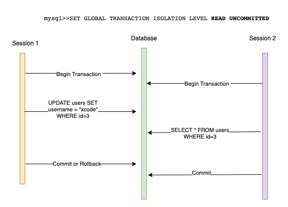
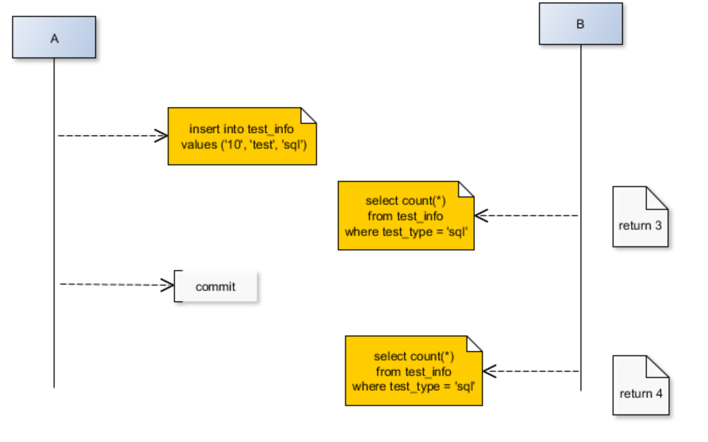
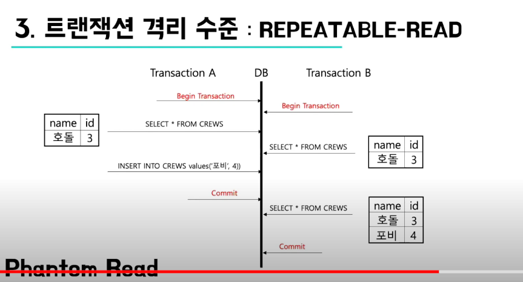
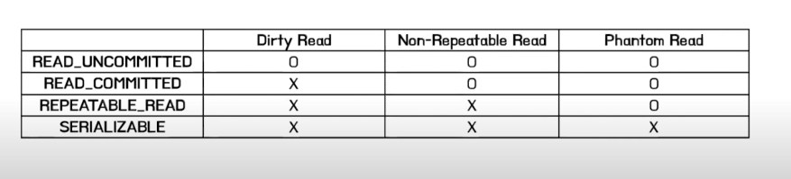
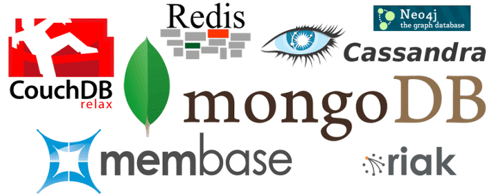

# 트랜잭션에 대해 설명하고 트랜잭션의 ACID에 대해서 설명해주세요.

<hr/>
<br/>

## 트랜잭션이란?

<br/>

    Transaction 단어의 영어 뜻은 1.거래,매매 혹은 2.처리(과정)의 의미가 있습니다. 그래서인지 많은 분들이 트랜잭션에 대해 은행거래를 예시로 드는 경우가 많습니다.

바로 예시를 보겠습니다.
고향에 사시는 부모님께 매달 용돈을 보내드리는 대은이는 월급날이 되자 어김없이 부모님께 용돈을 송금합니다. 이때 출금과 입금은 각 1번씩 발생하게 됩니다. 그런데 부모님 통장으로 돈을 입금하는 매우 짧은 순간 네트워크 장애로 인해 부모님 통장에 돈이 입금되지 않은 상황이 발생해버렸습니다.
대은이의 통장에서는 돈이 빠져나갔지만 부모님의 통장에는 입금되지 않은 것입니다. 대은이의 돈 일부가 사라지게 되버렸습니다. 이런 경우는 어떻게 처리해야 될까요?

출금과 입금이 1번씩 발생하지만 은행에서는 송금 자체를 하나의 트랜잭션으로 보고 순향이의 통장에서 부모님의 통장으로 입금이 된것을 확인하면 그 때 거래를 성사시킵니다.(COMMIT을 발생시킵니다.) 따라서 위의 예시처럼 네트워크 장애로 출금만 발생하고 입금이 되지 않는 경우에는 이를 ROLLBACK하게 됩니다. 이렇게 처리해야 순향이의 돈이 사라지지 않고 다시 송금을 할 수 있기 때문입니다. 대은이는 첫번째 송금 시 "은행 전산장애로 인해 거래가 성사되지 않았습니다."같은 메세지를 받았을 것입니다.

- 즉, 여기서 DB트랜잭션이란 결국 사용자에 의해 실행된 SQL 문의 집합을 의미하며, 변경된 데이터는 TCL에 의해 데이터베이스에 반영되어야 한다는 것을 의미합니다.

\*\* TCL(Transaction Control Language)
-> DCL(Data Control Language)에서 트랜잭션을 제어하는 명령인 COMMIT과 ROLLBACK만을 따로 분리해서 TCL이라 한다.

<br/><hr/><br/>

## ACID란?

<br/>

- 데이터베이스 트랜잭션이 안전하게 수행된다는 것을 보장하기 위한 성질을 가르키는 약어입니다.

```

Atomicity(원자성)
: 트랜잭션은 DB에 모두 반영되거나, 전혀 반영되지 않아야 한다.
(= 완료되지 않은 트랜잭션의 중간 상태를 DB에 반영해서는 안된다.)

Consistency(일관성)
: 트랜잭션 작업처리결과는 항상 일관성 있어야 한다.
(= 데이터베이스는 항상 일관된 상태로 유지되어야 한다.)

Isolation(격리성, 독립성)
: 둘 이상의 트랜잭션이 동시 실행되고 있을 때, 어떤 트랜잭션도 다른 트랜잭션 연산에 끼어들 수 없다.
(= 각각의 트랜잭션은 서로 간섭 없이 독립적으로 이뤄져야한다.)

Durability(지속성)
: 트랜잭션이 성공적으로 완료되었으면 결과는 영구 반영되어야 한다.
```

하지만 이론과 현실은 다릅니다. ACID는 결국 이론일 뿐이고 실제에서는 성능을 위해 성질 보장이 완화되기도 합니다. 예를 들어, 독립성을 보장하기 위해서는 100개의 데이터를 순차적으로 처리해야 합니다. 독립성은 보장하지만 동시성은 떨어지게 됩니다. 동시성을 얻기 위한 방법으로 트랜잭션 격리 수준이 있습니다.

<br/><hr/><br/>

## 트랜잭션 격리 수준이란?

<br/>

: 동시에 DB에 접근할 때 그 접근을 어떻게 제어할지에 대한 설정
<br/>
<br/>
동시성 ⬆ ⬇ 데이터 정합성
<br/>
밑으로 갈수록 격리 수준이 높아지지만 성능이 떨어집니다.
<br/>
데이터 정합성과 성능은 반비례 관계입니다.

<br/>

    - READ-UNCOMMITTED
    - READ-COMMITED
    - REPEATABLE-READ
    - SERIALIZABLE

- READ-UNCOMMITTED

  커밋 전의 트랜잭션의 데이터 변경 내용을 다른 트랜잭션이 읽는 것을 허용

  - 위 그림처럼 커밋이 끝나지 않았음에도 해당 트랜잭션을 읽는 것을 Dirty Read라 합니다.

    <br/>

  

- READ-COMMITTED

  커밋이 완료된 트랜잭션의 변경사항만 다른 트랜잭션에서 조회 가능

  - READ-COMMITTED은 Non-Repetable Read문제가 일어납니다. Non-Repeatble Read는 위 그림과 같이 Select문을 2번 했는데 서로 다른 결과값이 나오는 것을 의미합니다. 즉, 데이터 불일치 문제입니다.

    <br/>

  

- REPETABLE-READ

  트랜잭션 범위 내에서 조회한 내용이 항상 동일함을 보장함

  - READ-COMMITTED와 다른 점은 한 트랜잭션이 조회한 데이터는 트랜잭션이 종료될 때까지 다른 트랜잭션이 변경하거나 삭제하는 것을 막으므로 한번 조회한 데이터는 반복적으로 조회해도 같은 값을 반환합니다. 하지만 이 레벨에서도 Phantom Read 문제가 발생합니다.

  - Phantom Read

    - Non-Reapeatable Read의 한 종류로 조건이 걸렸든 안걸렸든 select문을 쓸 때 나타날 수 있는 현상.

      ```
      --Transaction 1
      BEGIN TRAN;
      SELECT ID FROM dbo.employee
      WHERE ID > 5 and ID < 10;
      --The INSERT statement from the second transaction occurs here.
      SELECT ID FROM dbo.employee
      WHERE ID > 5 and ID < 10;
      COMMIT;
      --Transaction 2
      BEGIN TRAN;
      INSERT INTO dbo.employee
      (Id, Name) VALUES(6 ,'New');
      COMMIT;
      ```

      아래의 사진에서도 알 수 있듯 서로 조회되는 데이터가 다른 것을 알 수 있습니다. 이것을 코드 레벨로 나타낼 수 있습니다.

      위 두 트랜잭션이 동시에 실행되고 있다고 가정해봅시다.
      두 번째 트랜잭션의 SELECT문이 두 트랜잭션에서 사용하는 데이터를 변경하기 때문에 첫 번째 트랜잭션의 두 INSERT문에서 서로 다른 결과를 반환할 수 있습니다.

    <br/>

  

- SERIALIZABLE

  한 트랜잭션에서 사용하는 데이터를 다른 트랜잭션에서 접근 불가.

  - 트랜잭션의 ACID 성질이 엄격하게 지켜지나 성능은 가장 떨어집니다. SERIALIZABLE은 SELECT 작업에서 특히 PHANTOM READ를 방지하기 위해 범위가 지정된 WHERE절을 사용할 때 필요합니다.
  - 아래는 각 격리레벨에서 발생할 수 있는 문제점들을 표로 나타낸 것

    <br/>

  

<br/><hr/><br/>

# NoSQL은 무엇이고, RDBMS를 사용할 때보다 NoSQL 데이터베이스를 사용하는 것이 유리한 경우를 설명해주세요.

<hr/>
<br/>

    NoSQL이란 “Not Only SQL”을 의미한다. 즉, 우리가 익숙하게 사용하고 있는 RDBMS 형태의 관계형 데이터베이스가 아닌 다른 형태의 데이터 저장 기술을 의미한다.

    이러한 NoSQL은 일반적인 DBMS로 처리하기에 비용이 많이 들거나 효과적이지 못한 부분을 해결할 목적으로 개발되엇고 대용량의 로그 처리나 쓰는 행위가 많은 경우에 사용된다.

    즉, NoSQL은 많은 양의 데이터의 처리 속도를 향상시키기 위해 데이터를 저장, 응답하는 방법과 단순 저장작업에 있어서 매우 최적화된 키 저장 기법을 사용한다.

    아래 사진은 NoSQL로 대표되는 데이터베이스들이다.

   <br/>



- 다른 데이터 모델을 사용하고 데이터 저장 및 검색을 위한 특화된 메커니즘을 제공, 최적화된 키-값 저장 기법을 사용하며 응답속도나 효율 부문에서 매우 뛰어난 성능을 발휘한다.

- 최근 클라우드에서 제공하는 NoSQL이 각광받고 있는데, RDBMS와 비교했을 때, 가장 큰 장점이 스키마가 필요 없고 데이터 분산이 용이하다는 장점 때문이다.

- 이러한 NoSQL은 SNS가 등장하고 유행하면서 더욱 각광받게 되엇다. SNS에서는 무수히 많은 양의 비정형 데이터를 보다 쉽고 저장하고 처리해야하는 필요성이 대두되었기 때문에 NoSQL의 사용은 비약적으로 증가하게 되었다.

<br/>

## NoSQL을 사용하는 것이 유리한 경우

<br/>


- 정리

  - NoSQL은 언제 사용하면 좋을까?

    NoSQL은 정확한 데이터 구조가 정해지지 않은 경우, 데이터 update가 자주 이루어지지 않고, 조회가 많은 경우, 또 scale-out이 가능하므로 데이터 양이 매우 많은 경우에 사용하면 좋다.

  - RDB는 언제 사용하면 좋을까?

    RDB는 데이터 구조가 명확하여 변경될 여지가 없는 경우, 또 데이터 중복이 없으므로 데이터 update가 잦은 시스템에서 사용하면 좋다.

<br/><hr/><br/>

# 인덱스를 사용해야 하는 경우랑 사용을 피해야 하는 경우는?

<hr/>
<br/>

<br/><hr/><br/>

# Inner Join과 Outer Join의 차이에 대해서 설명해주세요.

<hr/>
<br/>

## INNER JOIN

## OUTER JOIN

<br/><hr/><br/>
