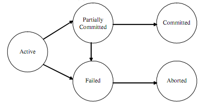

# 트랜잭션에 대해 설명하고 트랜잭션의 ACID에 대해서 설명해주세요.

## _트랜잭션_

    : 데이터베이스의 상태를 변화시키는 하나의 논리적 기능을 수행하기 위한 작업의 단위

    cf) 작업단위 = 사람이 정하는 기준에 따라 한꺼번에 모두 수행되어야 할 일련의 연산들을 의미

    cf) 데이터베이스의 상태를 변화시킨다 = 질의어(SELECT, INSERT, DELETE, UPDATE)를 이용해 데이터베이스에 접근하는 것
    (SQL 명령문을 통해 데이터의 상태를 바꿀 때 마다 자동적으로 Commit을 실행하여 변경된 내역을 데이터베이스에 반영)

    DDL이나 DML 중 레코드를 수정/삭제/추가 한 것에만 의미가 있음
    Select는 읽기만 하므로 트랜잭션을 사용할 이유가 없음

    BEGIN과 END 혹은 BEGIN과 COMMIT 사이에 해당 SQL들을 사용

    ROLLBACK -BEGIN 뒤에 실행된 문장들이 무효화됨

    ✔️ END나 COMMIT이 불리기 전까지는 MYSQL 사용자에게는 바뀐 것 처럼 보이지만 다른 사람들 눈에는 안보임

 

    BEGIN; -- START TRANSACTION
    A의 계좌로부터 인출;
    B의 계좌로 입금;
    END; -- COMMIT

- BEGIN == START TRANSACTION
- START == COMMIT
- 만약 BEGIN 전의 상태로 돌아가고 싶다면 ROLLBACK 실행
- 보통 autocommit모드애 따라 달라진다.

   

_ex) 은행에서 돈을 이체하는 것_

    1. A 은행에서 B은행으로 돈을 이체하려고 함
    2. 송금 중 알 수 없는 오류로 A은행에서 돈은 빠져나갔지만 B은행의 계좌에는 입금되지 않음

    이러한 상황을 막기 위해 거래가 모두 끝나야 안전한 거래로 승인(Commit) 하고,
    거래 도중 오류가 발생했을 시 거래를 시작하기 전으로 되돌려야한다. (Rollback)

    ⇒ 은행업무(A은행 이체 + B은행 입금) = 트랜잭션
    ⇒ 이러한 트랜잭션을 통해 데이터베이스의 안정성을 확보할 수 있다.
    ⇒ 1번과 2번의 두 과정은 동시에 성공하던지 실패해야함(Atomicity 원자성)
    ⇒ 조회(Select)만 한다면 이는 트랜잭션으로 묶일 이유가 없음

    - Commit
    : 하나의 트랜잭션이 성공적으로 끝나서 데이터베이스가 일관성 있는 상태에 있음을 의미

    - Rollback
    : 하나의 트랜잭션 처리가 비정상적으로 종료되어 트랜잭션의 원자성이 깨진 상태를 의미
    트랜잭션의 원자성을 지키기 위해 해당 트랜잭션이 행한 모든 연산을 재시작하거나 취소(Undo)함
    Rollback시에는 해당 트랜잭션을 재시작하거나 폐기

_ex) 게시물을 수정하는 과정에서 select와 update가 실행_

    ⇒ 두 개의 쿼리문이 트랜잭션으로 묶이며, 하나의 트랜잭션이 실행될 때 2개의 쿼리문이 실행된다.

    ⇒ 두 개의 쿼리문이 하나의 트랜잭션으로 묶여있다고 가정할 때, 1개의 sql문만 실행되는 일은 발생하지 않는다(All or Nothing) = Atomicity(원자성)

 

## _트랜잭션의 ACID_

: 데이터의 무결성을 보장하기 위해 DBMS의 트랜잭션이 가져야할 특징

    1) Atomicity(원자성)
        - 트랜잭션 내 모든 명령은 반드시 완벽히 수행되어야 함(부분적으로 실행되거나 중단되지 않는 것을 보장)
        - 어느 하나라도 오류가 발생하면 트랜잭션 전부가 취소되어야 함
        - 트랜잭션의 연산은 모두 반영되도록 Commit 되거나 전혀 반영되지 않도록 Rollback 되어야 함

    2) Consistency(일관성)
        - 트랜잭션이 그 실행을 성공적으로 완료하면 언제나 일관성 있는 데이터베이스 상태로 변환
        - 시스템이 가지고 있는 고정요소는 트랜잭션 수행 전과 트랜잭션 수행 후의 상태가 같아야 함

    3) Isolation(독립성, 격리성)
        - 트랜잭션 수행 시 다른 트랜잭션 연산에 끼어들지 못하도록 보장
        - 수행 중인 트랜잭션은 완전히 완료될 때 까지 다른 트랜잭션에서의 수행결과를 참조할 수 없음

    4) Durability(영속성, 지속성)
        - 성공적으로 완료된 트랜잭션의 결과는 시스템이 고장나더라도 영구적으로 반영되어야 함

 

## _트랜잭션 상태_

    - Active(활동): 트랜잭션이 실행중인 상태
    - Failed(실패) : 트랜잭션 실행에 오류가 발생하여 중단된 상태
    - Aborted(철회) : 트랜잭션이 비정상적으로 종료되어 Rollback 연산을 수행한 상태
    - Partially Committed(부분완료) : 트랜잭션의 마지막 연산까지 실행헀지만, Commit연산이 실행되기 직전의 상태
    - Committed(완료) : 트랜잭션이 성공적으로 종료되어 Commit연산을 실행한 후의 상태

 

트랜잭션은 데이터베이스 시스템에서 병행제어 및 회복작업 시 처리되는 작업의 논리적 단위
사용자가 시스템에 대한 서비스 요구 시 시스템이 응답하기 위한 상태 변화 과정의 작업 단위
Commit되거나 Rollback되거나 둘 중 하나 !

  
