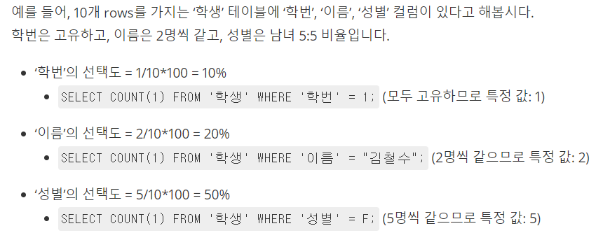

# DDL, DML, DCL 비교

**SQL 문은 기본적으로 DDL, DML, DCL 3가지 범주로 나뉩니다.**

    - DDL (데이터 정의 언어) : 명령은 데이터를 보유하는 구조를 정의하는 데 사용됩니다. 이 명령은 자동 커밋됩니다. 즉, 데이터베이스의 DDL 명령에 의해 수행 된 변경 사항이 영구적으로 저장됩니다.
    - DML (데이터 조작 언어) : 명령은 데이터베이스의 데이터를 조작하는 데 사용됩니다. 이 명령은 자동 커밋되지 않으며 롤백 할 수 있습니다.
    - DCL (데이터 제어 언어) : 명령은 데이터베이스에서 데이터를 사용하기위한 액세스 권한 취소와 같이 데이터베이스에서 데이터의 가시성을 제어하는 데 사용됩니다.

  

# DB에서 다양한 유형의 관계는 무엇인가요?

**DB 에는 3가지 유형의 관계가 있습니다.**

    - 일대일(1:1) : 한 테이블은 비슷한 종류의 열을 가진 다른 테이블과 관계가 있습니다. 각 PK는 관련 테이블에서 하나의 레코드 또는 하나의 레코드와 관련이 없습니다.
    - 일대다(1:N) : 한 테이블은 기본 및 외래 키 관계가있는 다른 테이블과 관계가 있습니다. 기본 키 테이블에는 관련 테이블에없는 하나 또는 여러개의 레코드와 관련된 하나의 레코드 만 포함됩니다.
    - 다대다(N:M) : 두 테이블의 각 레코드는 다른 테이블의 여러 레코드와 관련될 수 있습니다.

  

# RDBMS 의 특징은?

    - 데이터베이스에 별도의 테이블에 저장된 관계형 데이터 모델을 기반으로하며 공통 열의 사용과 관련이 있습니다. SQL (Structured Query Language)을 사용하여 관계형 데이터베이스에서 데이터에 쉽게 액세스 할 수 있습니다.

# mySQL 의 데이터를 오라클 DB 로 어떻게 옮길 수 있을까요?

    참조 : [MYSQL 데이터 ORACLE 로 복사하기](https://javadeveloper.tistory.com/12)

  

# 인덱스의 성능을 향상시키는 방법은?

**① 카디널리티(Cardinality)**

    카디널리티란?
    - 한 컬럼이 갖고 있는 값의 상대적인 중복 정도(중복 수치를 나타내는 지표)
    - 카디널리티가 높을 수록(=중복 정도가 낮을 수록) 인덱스 설정에 좋은 컬럼이다.
    - 컬럼에 인덱스를 걸 때, 내가 원하는 데이터를 선택하는 과정에서 최대한 많은 데이터가 걸러져야 성능이 좋을 것이다. 즉, 여러 컬럼을 동시에 인덱싱할 때, 카디널리티가 높은 컬럼(중복이 적은 컬럼)을 우선 순위로 두는 것이 인덱싱 전략에 유리하다.

**② 선택도(Selectivity)**

    선택도란?
    - 특정 값을 얼마나 잘 선택할 수 있는 지에 대한 지표
    - 특정 필드 값을 지정했을 때, 선택되는 레코드 수를 테이블 전체 레코드 수로 나눈 것.
    - 선택도가 낮을 수록(=중복 정도가 낮을 수록) 인덱스 설정에 좋은 컬럼이다.(5~10%가 적당하다고 합니다.)

  
**③ 활용도**

    활용도란?
    - 해당 컬럼이 실제 작업에서 얼마나 활용되는 지에 대한 값
    - 수동 쿼리 조회, 로직과 서비스에서 쿼리를 날릴 때, WHERE 절에 자주 사용되는 지를 판단하자.
    - 활용도가 높을 수록 인덱스 설정에 좋은 컬럼이다.

  

# 해시 알고리즘 보다 B+Tree를 이용한 인덱스를 많이 쓰는 이유는?

    - B+Tree는 검색 작업에 있어서 해시보다는 비효율적인 시간복잡도를 가진다. (트리를 사용하기 때문에 시간복잡도는 O(logN))
    - 하지만 해시의 데이터들은 정렬되어 있지 않고, B+Tree에서는 **해시와는 다르게 순차 검색 연산을 효율적으로 수행**할 수 있다. 이는 순차 검색 연산을 이용한 등호 연산(<, >)이 자주 발생하는 인덱스에서 큰 강점이기 때문에 → 해시 알고리즘 보다는 B+Tree 를 이용한 인덱스가 주로 사용된다.
