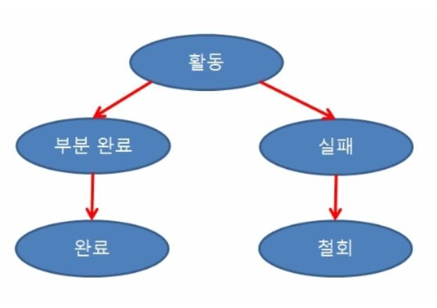
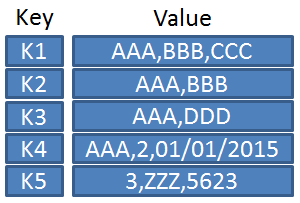
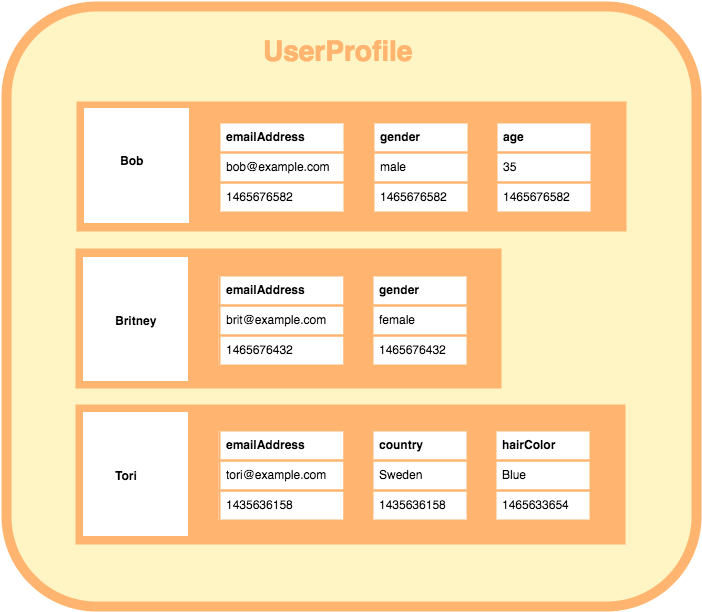
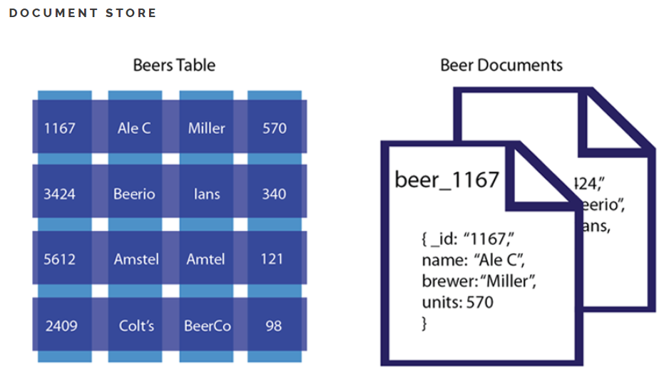
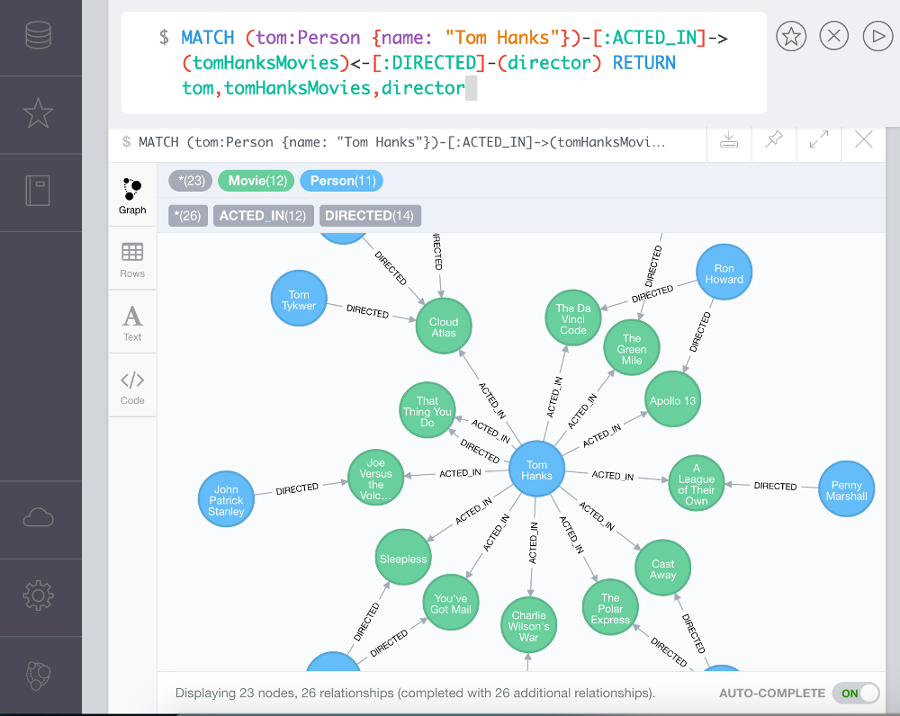
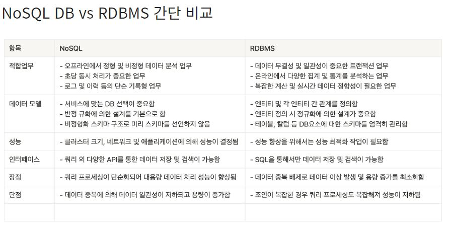

# 트랜잭션에 대해 설명하고 트랜잭션의 ACID에 대해서 설명해주세요.

## 트랜잭션

    데이터베이스의 상태를 변환시키는 하나의 논리적 기능을 수행하기 위한 작업의 단위 또는 한꺼번에 모두 수행되어야 할 일련의 연산들.

### 특징

    1. 트랜잭션은 데이터베이스 시스템에서 병행 제어 및 회복 작업 시 처리되는 작업의 논리적 단위이다.
    2. 사용자가 시스템에 대한 서비스 요구 시 시스템이 응답하기 위한 상태 변환 과정의 작업단위이다.
    3. 하나의 트랜잭션은 Commit되거나 Rollback됩니다.

## 연산

### Commit 연산

     Commit 연산은 한개의 논리적 단위(트랜잭션)에 대한 작업이 성공적으로 끝났고 데이터베이스가 다시 일관된 상태에 있을 때, 이 트랜잭션이 행한 갱신 연산이 완료된 것을 트랜잭션 관리자에게 알려주는 연산이다.

### Rollback 연산

    1. Rollback 연산은 하나의 트랜잭션 처리가 비정상적으로 종료되어 데이터베이스의 일관성을 깨뜨렸을 때, 이 트랜잭션의 일부가 정상적으로 처리되었더라도 트랜잭션의 원자성을 구현하기 위해 이 트랜잭션이 행한 모든 연산을 취소(Undo)하는 연산이다.
    2. Rollback시에는 해당 트랜잭션을 재시작하거나 폐기한다.

### 상태

- 활동(Active) : 트랜잭션이 실행중인 상태
- 실패(Failed) : 트랜잭션 실행에 오류가 발생하여 중단된 상태
- 철회(Aborted) : 트랜잭션이 비정상적으로 종료되어 Rollback 연산을 수행한 상태
- 부분 완료(Partially Committed) : 트랜잭션의 마지막 연산까지 실행했지만, Commit 연산이 실행되기 직전의 상태
- 완료(Committed) : 트랜잭션이 성공적으로 종료되어 Commit 연산을 실행한 후의 상태.

### 데이터베이스의 상태를 변화시킨다는 것은?

- 질의어(SQL)를 이용하여 데이터베이스를 접근 하는 것을 의미합니다. (SELECT, INSERT, DELETE, UPDATE)

## 트랜잭션의 ACID(성질)

 

### Atomicity(원자성)

    1. 트랜잭션의 연산은 데이터베이스에 모두 반영되든지 아니면 전혀 반영되지 않아야 한다.
    2. 트랜잭션 내의 모든 명령은 반드시 완벽히 수행되어야 하며, 모두가 완벽히 수행되지 않고 어느하나라도 오류가 발생하면 트랜잭션 전부가 취소되어야 한다.

### Consistency(일관성)

    1. 트랜잭션이 그 실행을 성공적으로 완료하면 언제나 일관성 있는 데이터베이스 상태로 변환한다.
    2. 시스템이 가지고 있는 고정요소는 트랜잭션 수행 전과 트랜잭션 수행 완료 후의 상태가 같아야 한다.

### Isolation(독립성,격리성)

    1. 둘 이상의 트랜잭션이 동시에 병행 실행되는 경우 어느 하나의 트랜잭션 실행중에 다른 트랜잭션의 연산이 끼어들 수 없다.
    2. 수행중인 트랜잭션은 완전히 완료될 때까지 다른 트랜잭션에서 수행 결과를 참조할 수 없다.

### Durability(영속성, 지속성)

    1. 성공적으로 완료된 트랜잭션의 결과는 시스템이 고장나더라도 영구적으로 반영되어야 한다.

  

# NoSQL은 무엇이고, RDBMS를 사용할 때보다 NoSQL 데이터베이스를 사용하는 것이 유리한 경우를 설명해주세요.

## NoSQL이란?

    NoSQL은 비관계형 데이터베이스를 지칭한다.즉 관계형 데이터 모델을 지양 하며 대량의 분산된 데이터를 저장하고 조회하는 데 특화되었으며 스키마 없이 사용 가능하거나 느슨한 스키마를 제공하는 저장소를 말합니다.

## 특징

- 유연성 : 스키마 선언 없이도 필드의 추가 및 삭제가 자유로운 Schema-less 구조
- 확장성 : 스케일 아웃에 의한 서버 확장이 용이
- 고성능 : 대용량 데이터를 처리하는 성능이 뛰어나다.
- 가용성 : 여러 대의 백업 서버 구성이 가능하여 장애 발생 시에도 무중단 서비스가 가능하다.

## 기대하는 특징

### 높은 확장성

    점진적으로 노드를 추가할 수 있어야 하고 이는 파티셔닝을 통해서 가능하다

### 높은 가용성

    실패의 단일 포인트가 없고 데이터는 복제되기 때문에 어떤 노드가 죽었을 때도 데이터는 이용이 가능해야한다

### 높은 성능

    - 디스크 대신 메모리 기반으로 결과는 빠르게 리턴되어야하고 이는 Non-Blocking Write와 낮은 복잡성을 가진 알고리즘을 통해서 이룰 수 있다.
    -요청한 작업을 즉시 마칠 수 없다면 즉시 리턴해야한다
    - Non-Blocking

### 원자성

    각각의 쓰기는 원자성을 가질 필요가 있다.

### 일관성

    - 강한 일관성은 필요 없고 결과적인 일관성만 가지면된다(Read-Your-Writes)
    - 결과적인 일관성
    - Read-Your-Writes(RYW) 일관성은 레코드가 업데이트 되었을때 그 레코드에 대한 읽기 시도는 업데이트된 값을 돌려주는 것을 보장해주는 것의 의미합니다.

### 지속성

    데이터는 휘발성 메모리만이 아닌 디스크에서 유지되어야 한다

### ETC

    배포, 모델링, 쿼리의 유연함

## 장점

    1. RDBMS에 비해 저렴한 비용으로 분산처리와 병렬 처리 가능
    2. 비정형 데이터 구조 설계로 설계 비용 감소
    3. Big Data 처리에 효과적
    4. 가변적인 구조로 데이터 저장이 가능
    5. 데이터 모델의 유연한 변화가 가능.

## 단점

    1. 데이터 업데이트 중 장애가 발생하면 데이터 손실 발생 가능
    2. 많은 인덱스를 사용하려면 충분한 메모리가 필요. 인덱스 구조가 메모리에 저장
    3. 데이터 일관성이 항상 보장되지 않음.

## 종류

### 1. Key-Value Database

- 기본적인 패턴으로 KEY-VALUE 하나의 묶음(Unique)으로 저장되는 구조로 단순한 구조이기에 속도가 빠르며 분산 저장 시 용이합니다.
- Key 안에 (Column, Value) 형태로 된 여러개의 필드, 즉 COULUMN FAMILIES를 갖습니다.
- 주로 SERVER CONFIG, SESSION CLUSTERING등에 사용되고 엑세스 속도는 빠르지만, SCAN에는 용이하지 않습니다.

 

### 2. Wide-Column Database

- 행마다 키와 해당 값을 저장할 때마다 각각 다른값의 다른 수의 스키마를 가질 수 있습니다.
- 위 그림을 참고하면 사용자의 이름(key)에 해당하는 값에 스키마들이 각각 다름을 볼 수 있습니다.
- 이러한 구조를 갖는 WIDE COLUMN DATABASE 는 대량의 데이터의 압축, 분산처리, 집계 쿼리(SUM, COUNT, AVG 등)및 쿼리 동작 속도 그리고 확장성이 뛰어난 것이 그 대표적인 특징이라 할 수 있습니다.
- EX) Hbase, GoogleBigTable, Vertica

 

### 3. Document Database

- 테이블의 스키마가 유동적, 즉 레코드마다 각각 다른 스키마를 가질 수 있습니다.
- 보통 XML, JSON과 같은 DOCUMENT를 이용해 레코드를 저장합니다.
- 트리형 구조로 레코드를 저장하거나 검색하는데 효과적입니다.

- EX) MongoDB, CouchDB, Azure Cosmos DB

 

### 4. Graph Database

- 데이터를 노드로(그림에서 파란,녹색 원)표현하며 노드 사이의 관계를 엣지(그림에서 화살표)로 표현
- 일반적으로 RDBMS 보다 성능이 좋고 유연하며 유지보수에 용이한 것이 특징
- Social networks, Network diagrams 등에 사용할 수 있다.
- EX) Neo4j, BlazeGraph, OrientDB

## 사용시 효율적인 상황

- 아주 낮은 응답 지연시간(latency)이 요구됨
- 다루는 데이터가 비정형이라 관계형 데이터가 아니다.
- 데이터(JSON, YAML, XML등)를 직렬화나 역직렬화 할 수 있으면 된다.
- 아주 많은 양의 데이터를 저장할 필요가 있을때.

### 어떤 상황에 사용하는가?

- 데이터에 대한 캐시가 필요한 경우
- 배열 형식의 데이터를 고속으로 처리할 필요가 있는 경우
- 정확한 데이터 구조를 알 수 없거나 변경 / 확장 될 수 있는 경우
- 읽기(read)처리를 자주하지만, 데이터를 자주 변경(update)하지 않는 경우(즉, 한번의 변경으로 수십개의 문서를 업데이트 할 필요가 없는 경우)
- 데이터베이스를 수평으로 확장해야하는 경우 (막대한 양의 데이터를 다뤄야 하는 경우)

