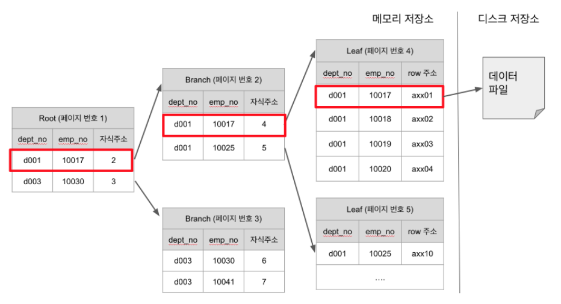

# DB 튜닝(Tuning)이 무엇인지 그리고 튜닝의 3단계에 대해 설명해주세요.

    답
        - DB튜닝이란? = DB의 성능 향상을 위하여 운영체제나 DB자체의 구조를 이해하고 필요한 요소를 변경하는 작업입니다.
        - 하는 이유는? = 주어진 H/W환경을 통해 처리량과 응답속도를 개선하기 위해서 수행합니다.
        - 3단계는?
            1. 데이터베이스 설계 튜닝(모델링 관점)
                - 데이터베이스 설계단계에서 성능을 고려
                - 데이터 모델링, 인덱스 설계
                - 데이터파일, 테이블 스페이스 설계
                - 데이터베이스 용량 산정

                사례 = 반정규화, 분산파일배치

            2. 데이터베이스 환경 튜닝(환경 관점)
                - 성능을 고려하여 메모리나 블록 크기 등을 지정
                - CPU, I/O에 관한 관점

                사례 = Buffer 크기, Cache 크기

            3. SQL 문장 튜닝(APP)관점
                - 성능을 고려하여 SQL 작성하고 쿼리 문장을 수정
                - Join, Indexing, SQL Execution Plan

                사례 = Hash/ Join

            데이터 베이스의 튜닝에 대해서 더 알고싶다면? ⇒ 아래를 클릭

            [데이터베이스 튜닝 (DB Tuning) > 도리의 디지털라이프](http://blog.skby.net/데이터베이스-튜닝-db-tuning/)

  

# 정규화와 비정규화에 대해서 설명해주세요.

|      | 정규화                                                                                             | 비정규화                                                                                                 |
| ---- | -------------------------------------------------------------------------------------------------- | -------------------------------------------------------------------------------------------------------- |
| 설명 | 중복을 최소화하도록 설계된 데이터베이스를 말한다.                                                  | 읽는 시간을 최적화하도록 설계된 데이터베이스를 말한다.                                                   |
| 장점 | 데이터베이스 변경 시 이상현상 제거, 효과적인 검색 알고리즘 생성, 데이터 구조의 안정성, 무결성 유지 | 빠른 데이터 조회(Join 비용이 줄어들기 때문), 데이터 조회 쿼리의 간단화                                   |
| 단점 | Join연산의 증가(데이터를 처리 할때)로 응답 시간이 저하될 수도 있다.                                | 데이터 갱신이나 삽입 비용이 높음, 데이터의 무결성 해침, 데이터 중복저장으로 인한 추가 저장공간 확보 필요 |

    데이터의 무결성은 무엇인가? : 데이터의 정확성, 일관성, 유효성이 유지되는 것을 의미함.

    - 정확성 : 중복이나 누락이 없는 상태
    - 일관성 : 원인과 결과의 의미가 연속적으로 보장되어 변하지 않는 상태.
    - 유효성 : 사용자로 부터 값을 입력받을 때 정확한 값만 입력되도록 하는 것.

    = 무결성 설계를 하지 않는다면 테이블에 중복된 데이터 존재, 부모와 자식 데이터 간의 논리적 관계 깨짐, 잦은 에러와 재개발 비용 발생 등과 같은 문제가 발생함.

    >무결성에 대해 자세히 보기

    [[Database] 데이터 무결성(Data Integrity)이란?](https://cocoon1787.tistory.com/778)

  

# Index가 무엇인지 설명해주고 장단점에 대해서 말씀해주시고, 자료구조 및 관리방법을 간단하게 알려주세요.

## 인덱스란?

    - 데이터의 검색 속도를 높이는 기능입니다.
    - 테이블을 처음부터 끝까지 검색하는 방법인 FTS(Full Table Scan)과는 달리 인덱스를 검색하여 해당 자료의 테이블을 엑세스 할 수가 있습니다.

### 장점

    - 인덱스는 항상 정렬된 상태를 유지하기 때문에 원하는 값을 검색하는데 빠릅니다.

### 단점

    - 인덱스를 구성하는 비용. ⇒  추가, 수정, 삭제 연산시에 인덱스를 형성하기 위한 추가적인 연산이 수행됩니다. 데이터가 적다면 오히려 유지/관리 부담이 더 클 수 있으며 물리적인 공간을 차지합니다.

### Index의 자료구조 및 관리 방법

    1. B+Tree 인덱스 자료구조
    - 자식 노드가 2개 이상인 B-Tree를 개선시킨 자료구조이며, BTree 리프노드들을 LinkedList로 연결하여 순차 검색을 용이하게 합니다. 해시 테이블보다 나쁜 O(log2N)의 시간복잡도를 갖지만 일반적으로 사용되는 자료구조 입니다.

    - 인덱스 탐색은 Root -> Branch -> Leaf -> 디스크 저장소 순으로 진행됩니다.
        - 예를 들어 Branch (페이지번호 2) 는 dept_no가 d001이면서 emp_no가 10017 ~ 10024까지인 Leaf의 부모로 있습니다.
        - 즉, `dept_no=d001 and emp_no=10018`로 조회하면 페이지 번호 4인 Leaf를 찾아 데이터파일의 주소를 불러와 반환하는 과정을 하게 됩니다.
    - 인덱스의 **두번째 컬럼은 첫 번째 컬럼에 의존해서 정렬되어 있습니다.
        - 즉, 두번째 컬럼의 정렬은 첫번째 컬럼이 똑같은 열에서만 의미가 있습니다.
        - 만약 3번째, 4번째 인덱스 컬럼도 있다면 두번째 컬럼과 마찬가지로 3번째 컬럼은 2번째 컬럼에 의존하고, 4번째 컬럼은 3번째 컬럼에 의존하는 관계가 됩니다.
    - 디스크에서 읽는 것은 메모리에서 읽는것보다 성능이 훨씬 떨어집니다.
        - 결국 인덱스 성능을 향상시킨다는 것은 디스크 저장소에 얼마나 덜 접근하게 만드느냐, 인덱스 Root에서 Leaf까지 오고가는 횟수를 얼마나 줄이느냐에 달려있습니다.
    - 인덱스의 갯수는 3~4개 정도가 적당합니다.
        - 너무 많은 인덱스는 새로운 Row를 등록할때마다 인덱스를 추가해야하고, 수정/삭제시마다 인덱스 수정이 필요하여 성능상 이슈가 있습니다.
        - 인덱스 역시 공간을 차지합니다. 많은 인덱스들은 그만큼 많은 공간을 차지합니다.
        - 특히 많은 인덱스들로 인해 옵티마이저가 잘못된 인덱스를 선택할 확률이 높습니다.

### B-tree Vs B+tree

| 구분                  | B-tree                                                                                                                            | B+tree                                    |
| --------------------- | --------------------------------------------------------------------------------------------------------------------------------- | ----------------------------------------- |
| 데이터 저장           | 리프 노드, 브랜치 노드 모두 데이터 저장 가능                                                                                      | 오직 리프 노드에만 데이터 저장 가능       |
| 트리의 높이           | 높음                                                                                                                              | 낮음(한 노드 당 key를 많이 담을 수 있음)  |
| 풀 스캔 시, 검색 속도 | 모든 노드 탐색                                                                                                                    | 리프 노드에서 선형 탐색                   |
| 키 중복               | 없음                                                                                                                              | 있음(리프 노드에 모든 데이터가 있기 때문) |
| 검색                  | 자주 access 되는 노드를 루트 노드 가까이 배치할 수 있고, 루트 노드에서 가까울 경우, 브랜치 노드에도 데이터가 존재하기 때문에 빠름 | 리프 노드까지 가야 데이터 존재            |
| 링크드 리스트         | 없음                                                                                                                              | 리프 노드끼리 링크드 리스트로 연결        |

    2. 해시 테이블
    - 컬럼의 값으로 생성된 해시를 기반으로 인덱스를 구현합니다. 시간복잡도가 O(1)이라 검색이 매우 빠릅니다.
    - 부등호(<,>)와 같은 연속적인 데이터를 순차 검색은 불가능하기 때문에 사용에 적합하지 않습니다.
    - 해시 테이블은 (Key, Value)로 데이터를 저장하는 자료구조 중 하나로 빠르게 데이터를 검색할 수 있는 자료구조이다. 해시 테이블이 빠른 검색속도를 제공하는 이유는 내부적으로 배열(버킷)을 사용하여 데이터를 저장하기 때문이다. 해시 테이블은 각각의 Key값에 해시함수를 적용해 배열의 고유한 index를 생성하고, 이 index를 활용해 값을 저장하거나 검색하게 된다. 여기서 실제 값이 저장되는 장소를 버킷 또는 슬롯이라고 한다.

    참조 : [[자료구조] 해시테이블(HashTable)이란?](https://mangkyu.tistory.com/102)

  

# 클러스터형 인덱스와 비클러스터형 인덱스에 대해서 설명해주세요.

## 클러스터형 인덱스

    - 인덱스를 생성할 때는 데이터 페이지 전체를 다시 정렬합니다.
    - 이미 대용량의 데이터가 입력된 상태라면, 업무시간에 클러스터형 인덱스를 생성하는 것은 심각한 시스템 부하를 줄 수 있으므로 신중해야 합니다.
    - 클러스터형 인덱스는 인덱스 자체의 리프 페이지가 곧 데이터 페이지 입니다.즉 인덱스 자체에 데이터가 포함되어 있다고 말할 수 있습니다.
    - 비클러스터형 인덱스 보다 검색 속도는 더 빠릅니다. 하지만 데이터의 입력/수정/삭제는 느립니다.
    - 클러스터형 인덱스는 성능이 좋지만, 테이블에 한 개만 생성할 수 있습니다. 그래서 어느 열에 클러스터형 인덱스를 생성하느냐에 따라서 시스템의 성능이 달라질 수 있습니다.
    - 클러스터형 인덱스는 해당 키 값을 기반으로 테이블이나 뷰의 데이터 행을 정렬하고 저장합니다.
    - 만약 테이블에 클러스터형 인덱스가 없으면 해당 데이터 행은 힙이라는 정렬되지 않은 구조로 저장이 됩니다.

## 비클러스터형 인덱스

    - 비 클러스터형 인덱스를 생성할 때는 데이터 페이지는 그냥 둔 상태에서 별도의 페이지에 인덱스를 구성해줍니다.
    - 비 클러스터형 인덱스에서 인덱스 자체의 리프 페이지는 데이터가 아니라, 데이터가 위치하는 포인터 입니다. 클러스터형 보다 검색 속도는 느리지만, 데이터의 입력/수정/삭제는 더 빠릅니다.
    - 비 클러스터형 인덱스는 여러 개 생성할 수 있습니다. 하지만 함부로 남용할 경우에는 오히려 시스템의 성능을 저하시킬 수 있습니다.
    - 비 클러스터형 인덱스의 구조는 데이터 행으로부터 독립적입니다. 비 클러스터형 인덱스에는 비 클러스터형 인덱스 키 값이 있으며 각 키 값 항목에는 해당 키 값이 포함된 데이터 행에 대한 포인터가 있습니다.
