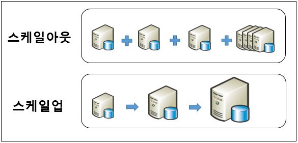

# 트랜잭션에 대해 설명하고 트랜잭션의 ACID에 대해서 설명해주세요.

## 트랜잭션 ?

- 데이터베이스의 상태를 변화시키기 위해 수행하는 작업 단위
- 상태를 변화 시킨다는 의미 -> SQL 질의어를 통해 DB에 접근하는 것
  ```
  - SELECT
  - INSERT
  - DELETE
  - UPDATE
  ```
- 작업 단위 -> 많은 SQL 명령문들을 사람이 정하는 기준에 따라 정하는 것

  ```
  예시) 사용자 A가 사용자 B에게 만원을 송금한다.

  * DB에서 일어나는 작업
    - 1. 사용자 A의 계좌에서 만원을 차감한다 : UPDATE문
    - 2. 사용자 B의 계좌에 만원을 추가한다 : UPDATE문

  현재 작업 단위 : 출금 UPDATE문 + 입금 UPDATE문
    - 이를 통틀어 하나의 트랜잭션이라고 한다.
    - 위 두 쿼리문 모두 성공적으로 완료되어야만 "하나의 작업(트랜잭션)"이 완료된 것이다.  `commit`
    - 작업 단위에 속하는 쿼리 중 하나라도 실패하면 모든 쿼리문을 취소하고 이전 상태로 돌려놓아야 한다. `rollback`
  ```

  <br/>

## ACID ( 원자성, 일관성, 독립성, 지속성 )

- 데이터베이스 내에서 일어나는 하나의 트랜잭션의 안전성을 보장하기 위해 필요한 성질

  - A ( Atomicity , 원자성 )
    - 트랜잭션이 안전성 보장을 위해 가져야 할 성질 중의 하나
    - 시스템에서 한 트랜잭션의 연산들이 모두 성공하거나, 반대로 전부 실패되는 성질
  - C ( Consistency , 일관성 )

    - 데이터베이스의 상태가 일관되어야 한다는 성질
    - 하나의 트랜잭션 이전과 이후, 데이터베이스의 상태는 이전과 같이 유효 해야 한다.

      ```
      예시) '모든 고객은 반드시 이름을 가지고 있어야 한다'는 제약 조건이 존재

            - 일관성을 위반하는 사례 ( 제약조건을 위반 )
              1. 이름 없는 새로운 고객을 추가하는 쿼리
              2. 기존 고객의 이름을 삭제하는 쿼리

            - 위의 사례가 일어날 경우 데이터베이스는 일관되지 않는 데이터를 가지게 된다.

            - 데이터베이스의 유효한 상태는 다를 수 있지만, 데이터의 상태에 대한 일관성은 변하지 않아야 한다.

      ```

  - I ( Isolation , 격리성,고립성 )

    - 모든 트랜잭션은 다른 트랜잭션으로부터 독립되어야 한다.
    - 동시에 여러 개의 트랜잭션들이 수행될 때, 각 트랜잭션은 격리되어 있어 연속으로 실행된 것과 동일한 결과를 나타낸다.

      ```
      예시) 계좌에 10,000원이 있다

            이 계좌로부터 B계좌로 6,000원 , C계좌로 6,000원을 동시에 계좌 이체하는 경우 , 계좌 B에 먼저 송금한 뒤 계좌 C에 보내는 결과와 동일해야 한다

            동시에 트랜잭션을 실행한다고 해서 마이너스 통장이 되는 것이 아니다.

            각각의 송금 작업을 연속으로 실행하는 것과 동일한 결과가 나타나야 한다.

            격리성을 지키는 각 트랜잭션은 독립적이므로, 다른 트랜잭션의 작업 내용을 알 수 없다.

            트랜잭션이 동시에 실행될 때와 연속으로 실행될 때의 데이터베이스 상태가 동일해야 한다.

      ```

  - D ( Durability , 지속성 )

    - 하나의 트랜잭션이 성공적으로 수행되었다면, 해당 트랜잭션에 대한 로그가 남아야 하는 성질 - 만약 런타임 오류나 시스템 오류가 발생하더라도, 해당 기록은 영구적이어야 한다.

      ```
      예시) 은행에서 계좌이체를 성공적으로 실행한 뒤, 해당 은행 DB에 오류가 발생하여 종료되더라도 계좌이체 내역은 기록으로 남아야 한다.

            또한, 계좌이체를 로그로 기록하기 전에 시스템 오류 등에 의해 종료가 된다면 , 해당 이체 내역은 실패로 돌아가고 각 계좌들은 계좌이체 이전 상태들로 돌아가게 된다.
      ```

    <br><br>

# NoSQL은 무엇이고, RDBMS를 사용할 때보다 NoSQL 데이터베이스를 사용하는 것이 유리한 경우를 설명해주세요.

## NoSQL ( Not only SQL ) ?

- 관계형 데이터 모델을 <b><u>지양</u></b>하는 비관계형 데이터베이스를 지칭
- 대량의 분산된 데이터를 저장하고 조회하는데 특화
- 스키마 없이 사용하거나 느슨한 스키마를 제공하는 저장소

- 장점
  ```
    - 스키마가 없어서 유연함, 언제든지 데이터를 조정하고 새로운 필드를 추가 가능
    - 데이터는 애플리케이션이 필요로 하는 형식으로 저장되며 데이터를 읽어오는 속도가 빨라진다
    - 수직, 수평확장이 가능해서 애플리케이션이 발생시키는 모든 읽기/쓰기 요청 처리가 가능
  ```
- 단점

  ```
    - 유연성으로 인해 데이터 구조 결정을 미루게 될 수 있다.
    - 데이터 중복을 계속 업데이트 해야한다.
    - 데이터가 여러 컬렉션이 중복되어 있기 때문에 수정시 모든 컬렉션에서 수행해야 한다.
  ```

## NoSQL을 사용하는 것이 유리한 경우

```
- 정확한 데이터 구조를 알 수 없거나 변경/확장 될 수 있는 경우
- 읽기를 자주하지만, update 연산이 잦지 않으며 , 자주 변경되지 않는 데이터를 저장할 때 유리하다.
- 데이터베이스를 수평으로 확장해야 하는 경우 ( 막대한 양의 데이터를 다뤄야하는 경우)
- Scale-out이 가능하다는 장점을 활용해 막대한 데이터를 저장해야 해서 DB를 Scale-out 해야 되는 시스템
```

## RDBMS를 사용하는 것이 유리한 경우

```
- 데이터 구조가 명확하고, 변경 될 여지가 없으며 스키마가 중요한 경우
- 중복된 데이터가 없어(데이터 무결성) 변경이 용이하기 때문에 관계를 맺고 있는 데이터가 자주 변경이 이루어지는 시스템
```

<br/>

\*) scale-out / scale-in
<br/>


<br><br>

# 인덱스를 사용해야 하는 경우랑 사용을 피해야 하는 경우는?

## 사용하면 좋은 경우

## 사용을 피해야 하는 경우

<br><br>

# Inner Join과 Outer Join의 차이에 대해서 설명해주세요.

## INNER JOIN

## OUTER JOIN

<br><br>
