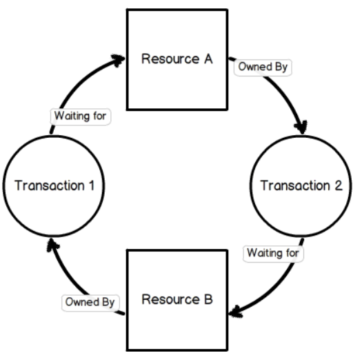

# 복수의 트랜잭션을 사용하다보면 교착상태가 발생할 수 있는데 , 교착상태 발생 빈도를 낮출 수 있는 방법을 아는대로 말해보세요

    교착상태란 두 개 이상의 트랜잭션이 특정 자원의 잠금(Lock)을 획득한 채 다른 트랜잭션이 소유하고 있는 잠금을 요구하면 아무리 기다려도 상황이 바뀌지 않는 상태를 교착상태라고 하며 ,

    - 교착 상태의 예 ( 잠금(Lock)에 대해 궁금하다면 )
        - 잠금 : 트랜잭션이 동시에 동일한 레코드나 테이블의 변경을 요청할 경우 순서대로 한 시점에 하나의 트랜잭션만 변경할 수 있게 해주는 역할
        - 잠금, 트랜잭션 비슷한 개념 같지만
        - 잠금 - 동시성 제어  , 트랜잭션 - 데이터 정합성 보장하기 위한 기능
        - 잠금은 명시적 ,묵시적으로 획득할수 있으며 여러 종류가 있다.

                (내용이 너무 많아 토글 하단 링크에서 확인할 수 있습니다. )


        * 교착상태의 예시(MySQL)



        MySQL MVCC에 따른 특성 때문에 트랜잭션에서 갱신 연산(Insert, Update, Delete)를 실행하면 잠금을 획득한다.

        - 트랜 잭션1이 테이블B의 첫번째 행의 잠금 획득 ,
        - 트랜 잭션2 또한 테이블 A의 첫번째 행의 잠금 획득
        - 이 상태에서 트랜잭션을 commit 하지 않은 채 서로의 첫번째 행에 대한 잠금을 요청하면 Deadlock이 발생
        - 참고

        [[MySQL] 트랜잭션과 잠금](https://velog.io/@juijeong8324/MySQL-transactionandlock)


    발생 빈도를 낮추기 위해서는

        1. 트랜잭션을 자주 커밋한다.
        2. 정해진 순서로 테이블에 접근한다. ( 예를 들어 트랜잭션 1과 2가 있을 경우, 트랜잭션 1은 테이블 B→A , 트랜잭션 2는 A→B순으로 접근하게 하기 )
        3. 읽기 잠금 획득 ( SELECT ~ FOR UPDATE ) 의 사용을 피한다.
            - SELECT FROM FOR UPDATE
            - FOR UPDATE 옵션이 사용된 SELECT 쿼리 문장도 WHERE 조건절에 일치하는 레코드를 검색하기 위해 접근한 모든 레코드에 대해 배타적 넥스트 키 락을 걸게 된다.
            - → 대상 레코드가 다른 트랜잭션에 의해 읽기 잠금이나 쓰기 잠금으로 사용되고 있다면 반드시 그 잠금이 해제될 때까지 대기해야 한다.
            - FOR UPDATE가 사용되면 SELECT 쿼리는 스냅 샷을 이용한 읽기를 사용하지 못하기 때문에 일관된 읽기가 무시된다.
                - 참고
                [[Real MySQL] 12장. 쿼리 종류별 잠금 (2) SQL 문장별 잠금](https://willseungh0.tistory.com/146#SELECT%--FROM%--LOCK%--IN%--SHARE%--MODE)

        4. 한 테이블의 복수 행을 복수의 연결에서 순서 없이 갱신하면 교착상태가 발생하기 쉬워, 이러한 경우 테이블 단위의 잠금을 획득해 갱신을 직렬화 하면 동시성은 떨어지지만 교착상태를 회피할 수 있다.
            - 정확할지는 모르겠지만 이해한 바로는 , 한 테이블에 여러 트랜잭션이 연결하게 될 경우 순서가 없으면 교착상태가 발생할 확률이 높기때문에, 테이블 단위의 잠금을 획득해 직렬화( 여러 트랜잭션이 동시 병행 수행되더라도 각 트랜잭션이 하나씩 차례대로 수행되는 것,  DB의 일관성을 보장 ) 하여 교착상태를 피할 수 있다는 것 같습니다.

<br><br>

# SQL(RDB) vs NOSQL

## RDB vs NoSQL

### SQL ( ex, MySQL ,.. )

    - SQL - RDBMS에서 데이터를 저장, 수정 ,삭제 및 검색 가능
    - RDB 특징
            - 데이터는 정해진 데이터 스키마에 따라 테이블에 저장된다.
            - 데이터는 관계를 통해 여러 테이블에 분산된다.
    - 데이터는 테이블에 레코드로 저장되는데 , 각 테이블마다 명확하게 정의된 구조가 있다.
    - 스키마를 준수하지 않은 레코드는 테이블에 추가할 수 없다.
    - 데이터의 중복을 피하기 위해 ‘관계’를 이용한다.
    - 하나의 테이블에서 중복 없이 하나의 데이터만을 관리하기 때문에 다른 테이블에서 부정확한 데이터를 다룰 위험이 없어지는 장점이 있다.

### NoSQL(Not Only SQL, ex, MongoDB, … )

    - NoSQL - 비관계형 DB , 스키마도 없고 , 관계도 없음
    - NoSQL에서는 레코드를 문서(documents) 라고 부른다.
    - document는 Json과 비슷한 형태로 존재
    - SQL과 달리 다른 구조의 데이터를 같은 컬렉션에 추가가 가능하다.
    - RDB처럼 여러  테이블에 나누어 담지 않고, 관련 데이터를 동일한 컬렉션에 담는다.
    - SQL은 order,user,product 를 나눴다면 NoSQL은 orders에 한번에 포함
    - 여러 테이블에 조인할 필요없이 이미 필요한 모든 것을 갖춘 문서를 작성
    - 따라서, 조인을 잘 사용하지 않고 자주 변경되지 않는 데이터 일때 효율적

## 확장 개념

    - 두 데이터베이스를 비교할 때 중요한 Scaling 개념 존재
    - 데이터 서버의 확장성은 ‘수직적’ 확장과 ‘수평적' 확장으로 나누어진다.
        - 수직적 확장 : 단순히 DB 서버의 성능을 향상 시키는 것 ( ex , CPU 업그레이드)
        - 수평적 확장 : 더 많은 서버가 추가되고 DB가 전체적으로 분산됨을 의미  ( 하나의 데이터 베이스에서 작동하지만 여러 호스트에서 작동 )
    - 데이터 저장 방식으로 인해 SQL 데이터베이스는 일반적으로 수직적 확장만 지원함
        - 수평적 확장은 NoSQL 데이터베이스에서만 가능

## 정리

    SQL 장점

    - 명확하게 정의된 스키마, 데이터 무결성 보장
    - 관계는 각 데이터를 중복없이 한번만 저장

    SQL 단점

    - 덜 유연함. 데이터 스키마를 사전에 계획하고 알려야 함. (나중에 수정하기 힘듬)
    - 관계를 맺고 있어서 조인문이 많은 복잡한 쿼리가 만들어질 수 있음
    - 대체로 수직적 확장만 가능함

    NoSQL 장점

    - 스키마가 없어서 유연함. 언제든지 저장된 데이터를 조정하고 새로운 필드 추가 가능
    - 데이터는 애플리케이션이 필요로 하는 형식으로 저장됨. 데이터 읽어오는 속도 빨라짐
    - 수직 및 수평 확장이 가능해서 애플리케이션이 발생시키는 모든 읽기/쓰기 요청 처리 가능

    NoSQL 단점

    - 유연성으로 인해 데이터 구조 결정을 미루게 될 수 있음
    - 데이터 중복을 계속 업데이트 해야 함
    - 데이터가 여러 컬렉션에 중복되어 있기 때문에 수정 시 모든 컬렉션에서 수행해야 함 (SQL에서는 중복 데이터가 없으므로 한번만 수행이 가능)

    SQL 데이터베이스 사용이 더 좋을 때

    - 관계를 맺고 있는 데이터가 자주 변경되는 애플리케이션의 경우

        > NoSQL에서는 여러 컬렉션을 모두 수정해야 하기 때문에 비효율적
        >
    - 변경될 여지가 없고, 명확한 스키마가 사용자와 데이터에게 중요한 경우

    NoSQL 데이터베이스 사용이 더 좋을 때

    - 정확한 데이터 구조를 알 수 없거나 변경/확장 될 수 있는 경우
    - 읽기를 자주 하지만, 데이터 변경은 자주 없는 경우
    - 데이터베이스를 수평으로 확장해야 하는 경우 (막대한 양의 데이터를 다뤄야 하는 경우)

    하나의 제시 방법이지 완전한 정답이 정해져 있는 것은 아니다.

    SQL을 선택해서 복잡한 JOIN문을 만들지 않도록 설계하여 단점을 없앨 수도 있고

    NoSQL을 선택해서 중복 데이터를 줄이는 방법으로 설계해서 단점을 없앨 수도 있다.

<br><br>

# 나쁜 릴레이션은 어떻게 파악하는지

    각각의 정규형마다 어떠한 함수적 종속성을 만족하는지에 따라 정규형이 정의된다.

    그 정규형을 만족하지 못하는 정규형은 나쁜 릴레이션으로 파악한다.

    각 정규형은 다음의 조건을 만족해야 한다.

    1. 각각의 정규형은 분해의 대상인 분해 집합은 무손실 조인을 보장해야한다.
    2. 분해집합은 함수적 종속성을 보존해야 한다.

    cf)

    - 제 1 정규형 : 애트리뷰트의 도메인이 오직 원자값 만을 포함 , 튜플의 모든 애트리뷰트가 도메인에 속하는 하나의 값을 가져야 한다.
    - 제 2 정규형 : 모든 비주요 애트리뷰트들이 주요 애트리뷰트에대해서 완전 함수적 종속이다.
    - 제 3 정규형 : 어떠한 비주요 애트리뷰트도 기본키에 대해서 이행적으로 종속되지 않는다.
    - BCNF(Boyce-Codd) 정규형 : 여러 후보 키가 존재하는 릴레이션에 해당하는 정규화 , 복잡한 식별자 관계에 의해 발생하는 문제를 해결하기 위해 제3 정규형을 보완하는데 의미 ,  비주요 애트리뷰트가 후보키의 일부를 결정하고 분해하는 과정을 말한다.
    - 참고

    [정규화 (제1 정규화 ~ 제3 정규화)](https://mr-dan.tistory.com/10)

<br><br>

# RBO 와 CBO 에 대해 아는대로 설명해주세요.

## 결정 규칙

    - 옵티마이저 : SQL의 실행계획을 만들어주는 역할
        - 옵티마이저 기술은 모든 RDBMS가 다르고 이 옵티마이저의 성능으로 쿼리의 성능이 달라진다.
    - 규칙기반 옵티마이저 ( Rule-Based Optimizer, RBO )
        - 연산자, 인덱스의 유무 , 조건절 형태 등 정해진 규칙의 우선순위에 따라 실행계획 생성
        - 테이블의 레코드 건수, 선택도 등을 고려하지 않고 옵티마이저에 내장된 우선순위에 따라 실행계획을 수립하는 방식이다.
            통계정보를 조사하지 않고, 실행계획이 수립되기 때문에 쿼리가 거의 항상 같은 실행 방법을 만들어낸다.

        - RBO는 인덱스 통계정보가 거의 없고 상대적으로 느린 CPU 연산 탓에 비용 계산 과정이 부담스러웠기 때문에 사용하던 방식으로 , 현재 RDBMS는 대부분 CBO를 채택하고 있다.
            - 인덱스를 이용한 액세스 방식 > 전체 테이블 액세스 방식
            - 조인 칼럼에 대한 인덱스가 양쪽 테이블에 모두 존재할 때, 우선순위가 높은 테이블 선택
            - 만약 조인 테이블의 우선순위가 동일하지않다면, FROM 절에 나열된 테이블의 역순으로 수행
            - 조인 칼럼에 대한 인덱스가 양쪽 테이블에 모두 존재할 때, 우선순위가 높은 테이블을 선택
        - 단점 : 인덱스가 존재하면 무조건 사용 , 상황에 따라 인덱스를 사용하지 않는 것이 유리할 수도 있는 경우에 대처가 어렵다.

    - 비용기반 옵티마이저 ( Cost-Based Optimizer, CBO )
        - RBO의 단점을 극복하고자 통계정보 사용
        - 쿼리를 수행하는데 소요되는 예상 비용을 바탕으로 실행계획을 생성한다.
        - 통계정보, DBMS 설정정보, DBMS 버전등의 차이로 인해 똑같은 SQL문이라도 서로 다른 실행계획이 생성될 수 있다.

```sql
SELECT *
FROM employees e, dept_emp de
WHERE e.emp_no=de.emp_no;
```

        - 드라이빙 테이블 : 조인 시 먼저 엑세스 되는 쪽
        - 드리븐 테이블 :  나중에 엑세스 되는 테이블
        - 조인이 수행될 때 인덱스가 있다면 데이터 조회시에 Full Scan이 일어나지 않기 때문에 인덱스가 있는 테이블을 드리븐 테이블로 두면 드라이빙 테이블이 드리븐 테이블에 대해서 FullScan을 하지 않아 더 빠르다.
        - 따라서 인덱스가 한쪽에만 있으면 인덱스가 없는 테이블이 드라이빙 테이블로 ,
        - 둘다 있거나, 없을경우 레코드 건수 등 통계정보에 따라 옵티마이저가 판단

        1 ) 두 칼럼 모두 각각 인덱스가 있는 경우

        각 테이블의 레코드 건수에 따라 employees 가 드라이빙 테이블이 될 수도 있고, dept_emp 테이블이 드라이빙 테이블이 될 수도 있다.

        2) dept_emp.emp_no 에만 인덱스가 있는 경우

        employees 테이블의 반복된 풀 스캔을 막기 위해 employees 테이블을 드라이빙 테이블로 선택하고, 인덱스가 있는 dept_emp 테이블을 드리븐 테이블로 조인을 수행하도록 실행 계획을 수립한다.

        3) employees.emp_no에만 인덱스가 있는 경우

        ept_emp 테이블을 드라이빙 테이블로, employees 테이블을 드리븐 테이블로 선택하게 된다.

        4) 두 칼럼 모두 인덱스가 없는 경우

        어느 테이블을 드라이빙으로 선택하더라도 드리븐 테이블의 풀 스캔은 발생하기 때문에 스캔되는 레코드 수에 따라 적절히 드라이빙 테이블을 선택하게 된다.

        - 참고

            [[CS면접 질문 정리] 데이터베이스](https://land-turtler.tistory.com/155)

<br><br>

# 인덱스 헌팅에 대해서 아는대로 설명해주세요.

## 인덱스 헌팅

    - 정의: 인덱스 수집을 향상시켜 데이터베이스 성능뿐만 아니라 쿼리 성능을 향상시키는 프로세스
    - 인덱스 헌팅을 이용하여 쿼리 성능을 향상 시키는 방법
        - 쿼리 최적화 프로그램을 사용하여 워크로드와 쿼리를 조정
        - 인덱스 및 쿼리 배포의 성능 및 효과 관찰
        - 용어
            - 쿼리 최적화 프로그램
                - 쿼리 최적화 단계에서 데이터베이스 엔진 구성 요소에 의해 만들어진다
                - 각 SQL문을 평가하여 최적의 실행 계획을 결정
                    - 실행계획 :  쿼리에 대한 많은 요소의 효율성을 고려하는 단계
                        - RBO, CBO를 이용하여 실행계획을 생성
        - 워크로드 : 고객 대면 애플리케이션 이나 백엔드 프로세스와 같이 비즈니스 가치를 창출하는 리소스 및 코드 모음  OR 주어진 기간에 시스템에 의해 실행되어야 할 작업의 할당량
