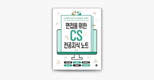

# CS 스터디룸

## 스터디 운영 방식

### 출결 관련 🧦

1. 지각비 30분까지 : 2천원, 30분~1시간 : 3천원 , 1시간 이후 : 4천원,

   결석비 : 5천원

   사유 있을 시 면제.

2. 매주 2회 운영 (평일 1회, 주말 1회) 상의 후 날짜 및 시간 결정.

### 스터디 내용 💻

- CS면접 관련 질문들에 대한 답을 1시간 동안 공부합니다.
- 30분은 알고리즘 문제를 풉니다.(주로 DB관련을 풀 예정입니다.)
- 스터디 시작 하기 전에 미리 문제들을 찾아옵니다.

### 툴 활용법 🔎

- 문제는 먼저 노션에 정리해서 올려놓습니다.
- 정해진 스터디 시간에는 노션에 올라간 문제를 각자의 README파일에 올려 GIT에 저장합니다.

### 사용하는 책

면접을 위한 CS 전공지식 노트(주홍철 지음)



<br>

### GIT 최초 설정

1. 프로젝트 레포 fork 해서 자신의 github로 복사
2. fork한 프로젝트 자신의 로컬 저장소에 clone
3. 브랜치 생성
   ```
   $ git remote add upstream <원래 프로젝트 레포의 url>
   $ git remote -v
   $ git checkout -b 브랜치이름
   ```

Read Me 생성 혹은 변경 후,

```
$ git add .
$ git commit -m "msg"
$ git push origin 브랜치이름
```

Compare & pull request

Merge 된 후, main 브랜치로 이동하여 upstream의 커밋 내역을 가져와서 동기화

```
$ git fetch upstream
$ git merge upstream/main
$ git push
```

<br><br>
